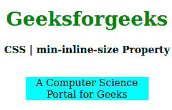
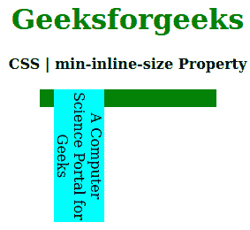

# CSS 最小内嵌尺寸属性

> 原文: [https://www.geeksforgeeks.org/css-min-inline-size-property/](https://www.geeksforgeeks.org/css-min-inline-size-property/)

`CSS` 最小内嵌尺寸属性用于在与写入方向相反的方向上创建元素的最小尺寸。比如如果书写方向是水平的，那么**最小线内尺寸**相当于**最小高度**，如果是垂直模式，那么等于**最小宽度**。

## 语法

```html
min-inline-size: length | percentage | auto | none | min-content |
                 max-content | fit-content | inherit | initial | unset;
```

## 属性值

*   `length`: 设置 `px`、`cm`、`pt` 等定义的固定值。允许负值。它的默认值是 `0px`。
*   `percentage(%)`: 与长度相同，但大小是根据窗口大小的百分比设置的。
*   `auto`: 当希望浏览器确定块大小时使用。
*   `none`: 不想限制盒子大小时使用。
*   `max-content`: 当你喜欢盒子大小的最大宽度时使用。
*   `min-content`: 当你喜欢盒子大小的最小宽度时使用。
*   `fit-content`: 当你喜欢盒子大小的精确宽度时使用。
*   `initial`: 用于将 `min-inline-size` 属性的值设置为默认值。
*   `inherit`: 当希望元素继承其父元素的 `min-inline-size` 属性作为自己的属性时使用。
*   `unset`: 用于取消设置默认最小线内尺寸。

以下示例说明了 `CSS` 中的 `min-inline-size` 属性。

## 示例 1

```html
<!DOCTYPE html> 
<html>

<head> 
    <title>CSS | min-inline-size Property</title> 
    <style> 
        h1 { 
            color: green; 
        }

        div { 
            background-color: green; 
            width: 200px; 
            height: 20px; 
        }

        .one { 
            position: relative; 
            min-inline-size: 10px; 
            background-color: cyan; 
        } 
    </style> 
</head>

<body> 
    <center> 
        <h1>Geeksforgeeks</h1> 
        <b>CSS | min-inline-size Property</b> 
        <br> 
        <br> 
        <div> 
            <p class="one"> 
                A Computer Science Portal for Geeks 
            </p> 
        </div> 
    </center> 
</body>

</html>
```

**输出:**


## 示例 2

```html
<!DOCTYPE html> 
<html>

<head> 
    <title>CSS | min-inline-size Property</title> 
    <style> 
        h1 { 
            color: green; 
        }

        div { 
            background-color: green; 
            width: 200px; 
            height: 20px; 
        }

        .one { 
            position: relative; 
            writing-mode: vertical-rl;
            min-inline-size: 150px; 
            background-color: cyan; 
        } 
    </style> 
</head>

<body> 
    <center> 
        <h1>Geeksforgeeks</h1> 
        <b>CSS | min-inline-size Property</b> 
        <br> 
        <br> 
        <div> 
            <p class="one"> 
                A Computer Science Portal for Geeks 
            </p> 
        </div> 
    </center> 
</body>

</html>
```

**输出:**


## 支持的浏览器

`min-inline-size` 属性支持的浏览器如下:

*   火狐浏览器
*   谷歌 Chrome
*   边缘
*   歌剧

## 参考

[https://developer.mozilla.org/en-US/docs/Web/CSS/min-inline-size](https://developer.mozilla.org/en-US/docs/Web/CSS/min-inline-size)