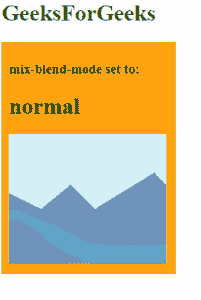
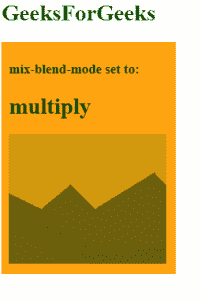
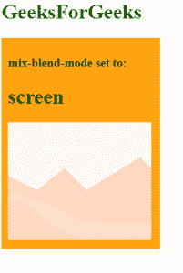
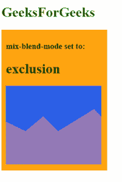
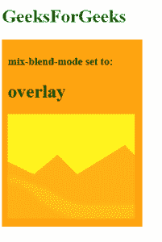
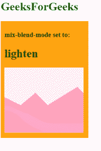
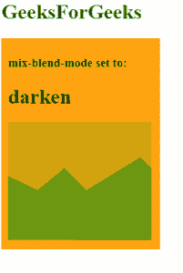
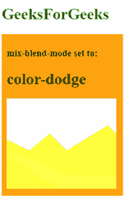

# CSS 混合-混合-模式属性

> 原文:[https://www.geeksforgeeks.org/css-mix-blend-mode-property/](https://www.geeksforgeeks.org/css-mix-blend-mode-property/)

元素的 CSS `混合-混合模式`属性用于指定元素背景与元素父元素的混合。

**语法:**

```html
 mix-blend-mode: normal | multiply | exclusion 
            | overlay | lighten | darken 
            | color-dodge | color-burn 
            | hard-light | soft-light 
            | difference | hue 
            | saturation | color | screen 
            | luminosity
```

**值:**

*   **初始**–默认设置，这不会设置混合模式。
*   **继承**–这将继承其父元素的混合模式。
*   **取消设置**–这将从元素中移除当前混合模式。

## `normal`
`normal` – no blending is applied on the element.

```html
    <!DOCTYPE html>
    <html>
    <body>
        <h1 style='color: green'>GeeksForGeeks</h1>
        <div style="background-color: orange; width: 225px; padding: 10px;">
            <h3>mix-blend-mode set to: </h3>
            <h1>normal</h1>

<!-- mix-blend-mode Property -->
            <div style="mix-blend-mode: normal">
                
            </div>
        </div>
    </body>
    </html>
```

**输出:**



## `multiply`
`multiply` – this multiplies the element’s color with the background. The resulting color is always as dark as the background.

```html
    <!DOCTYPE html>
    <html>
    <body>
        <h1 style='color: green'>GeeksForGeeks</h1>
        <div style="background-color: orange; width: 225px; padding: 10px;">
            <h3>mix-blend-mode set to: </h3>
            <h1>multiply</h1>

<!-- mix-blend-mode Property -->
            <div style="mix-blend-mode: multiply">
                
            </div>
        </div>
    </body>
    </html>
```

**输出:**



## `screen`
`screen` – this multiplies the element’s color with the background and then complements the result. The resulting color is always as bright as one of the blended layers.

```html
    <!DOCTYPE html>
    <html>
    <body>
        <h1 style='color: green'>GeeksForGeeks</h1>
        <div style="background-color: orange; width: 225px; padding: 10px;">
            <h3>mix-blend-mode set to: </h3>
            <h1>screen</h1>

<!-- mix-blend-mode Property -->
            <div style="mix-blend-mode: screen">
                
            </div>
        </div>
    </body>
    </html>
```

**输出:**



## `exclusion`
`exclusion` – this subtracts the darker of two colors from the lightest color of the element. The result is similar to ‘difference’ but with a lower contrast.

```html
    <!DOCTYPE html>
    <html>
    <body>
        <h1 style='color: green'>GeeksForGeeks</h1>
        <div style="background-color: orange; width: 225px; padding: 10px;">
            <h3>mix-blend-mode set to: </h3>
            <h1>exclusion</h1>

<!-- mix-blend-mode Property -->
            <div style="mix-blend-mode: exclusion">
                
            </div>
        </div>
    </body>
    </html>
```

**输出:**



## `overlay`
`overlay` – this applies ‘multiply’ on lighter colors and ‘screen’ on darker colors in the element. The effect is effectively the opposite of ‘hard-light’.

```html
    <!DOCTYPE html>
    <html>
    <body>
        <h1 style='color: green'>GeeksForGeeks</h1>
        <div style="background-color: orange; width: 225px; padding: 10px;">
            <h3>mix-blend-mode set to: </h3>
            <h1>overlay</h1>

<!-- mix-blend-mode Property -->
            <div style="mix-blend-mode: overlay">
                
            </div>
        </div>
    </body>
    </html>
```

**输出:**



## `lighten`
`lighten` – this replaces the background with the element’s color where the element is lighter.

```html
    <!DOCTYPE html>
    <html>
    <body>
        <h1 style='color: green'>GeeksForGeeks</h1>
        <div style="background-color: orange; width: 225px; padding: 10px;">
            <h3>mix-blend-mode set to: </h3>
            <h1>lighten</h1>

<!-- mix-blend-mode Property -->
            <div style="mix-blend-mode: lighten">
                
            </div>
        </div>
    </body>
    </html>
```

**输出:**



## `darken`
`darken` – this replaces the background with the element’s color where the element is darker.

```html
    <!DOCTYPE html>
    <html>
    <body>
        <h1 style='color: green'>GeeksForGeeks</h1>
        <div style="background-color: orange; width: 225px; padding: 10px;">
            <h3>mix-blend-mode set to: </h3>
            <h1>darken</h1>

<!-- mix-blend-mode Property -->
            <div style="mix-blend-mode: darken">
                
            </div>
        </div>
    </body>
    </html>
```

**输出:**



## `color-dodge`
`color-dodge` – this lightens the background color to reflect the color of the element.

```html
    <!DOCTYPE html>
    <html>
    <body>
        <h1 style='color: green'>GeeksForGeeks</h1>
        <div style="background-color: orange; width: 225px; padding: 10px;">
            <h3>mix-blend-mode set to: </h3>
            <h1>color-dodge</h1>

<!-- mix-blend-mode Property -->
            <div style="mix-blend-mode: color-dodge">
                
            </div>
        </div>
    </body>
    </html>
```

**输出:**



## `color-burn`
`color-burn`–这将使背景颜色变暗，以反映图像的自然颜色。结果增加了元素和背景之间的对比度。

```html
    <!DOCTYPE html>
    <html>
    <body>
        <h1 style='color: green'>GeeksForGeeks</h1>
        <div style="background-color: orange; width: 225px; padding: 10px;">
            <h3>mix-blend-mode set to: </h3>
            <h1>color-burn</h1>

<!-- mix-blend-mode Property -->
            <div style="mix-blend-mode: color-burn">
                
            </div>
        </div>
    </body>
    </html>
```

**输出:**


**Syntax:**
```
mix-blend-mode: normal
```

# CSS `mix-blend-mode` 属性示例

## `hard-light`
此模式在元素的较亮颜色上应用“正片叠底”（multiply），在较暗颜色上应用“滤色”（screen）。此效果实际上与“叠加”（overlay）模式相反。

```html
<!DOCTYPE html>
<html>
<body>
    <h1 style='color: green'>GeeksForGeeks</h1>
    <div style="background-color: orange; width: 225px; padding: 10px;">
        <h3>mix-blend-mode set to: </h3>
        <h1>hard-light</h1>
        <div style="mix-blend-mode: hard-light">
            
        </div>
    </div>
</body>
</html>
```

## `soft-light`
此模式在元素的较亮颜色上应用“正片叠底”，在较暗颜色上应用“滤色”。产生的效果比“叠加”模式更柔和。

```html
<!DOCTYPE html>
<html>
<body>
    <h1 style='color: green'>GeeksForGeeks</h1>
    <div style="background-color: orange; width: 225px; padding: 10px;">
        <h3>mix-blend-mode set to: </h3>
        <h1>soft-light</h1>
        <div style="mix-blend-mode: soft-light">
            
        </div>
    </div>
</body>
</html>
```

## `difference`
此模式从背景颜色中减去元素颜色的绝对值，或从元素颜色中减去背景颜色的绝对值（取两者中亮度较高者）。

```html
<!DOCTYPE html>
<html>
<body>
    <h1 style='color: green'>GeeksForGeeks</h1>
    <div style="background-color: orange; width: 225px; padding: 10px;">
        <h3>mix-blend-mode set to: </h3>
        <h1>difference</h1>
        <div style="mix-blend-mode: difference">
            
        </div>
    </div>
</body>
</html>
```

## `hue`
此模式使用元素的色相，以及背景的饱和度和明度。

```html
<!DOCTYPE html>
<html>
<body>
    <h1 style='color: green'>GeeksForGeeks</h1>
    <div style="background-color: orange; width: 225px; padding: 10px;">
        <h3>mix-blend-mode set to: </h3>
        <h1>hue</h1>
        <div style="mix-blend-mode: hue">
            
        </div>
    </div>
</body>
</html>
```

## `saturation`
此模式使用元素的饱和度，以及背景的色相和明度。

```html
<!DOCTYPE html>
<html>
<body>
    <h1 style='color: green'>GeeksForGeeks</h1>
    <div style="background-color: orange; width: 225px; padding: 10px;">
        <h3>mix-blend-mode set to: </h3>
        <h1>saturation</h1>
        <div style="mix-blend-mode: saturation">
            
        </div>
    </div>
</body>
</html>
```

## `color`
此模式使用元素的色相和饱和度，以及背景的明度。

```html
<!DOCTYPE html>
<html>
<body>
    <h1 style='color: green'>GeeksForGeeks</h1>
    <div style="background-color: orange; width: 225px; padding: 10px;">
        <h3>mix-blend-mode set to: </h3>
        <h1>color</h1>
        <div style="mix-blend-mode: color">
            
        </div>
    </div>
</body>
</html>
```

## `luminosity`
此模式使用元素的明度，以及背景的色相和饱和度。

```html
<!DOCTYPE html>
<html>
<body>
    <h1 style='color: green'>GeeksForGeeks</h1>
    <div style="background-color: orange; width: 225px; padding: 10px;">
        <h3>mix-blend-mode set to: </h3>
        <h1>luminosity</h1>
        <div style="mix-blend-mode: luminosity">
            
        </div>
    </div>
</body>
</html>
```

支持`混合模式`的浏览器有：

*   Chrome 41.0
*   Firefox 32.0
*   Opera 35.0
*   Safari 8.0