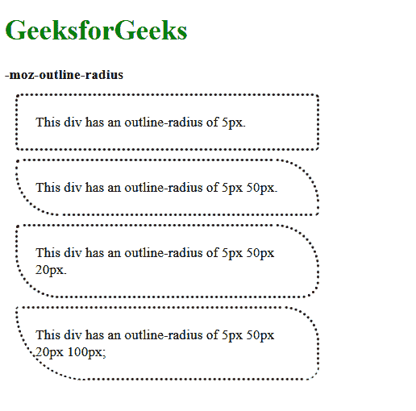
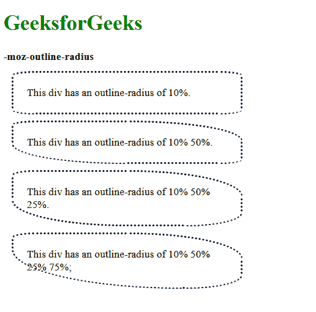

# CSS `-moz-outline-radius` 属性

> 原文：[https://www.geeksforgeeks.org/css-moz-outline-radius-property/](https://www.geeksforgeeks.org/css-moz-outline-radius-property/)

`-moz-outline-radius` 属性用于指定轮廓的半径。它用于给轮廓赋予圆角。此属性仅在 Firefox 中受支持。

## 语法

```html
-moz-outline-radius: <length> {1-4} 
| <percentage> (1-4} | initial | inherit
```

## 属性值

*   **`length`**：用于以长度单位设置轮廓半径。此属性的默认值为 `0`。
    该值可以用 4 种格式指定。
    *   当指定一个值时，半径将应用于元素的所有角。
    *   当指定两个值时，第一个值适用于左上角和右下角，第二个值适用于右上角和左下角。
    *   当指定三个值时，第一个适用于左上角，第二个适用于右上角和左下角，第三个适用于右下角。
    *   当指定四个值时，第一个适用于左上角，第二个适用于右上角，第三个适用于右下角，第四个适用于左下角。

## 示例

### 使用 `length` 值

```html
<!DOCTYPE html>
<html lang="en">
<head>
  <title>
    -moz-outline-radius property
  </title>
  <style>
    .elem-1 {
      outline: dotted;
      -moz-outline-radius: 5px;
      width: 300px;
      padding: 20px;
      margin: 15px;
    }

    .elem-2 {
      outline: dotted;
      -moz-outline-radius: 5px 50px;
      width: 300px;
      padding: 20px;
      margin: 15px;
    }

    .elem-3 {
      outline: dotted;
      -moz-outline-radius: 5px 50px 20px;
      width: 300px;
      padding: 20px;
      margin: 15px;
    }

    .elem-4 {
      outline: dotted;
      -moz-outline-radius: 5px 50px 20px 100px;
      width: 300px;
      padding: 20px;
      margin: 15px;
    }
  </style>
</head>
<body>
  <h1 style="color: green">
    GeeksforGeeks
  </h1>
  <b>
    -moz-outline-radius
  </b>
  <div class="elem-1">
    This div has an outline-radius
    of 5px.
  </div>
  <div class="elem-2">
    This div has an outline-radius
    of 5px 50px.
  </div>
  <div class="elem-3">
    This div has an outline-radius
    of 5px 50px 20px.
  </div>
  <div class="elem-4">
    This div has an outline-radius
    of 5px 50px 20px 100px;
  </div>
</body>
</html>
```

**输出：**


*   **`percentage`**：用于以百分比值设置轮廓半径。其应用格式与 `length` 值类似。此属性的默认值为 `0`。

### 使用 `percentage` 值

```html
<!DOCTYPE html>
<html lang="en">
<head>
  <title>
    -moz-outline-radius property
  </title>
  <style>
    .elem-1 {
      outline: dotted;
      -moz-outline-radius: 10%;
      width: 300px;
      padding: 20px;
      margin: 15px;
    }

    .elem-2 {
      outline: dotted;
      -moz-outline-radius: 10% 50%;
      width: 300px;
      padding: 20px;
      margin: 15px;
    }

    .elem-3 {
      outline: dotted;
      -moz-outline-radius: 10% 50% 25%;
      width: 300px;
      padding: 20px;
      margin: 15px;
    }

    .elem-4 {
      outline: dotted;
      -moz-outline-radius: 10% 50% 25% 75%;
      width: 300px;
      padding: 20px;
      margin: 15px;
    }
  </style>
</head>
<body>
  <h1 style="color: green">
    GeeksforGeeks
  </h1>
  <b>
    -moz-outline-radius
  </b>
  <div class="elem-1">
    This div has an outline-radius
    of 10%.
  </div>
  <div class="elem-2">
    This div has an outline-radius
    of 10% 50%.
  </div>
  <div class="elem-3">
    This div has an outline-radius
    of 10% 50% 25%.
  </div>
  <div class="elem-4">
    This div has an outline-radius
    of 10% 50% 25% 75%;
  </div>
</body>
</html>
```

**输出：**


*   **`initial`**：用于将属性设置为默认值。
*   **`inherit`**：用于从其父级继承属性。

## 支持的浏览器

以下列出了 `-moz-outline-radius` 属性支持的浏览器：

*   Firefox 1.5