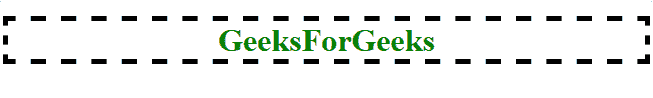
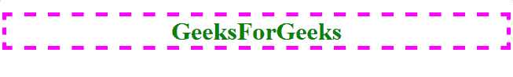
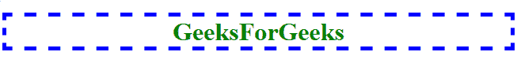
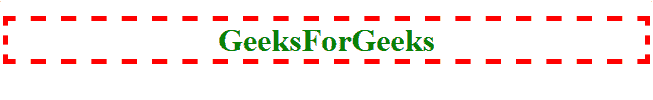
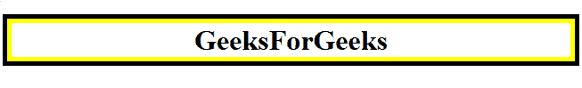
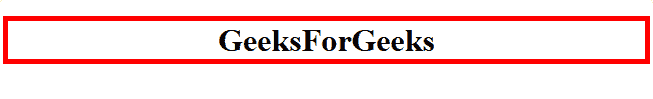

# CSS |轮廓-颜色属性

> 原文:[https://www.geeksforgeeks.org/css-outline-color-property/](https://www.geeksforgeeks.org/css-outline-color-property/)

CSS 的轮廓颜色属性设置元素的轮廓颜色。

## 语法

```html
outline-color: <color> | invert | inherit;
```

## 属性值

### `<color>`
将轮廓颜色设置为任何有效的 CSS 颜色。

**例:** `outline-color: black;`

```html
<!DOCTYPE html>
<html>
<head>
    <title>CSS outline-color property</title>
    <!-- Internal CSS Style Sheet -->
    <style>
        h1 {
            color: green;
            text-align: center;
            outline-width: 5px;
            outline-style: dashed;
            /* CSS property for outline-color */
            outline-color: black;
        }
    </style>
</head>
<body>
    <!-- outline-color: black;-->
    <h1>GeeksForGeeks</h1>
</body>
</html>
```

**输出:**


**例:** `outline-color: #FF00FF;`

```html
<!DOCTYPE html>
<html>
<head>
    <title>CSS outline-color property</title>
    <!-- Internal CSS Style Sheet -->
    <style>
        h1 {
            color: green;
            text-align: center;
            outline-width: 5px;
            outline-style: dashed;
            /* CSS property for outline-color */
            outline-color: #FF00FF;
        }
    </style>
</head>
<body>
    <!-- outline-color: #FF00FF;-->
    <h1>GeeksForGeeks</h1>
</body>
</html>
```

**输出:**


**例:** `outline-color: rgb(0, 0, 255);`

```html
<!DOCTYPE html>
<html>
<head>
    <title>CSS outline-color property</title>
    <!-- Internal CSS Style Sheet -->
    <style>
        h1 {
            color: green;
            text-align: center;
            outline-width: 5px;
            outline-style: dashed;
            /* CSS property for outline-color */
            outline-color: rgb(0, 0, 255);
        }
    </style>
</head>
<body>
    <!-- outline-color: rgb(0, 0, 255);-->
    <h1>GeeksForGeeks</h1>
</body>
</html>
```

**输出:**


**例:** `outline-color: hsl(0, 100%, 50%);`

```html
<!DOCTYPE html>
<html>
<head>
    <title>CSS outline-color property</title>
    <!-- Internal CSS Style Sheet -->
    <style>
        h1 {
            color: green;
            text-align: center;
            outline-width: 5px;
            outline-style: dashed;
            /* CSS property for outline-color */
            outline-color: hsl(0, 100%, 50%);
        }
    </style>
</head>
<body>
    <!-- outline-color: hsl(0, 100%, 50%);-->
    <h1>GeeksForGeeks</h1>
</body>
</html>
```

**输出:**


### `invert`
将轮廓颜色设置为与背景颜色相反的颜色，这确保轮廓始终可见。注意：并非所有浏览器都支持此值。

**例:** `outline-color: invert;`

```html
<!DOCTYPE html>
<html>
<head>
    <title>CSS outline-color property</title>
    <!-- Internal CSS Style Sheet -->
    <style>
        h1 {
            border: 5px solid yellow;
            text-align: center;
            outline-width: 5px;
            outline-style: solid;
            /* CSS property for outline-color */
            outline-color: invert;
        }
    </style>
</head>
<body>
    <!-- outline-color: invert;-->
    <h1>GeeksForGeeks</h1>
</body>
</html>
```

**输出:**


### `inherit`
根据从其父元素继承的 `outline-color` 属性来设置轮廓颜色。

**例:** `outline-color: inherit;`

```html
<!DOCTYPE html>
<html>
<head>
    <title>CSS outline-color property</title>
    <!-- Internal CSS Style Sheet -->
    <style>
        body {
            outline-color: red;
        }
        h1 {
            text-align: center;
            outline-width: 5px;
            outline-style: solid;
            /* CSS property for outline-color */
            outline-color: inherit;
        }
    </style>
</head>
<body>
    <!-- outline-color: inherit;-->
    <h1>GeeksForGeeks</h1>
</body>
</html>
```

**输出:**


## 支持的浏览器
CSS 的 `outline-color` 属性受以下浏览器支持:

*   `Chrome 1`
*   `Edge 12`
*   `Firefox 1.5`
*   `Internet Explorer 8`
*   `Opera 7`
*   `Safari 1.2`