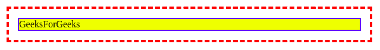
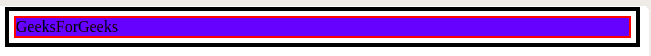

# CSS 轮廓偏移属性

> 原文: [https://www.geeksforgeeks.org/css-outline-offset-property/](https://www.geeksforgeeks.org/css-outline-offset-property/)

CSS 轮廓偏移属性设置轮廓和元素边缘或边框之间的间距。

轮廓是围绕边框边缘之外的元素绘制的线条。元素与其轮廓之间的空间是透明的。此外，轮廓可以是非矩形的。默认值为 `0`。

## 语法

```html
outline-offset: length|initial|inherit;
```

## 属性值

### `length`

它是轮廓和边框之间的距离或空间，即轮廓从边框边缘向外偏移的距离。它也可以有负值。如果长度为负，则轮廓放置在元素内部。如果长度为 `0`，则轮廓和元素之间没有空间。

**语法：**

```html
outline-offset: 5px;
```

**例 1：**

```html
<!DOCTYPE html>
<html>
<head>
    <title>
        outline-offset Property
    </title>
    <style> 
        div {
            margin: 30px;
            border: 2px solid blue;
            background-color: yellow;
            outline: 4px dashed red;
            outline-offset: 15px;
        } 
    </style>
</head>
<body>
    <div>GeeksForGeeks</div>
    <br>
</body>
</html>
```

**输出：**


**例 2：**

```html
<!DOCTYPE html>
<html>
<head>
    <title>
        outline-offset Property
    </title>
    <style> 
        div {
            margin: 10px;
            border: 2px solid red;
            background-color: blue;
            outline: 4px solid black;
            outline-offset: 5px;
        } 
    </style>
</head>
<body>
    <div>GeeksForGeeks</div>
    <br>
</body>
</html>
```

**输出：**


### `initial`

它将 `outline-offset` 属性设置为其默认值。

**语法：**

```html
outline-offset: initial;
```

**示例：**

```html
<!DOCTYPE html>
<html>
<head>
    <title>
        outline-offset Property
    </title>
    <style>
        div {
            margin: 30px;
            border: 2px solid blue;
            background-color: yellow;
            outline: 4px dashed red;
            outline-offset: initial;
        }
    </style>
</head>
<body>
    <div>GeeksForGeeks</div>
    <br>
</body>
</html>
```

**输出：**


### `inherit`

元素从其父元素继承 `outline-offset` 属性。

**语法：**

```html
outline-offset: inherit;
```

## 支持的浏览器

`outline-offset` 属性支持的浏览器如下：

*   谷歌 Chrome 4.0
*   Internet Explorer 15.0
*   歌剧 10.5
*   Firefox 3.5
*   苹果 Safari 3.1