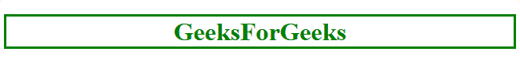
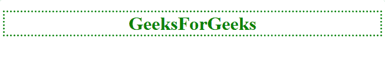
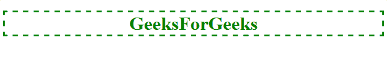
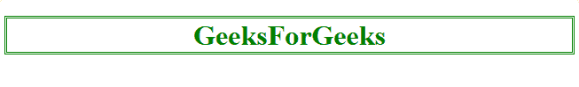
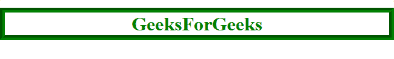
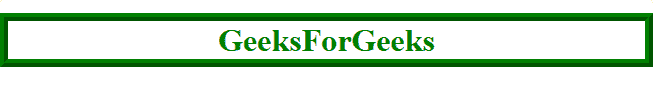
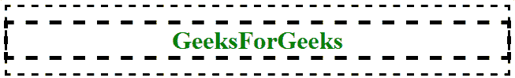

# CSS 轮廓样式属性（outline-style）

> 原文：[https://www.geeksforgeeks.org/css-outline-style-property/](https://www.geeksforgeeks.org/css-outline-style-property/)

CSS 中的 `outline-style` 属性用于设置元素轮廓的外观。元素的轮廓和边框相似，但不相同。轮廓不占用空间，并且绘制在元素的边框之外。此外，默认情况下，轮廓是围绕元素的所有四个边绘制的，无法更改这一点。

**语法：**

```html
outline-style: auto|none|dotted|dashed|solid|double|groove|ridge|inset|outset|initial|inherit;
```

**属性值：**

*   **auto：** 通过浏览器设置元素的轮廓。

**语法：**

```html
outline-style: auto;
```

**示例：**

```html
<!DOCTYPE html>
<html>
    <head>
        <title>
            CSS outline-style property
        </title>
        <!-- Internal CSS Style Sheet -->
        <style>
            h1 {
                color: green;
                text-align: center;
                /* CSS Property for outline-style */
                outline-style: auto;
            }
        </style>
    </head>
    <body>
        <!-- outline-style: auto;-->
        <h1>GeeksForGeeks</h1>
    </body>
</html>
```

**输出：**


*   **none：** 这是默认值，它将轮廓宽度设置为零，因此不可见。

**语法：**

```html
outline-style: none;
```

**示例：**

```html
<!DOCTYPE html>
<html>
    <head>
        <title>
            CSS outline-style property
        </title>
        <!-- Internal CSS Style Sheet -->
        <style>
            h1 {
                color: green;
                text-align: center;
                /* CSS Property for outline-style */
                outline-style: none;
            }
        </style>
    </head>
    <body>
        <!-- outline-style: none;-->
        <h1>GeeksForGeeks</h1>
    </body>
</html>
```

**输出：**


*   **dotted：** 用于将一系列点设置为元素周围的轮廓。

**语法：**

```html
outline-style: dotted;
```

**示例：**

```html
<!DOCTYPE html>
<html>
    <head>
        <title>
            CSS outline-style property
        </title>
        <!-- Internal CSS Style Sheet -->
        <style>
            h1 {
                color: green;
                text-align: center;
                /* CSS Property for outline-style */
                outline-style: dotted;
            }
        </style>
    </head>
    <body>
        <!-- outline-style: dotted;-->
        <h1>GeeksForGeeks</h1>
    </body>
</html>
```

**输出：**


*   **dashed：** 用于将一系列虚线线段设置为元素周围的轮廓。

**语法：**

```html
outline-style: dashed;
```

**示例：**

```html
<!DOCTYPE html>
<html>
    <head>
        <title>
            CSS outline-style property
        </title>
        <!-- Internal CSS Style Sheet -->
        <style>
            h1 {
                color: green;
                text-align: center;
                /* CSS Property for outline-style */
                outline-style: dashed;
            }
        </style>
    </head>
    <body>
        <!-- outline-style: dashed;-->
        <h1>GeeksForGeeks</h1>
    </body>
</html>
```

**输出：**


*   **solid：** 用于将实线线段设置为元素周围的轮廓。

**语法：**

```html
outline-style: solid;
```

**示例：**

```html
<!DOCTYPE html>
<html>
    <head>
        <title>CSS outline-style property</title>
        <!-- Internal CSS Style Sheet -->
        <style>
            h1 {
                color: green;
                text-align: center;
                /* CSS Property for outline-style */
                outline-style: solid;
            }
        </style>
    </head>
```

# CSS outline-style 属性

`outline-style` 属性用于设置元素轮廓的样式。

## 属性值

### double
`double` 值在元素周围设置双线段作为轮廓。轮廓的宽度等于各个线段宽度与它们之间空隙的总和。

**语法:**
```html
outline-style: double;
```

**示例:**
```html
<!DOCTYPE html>
<html>
  <head>
    <title>CSS outline-style property</title>
    <!-- Internal CSS Style Sheet -->
    <style>
      h1{
        color: green;
        text-align: center;
        /* CSS Property for outline-style */
        outline-style: double;
      }
    </style>
  </head>
  <body>
    <!-- outline-style: double;-->
    <h1>GeeksForGeeks</h1>
  </body>
</html>
```

**输出:**


### groove
`groove` 值在元素周围设置凹槽状的线段作为轮廓，使其具有雕刻感。

**语法:**
```html
outline-style: groove;
```

**示例:**
```html
<!DOCTYPE html>
<html>
  <head>
    <title>CSS outline-style property</title>
    <!-- Internal CSS Style Sheet -->
    <style>
      h1 {
        color: green;
        text-align: center;
        outline-width: 8px;
        /* CSS Property for outline-style */
        outline-style: groove;
      }
    </style>
  </head>
  <body>
    <!-- outline-style: groove;-->
    <h1>GeeksForGeeks</h1>
  </body>
</html>
```

**输出:**


### ridge
`ridge` 值在元素周围设置脊状的线段作为轮廓，使其具有凸起感。它与 `groove` 效果相反。

**语法:**
```html
outline-style: ridge;
```

**示例:**
```html
<!DOCTYPE html>
<html>
  <head>
    <title>CSS outline-style property</title>
    <!-- Internal CSS Style Sheet -->
    <style>
      h1 {
        color: green;
        text-align: center;
        outline-width: 8px;
        /* CSS Property for outline-style */
        outline-style: ridge;
      }
    </style>
  </head>
  <body>
    <!-- outline-style: ridge;-->
    <h1>GeeksForGeeks</h1>
  </body>
</html>
```

**输出:**


### inset
`inset` 值在元素周围设置内嵌的线段作为轮廓，使其具有固定在显示区域内的感觉。

**语法:**
```html
outline-style: inset;
```

**示例:**
```html
<!DOCTYPE html>
<html>
  <head>
    <title>CSS outline-style property</title>
    <!-- Internal CSS Style Sheet -->
    <style>
      h1 {
        color: green;
        text-align: center;
        outline-width: 8px;
        /* CSS Property for outline-style */
        outline-style: inset;
      }
    </style>
  </head>
  <body>
    <!-- outline-style: inset;-->
    <h1>GeeksForGeeks</h1>
  </body>
</html>
```

**输出:**


### outset
`outset` 值在元素周围设置看起来向外突出的线段作为轮廓。它与 `inset` 效果相反。

**语法:**
```html
outline-style: outset;
```

**示例:**
```html
<!DOCTYPE html>
<html>
  <head>
    <title>CSS outline-style property</title>
    <!-- Internal CSS Style Sheet -->
    <style>
      h1 {
        color: green;
        text-align: center;
        outline-width: 8px;
        /* CSS Property for outline-style */
        outline-style: outset;
      }
    </style>
  </head>
  <body>
    <!-- outline-style: outset;-->
    <h1>GeeksForGeeks</h1>
  </body>
</html>
```

**输出:**


### initial
`initial` 值用于将 `outline-style` 属性设置为其默认值。它将轮廓宽度设置为零，因此轮廓不可见。

**语法:**
```html
outline-style: initial;
```

**示例:**
```html
<!DOCTYPE html>
<html>
  <head>
    <title>CSS outline-style property</title>
    <!-- Internal CSS Style Sheet -->
    <style>
      h1 {
        color: green;
        text-align: center;
        outline-width: 5px;
        outline-color: black;
        /* CSS Property for outline-style */
        outline-style: initial;
      }
    </style>
  </head>
  <body>
    <!-- outline-style: initial;-->
    <h1>GeeksForGeeks</h1>
  </body>
</html>
```

**输出:**


### inherit
`inherit` 值使 `outline-style` 属性从其父元素继承。

**语法:**
```html
outline-style: inherit;
```

**示例:**
```html
<!DOCTYPE html>
<html>
  <head>
    <title>CSS outline-style property</title>
    <!-- Internal CSS Style Sheet -->
    <style>
      * {
        padding: 1px;
      }
      body {
        outline-style: dashed;
      }
      h1 {
        color: green;
        text-align: center;
        outline-width: 5px;
        outline-color: black;
        /* CSS Property for outline-style */
        outline-style: inherit;
      }
    </style>
  </head>
  <body>
    <!-- outline-style: inherit;-->
    <h1>GeeksForGeeks</h1>
  </body>
</html>
```

**输出:**


## 支持的浏览器
`outline-style` 属性支持的浏览器如下：
*   Google Chrome 1.0
*   Internet Explorer 8
*   Firefox 1.5
*   Opera 7.0
*   Safari 1.2