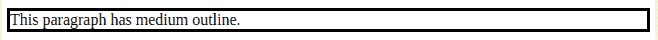
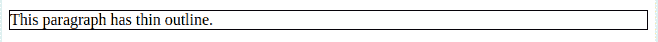
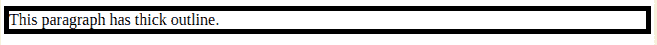
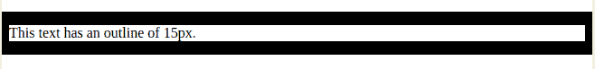
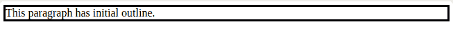
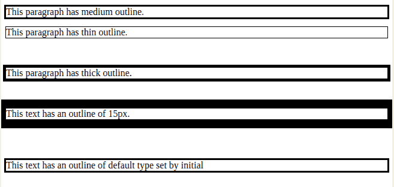

# CSS | 轮廓宽度属性

> 原文: [https://www.geeksforgeeks.org/css-outline-width-property/](https://www.geeksforgeeks.org/css-outline-width-property/)

轮廓是在元素边框之外的指定元素周围创建的线条，以使特定的元素更加独特和易于区分。

**轮廓宽度**属性用于指定特定元素的轮廓宽度。

在所需元素上使用轮廓宽度属性之前，必须声明或使用`outline-style`属性。从逻辑上讲，一个元素必须有一个轮廓来定义宽度或设计宽度的样式。

元素的轮廓显示在元素的边距周围，与边框属性不同。由于轮廓不是元素尺寸的一部分，因此元素的`width`和`height`属性不包含轮廓的宽度。

## 语法

```html
outline-width: medium|thin|thick|length|initial|inherit;
```

## 属性值

### `medium`
此值将轮廓宽度设置为默认值。轮廓的宽度比设置为`thick`的轮廓细，比设置为`thin`的轮廓粗。

```html
outline-width: medium;
```

```html
<html>
   <head>
      <title>
         CSS | outline-width Property
      </title>
   </head>
<body>
      <p style = "outline-width:medium;
                  outline-style:solid;">
         This paragraph has medium outline.
      </p>
   </body>
</html>
```

**输出:**


### `thin`
此值将轮廓宽度设置为细，实现的轮廓比宽度设置为`medium`和`thick`的轮廓更细。

```html
outline-width: thin;
```

```html
<html>
   <head>
      <title>
         CSS | outline-width Property
      </title>
   </head>
<body>
      <p style = "outline-width:thin; 
                  outline-style:solid;">
         This paragraph has thin outline.
      </p>
   </body>
</html>
```

**输出:**


### `thick`
此值将轮廓宽度设置为粗，实现的轮廓比宽度设置为`medium`和`thin`的轮廓更粗。

```html
outline-width: thick;
```

```html
<!DOCTYPE html>
<html>
   <head>
      <title>
         CSS | outline-width Property
      </title>
   </head>
<body>
      <p style = "outline-width:thick; 
                  outline-style:solid;">
         This paragraph has thick outline.
      </p>
   </body>
</html>
```

**输出:**


### `length`
此值用于定义轮廓的粗细。

```html
outline-width: 15px;
```

```html
<!DOCTYPE html>
<html>
   <head>
      <title>
         CSS | outline-width Property
      </title>
   </head>
<body>
      <p style = "outline-width:15px; 
                  outline-style:solid;">
         This paragraph has 15px outline.
      </p>
   </body>
</html>
```

**输出:**


### `initial`
此值将`outline-width`设置为其默认值。

```html
outline-width: initial;
```

```html
<html>
   <head>
      <title>
         CSS | outline-width Property
      </title>
   </head>
<body>
      <p style = "outline-width:initial; 
                  outline-style:solid;">
         This paragraph has initial outline.
      </p>
   </body>
</html>
```

**输出:**


### `inherit`
此值继承父元素的`outline-width`属性规范。

```html
outline-width: inherit;
```

```html
<!DOCTYPE html>
<html>
<head>
    <title>
        CSS | outline-width Property
    </title>
</head>
<body>
    <p style = "outline-width:medium; 
                 outline-style:solid;">
        This paragraph has medium outline.
    </p>
    <p style = "outline-width:thin; 
                 outline-style:solid;">
        This paragraph has thin outline.
    </p>
    <br>
    <p style = "outline-width:thick; 
                 outline-style:solid;">
        This paragraph has thick outline.
    </p>
    <br>
    <p style = "outline-width:15px; 
                 outline-style:solid;">
        This text has an outline of 15px.
    </p>
    <br><br> 
    <p style = "outline-width:initial; 
                 outline-style:solid;">
        This text has an outline of default
        type set by initial
    </p>
</body>
</html>
```



## 支持的浏览器
CSS | 轮廓宽度属性支持的浏览器如下:

*   谷歌 Chrome 1.0
*   Internet Explorer 8.0
*   Firefox 1.5
*   Opera 7.0
*   Safari 1.2