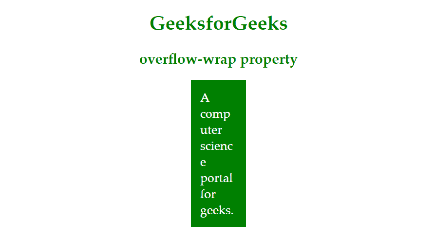

# CSS `overflow-wrap` 属性

> 原文：`https://www.geeksforgeeks.org/css-overflow-wrap-property/`

CSS 中的 `overflow-wrap` 属性用于指定浏览器可以在任何目标元素中换行，以防止原始字符串太长而无法容纳时溢出。这个属性在早期被称为 `word-wrap`，它仍然被一些浏览器支持，但是在 CSS3 草案中被重命名为 `overflow-wrap`。

**语法：**

```css
.box{
    overflow-wrap: break-word;
}
```

**值：**

*   `normal`：线路会按照原来的断线规则断线。
*   `break-word`：太长而无法容纳在容器元素中的单词会被分成几部分。
*   `inherit`：它允许元素从其父元素继承值。
*   `initial`：使属性使用默认值。

**示例：**

```html
<!DOCTYPE html>
<html>
<head>
    <title>
        CSS overflow-wrap property
    </title>
    <style>
        p {
            color: green;
        }

        .gfg {
            margin: auto;
            padding: 15px 15px;
            color: white;
            background-color: green;
            font-size: 20px;
            width: 60px;
            overflow-wrap: break-word;
        }

        div {
            text-align: justify;
        }

        h1,
        h2 {
            color: green;
        }

        h1,
        h2 {
            text-align: center;
        }
    </style>
</head>
<body>
    <h1>GeeksforGeeks</h1>
    <h2>overflow-wrap property</h2>
    <div class="gfg">
        A computer science portal for geeks.
    </div>
</body>
</html>
```

**输出：**

