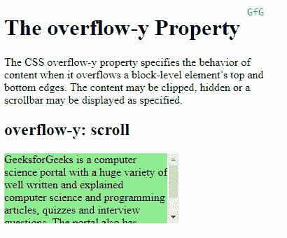
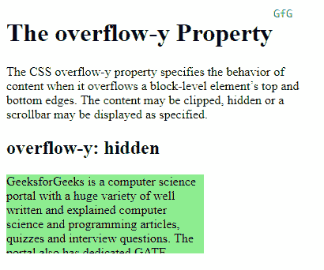
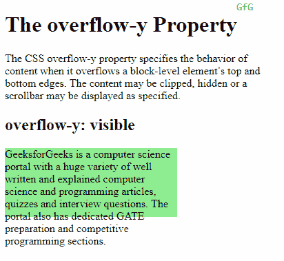
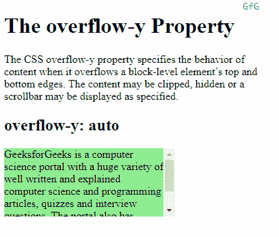

# CSS 溢出-y 属性

> 原文:[https://www.geeksforgeeks.org/css-overflow-y-property/](https://www.geeksforgeeks.org/css-overflow-y-property/)

CSS 的 `overflow-y` 属性指定内容溢出块级元素的上下边缘时的行为。基于分配给 `overflow-y` 属性的值，内容可以被剪切、隐藏或相应地显示滚动条。

## 语法:

```html
overflow-y: scroll | hidden | visible | auto
```

## 属性值:

*   **Scroll:** 如果分配给属性的值是 `scroll`，那么内容会被裁剪以适应元素，浏览器会显示一个滚动条来帮助滚动溢出的内容。无论内容是否被裁剪，都会添加滚动条。

## 示例:

```html
<!DOCTYPE html>
<html>
<head>
    <title>
        CSS overflow-y Property
    </title>
    <style>
        .content {
            background-color: lightgreen;
            height: 100px;
            width: 250px;
            overflow-y: scroll;
        }
    </style>
</head>
<body>
    <h1>The overflow-y Property</h1>
    <!-- Below paragraph doesnot have a fixed width
         or height and has no overflow set. So, it
         will just take up the complete width of
         it's parent to fit the content -->
    <p>
        The CSS overflow-y property specifies the
        behavior of content when it overflows a
        block-level element’s top and bottom edges.
        The content may be clipped, hidden or a
        scrollbar may be displayed as specified.
    </p>
    <h2>overflow-y: scroll</h2>
    <!-- Below div element has fixed height and
         width and thus overflow may occur. -->
    <div class="content">
        GeeksforGeeks is a computer science portal
        with a huge variety of well written and
        explained computer science and programming
        articles,quizzes and interview questions.
        The portal also has dedicated GATE preparation
        and competitive  programming sections.
    </div>
</body>
</html>
```

**输出** :


*   **Hidden:** 将 `hidden` 作为值分配给属性时，内容会被裁剪以适应元素。不提供滚动条，内容被隐藏。

## 示例:

```html
<!DOCTYPE html>
<html>
<head>
    <title>
        CSS overflow-y Property
    </title>
    <style>
        .content {
            background-color: lightgreen;
            height: 100px;
            width: 250px;
            overflow-y: hidden;
        }
    </style>
</head>
<body>
    <h1>The overflow-y Property</h1>
    <!-- Below paragraph doesnot have a fixed width
         or height and has no overflow set. So, it
         will just take up the complete width of
         it's parent to fit the content -->
    <p>
        The CSS overflow-y property specifies the
        behavior of content when it overflows a
        block-level element’s top and bottom edges.
        The content may be clipped, hidden or a
        scrollbar may be displayed as specified.
    </p>
    <h2>overflow-y: scroll</h2>
    <!-- Below div element has fixed height and
         width and thus overflow may occur. -->
    <div class="content">
        GeeksforGeeks is a computer science portal
        with a huge variety of well written and
        explained computer science and programming
        articles,quizzes and interview questions.
        The portal also has dedicated GATE preparation
        and competitive  programming sections.
    </div>
</body>
</html>
```

**输出** :


*   **Visible:** 如果分配给 `overflow-y` 属性的值是 `visible`，那么内容不会被裁剪，并可能溢出到包含元素的顶部或底部之外。

## 示例:

```html
<!DOCTYPE html>
<html>
<head>
    <title>
        CSS overflow-y Property
    </title>
    <style>
        .content {
            background-color: lightgreen;
            height: 100px;
            width: 250px;
            overflow-y: visible;
        }
    </style>
</head>
<body>
    <h1>The overflow-y Property</h1>
    <!-- Below paragraph doesnot have a fixed width
         or height and has no overflow set. So, it
         will just take up the complete width of
         it's parent to fit the content -->
    <p>
        The CSS overflow-y property specifies the
        behavior of content when it overflows a
        block-level element’s top and bottom edges.
        The content may be clipped, hidden or a
        scrollbar may be displayed as specified.
    </p>
    <h2>overflow-y: scroll</h2>
    <!-- Below div element has fixed height and
         width and thus overflow may occur. -->
    <div class="content">
        GeeksforGeeks is a computer science portal
        with a huge variety of well written and
        explained computer science and programming
        articles,quizzes and interview questions.
        The portal also has dedicated GATE preparation
        and competitive  programming sections.
    </div>
</body>
</html>
```

**输出** :


*   **Auto:** `auto` 的行为取决于内容，仅在内容溢出时才添加滚动条，这与 `scroll` 值不同，后者无论是否溢出都会添加滚动条。

## 示例:

```html
<!DOCTYPE html>
<html>
<head>
    <title>
        CSS overflow-y Property
    </title>
    <style>
        .content {
            background-color: lightgreen;
            height: 100px;
            width: 250px;
            overflow-y: auto;
        }
    </style>
</head>
<body>
    <h1>The overflow-y Property</h1>
    <!-- Below paragraph doesnot have a fixed width
         or height and has no overflow set. So, it
         will just take up the complete width of
         it's parent to fit the content -->
    <p>
        The CSS overflow-y property specifies the
        behavior of content when it overflows a
        block-level element’s top and bottom edges.
        The content may be clipped, hidden or a
        scrollbar may be displayed as specified.
    </p>
    <h2>overflow-y: scroll</h2>
    <!-- Below div element has fixed height and
         width and thus overflow may occur. -->
    <div class="content">
        GeeksforGeeks is a computer science portal
        with a huge variety of well written and
        explained computer science and programming
        articles,quizzes and interview questions.
        The portal also has dedicated GATE preparation
        and competitive  programming sections.
    </div>
</body>
</html>
```

**输出** :


## 支持的浏览器:

`overflow-y` 属性支持的浏览器如下:

*   铬
*   微软公司出品的 web 浏览器
*   火狐浏览器
*   歌剧
*   旅行队