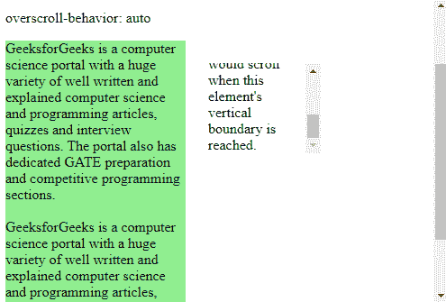
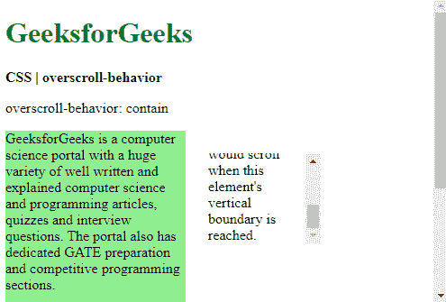
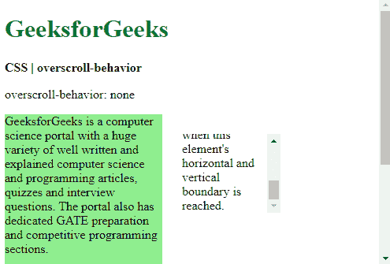
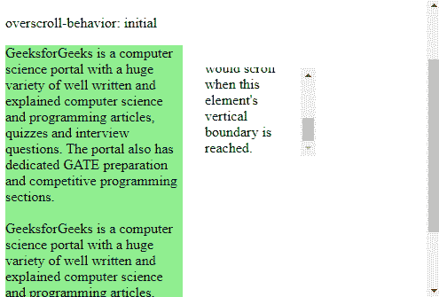

# CSS | overscroll-behavior 属性

> 原文: [https://www.geeksforgeeks.org/css-overscroll-behavior-property/](https://www.geeksforgeeks.org/css-overscroll-behavior-property/)

`overscroll-behavior` 属性用于设置到达滚动区域边界时浏览器的行为。此属性可用于防止在有多个滚动区域的页面中出现不必要的滚动。这是 `overscroll-behavior-x` 和 `overscroll-behavior-y` 属性的简写。

## 语法

```html
overscroll-behavior: auto | contain | none | initial | inherit
```

## 属性值

### auto
用于将滚动行为设置为默认值。即使到达元素的边界，整个页面连同元素也会滚动。这是默认值。

**示例:**

```html
<!DOCTYPE html>
<html>
<head>
  <title>
    CSS | overscroll-behavior
  </title>
  <style>
    .container {
      display: flex;
    }

    .main-content {
      width: 200px;
      background-color: lightgreen;
    }

    .smaller-box {
      overscroll-behavior: auto;
      height: 100px;
      width: 125px;
      margin: 25px;
      overflow-y: scroll;
    }
  </style>
</head>
<body>
  <h1 style="color: green">
    GeeksforGeeks
  </h1>
  <b>CSS | overscroll-behavior</b>
  <p>overscroll-behavior: auto</p>
  <div class="container">
    <div class="main-content">
      GeeksforGeeks is a computer science
      portal with a huge variety of well
      written and explained computer science
      and programming articles, quizzes and
      interview questions. The portal also
      has dedicated GATE preparation and
      competitive programming sections.<br><br>
      GeeksforGeeks is a computer science
      portal with a huge variety of well
      written and explained computer science
      and programming articles, quizzes and
      interview questions. The portal also
      has dedicated GATE preparation and
      competitive programming sections.
    </div>
    <div class="smaller-box">
      This is a smaller element that is also
      scrollable. The overscroll behavior
      can be used to control if the main
      content behind would scroll when this
      element's vertical boundary is reached.
    </div>
  </div>
</body>
</html>
```

**输出:** 向下滚动较小的元素


### contain
用于仅在使用的元素上设置默认滚动行为。在元素到达边界后进一步滚动不会滚动其后面的元素。相邻滚动区域不会发生滚动链。

**示例:**

```html
<!DOCTYPE html>
<html>
<head>
  <title>
    CSS | overscroll-behavior
  </title>
  <style>
    .container {
      display: flex;
    }

    .main-content {
      width: 200px;
      background-color: lightgreen;
    }

    .smaller-box {
      overscroll-behavior: contain;
      height: 100px;
      width: 125px;
      margin: 25px;
      overflow-y: scroll;
    }
  </style>
</head>
<body>
  <h1 style="color: green">
    GeeksforGeeks
  </h1>
  <b>CSS | overscroll-behavior</b>
  <p>overscroll-behavior: contain</p>
  <div class="container">
    <div class="main-content">
      GeeksforGeeks is a computer science
      portal with a huge variety of well
      written and explained computer science
      and programming articles, quizzes and
      interview questions. The portal also
      has dedicated GATE preparation and
      competitive programming sections.<br><br>
      GeeksforGeeks is a computer science
      portal with a huge variety of well
      written and explained computer science
      and programming articles, quizzes and
      interview questions. The portal also
      has dedicated GATE preparation and
      competitive programming sections.
    </div>
    <div class="smaller-box">
      This is a smaller element that is also
      scrollable. The overscroll behavior
      can be used to control if the main
      content behind would scroll when this
      element's vertical boundary is reached.
    </div>
  </div>
</body>
</html>
```

**输出:** 向下滚动较小的元素


### none
用于防止所有元素上的滚动链。默认的滚动溢出行为也会被阻止。

**示例:**

```html
<!DOCTYPE html>
<html>
<head>
  <title>
    CSS | overscroll-behavior
  </title>
  <style>
    .container {
      display: flex;
    }

    .main-content {
      width: 200px;
      background-color: lightgreen;
    }

    .smaller-box {
      overscroll-behavior: none;
      height: 100px;
      width: 125px;
      margin: 25px;
      overflow-y: scroll;
    }
  </style>
</head>
<body>
  <h1 style="color: green">
    GeeksforGeeks
  </h1>
  <b>CSS | overscroll-behavior</b>
  <p>overscroll-behavior: none</p>
  <div class="container">
    <div class="main-content">
      GeeksforGeeks is a computer science
      portal with a huge variety of well
      written and explained computer science
      and programming articles, quizzes and
      interview questions. The portal also
      has dedicated GATE preparation and
      competitive programming sections.<br><br>
      GeeksforGeeks is a computer science
      portal with a huge variety of well
      written and explained computer science
      and programming articles, quizzes and
      interview questions. The portal also
      has dedicated GATE preparation and
      competitive programming sections.
    </div>
    <div class="smaller-box">
      This is a smaller element that is also
      scrollable. The overscroll behavior
      can be used to control if the main
      content behind would scroll when this
      element's vertical boundary is reached.
    </div>
  </div>
</body>
</html>
```

**输出:** 向下滚动较小的元素


### initial
用于将 `overscroll-behavior` 设置为其默认值。

**示例:**

```html
<!DOCTYPE html>
<html>
<head>
  <title>
    CSS | overscroll-behavior
  </title>
  <style>
    .container {
      display: flex;
    }

    .main-content {
      width: 200px;
      background-color: lightgreen;
    }

    .smaller-box {
      overscroll-behavior: initial;
      height: 100px;
      width: 125px;
      margin: 25px;
      overflow-y: scroll;
    }
  </style>
</head>
<body>
  <h1 style="color: green">
    GeeksforGeeks
  </h1>
  <b>CSS | overscroll-behavior</b>
  <p>overscroll-behavior: initial</p>
  <div class="container">
    <div class="main-content">
      GeeksforGeeks is a computer science
      portal with a huge variety of well
      written and explained computer science
      and programming articles, quizzes and
      interview questions. The portal also
      has dedicated GATE preparation and
      competitive programming sections.<br><br>
      GeeksforGeeks is a computer science
      portal with a huge variety of well
      written and explained computer science
      and programming articles, quizzes and
      interview questions. The portal also
      has dedicated GATE preparation and
      competitive programming sections.
    </div>
    <div class="smaller-box">
      This is a smaller element that is also
      scrollable. The overscroll behavior
      can be used to control if the main
      content behind would scroll when this
      element's vertical boundary is reached.
    </div>
  </div>
</body>
</html>
```

**输出:** 向下滚动较小的元素


### inherit
用于从其父元素继承 `overscroll-behavior` 属性的值。

```html
height: 100px;
      width: 125px;
      margin: 25px;
      overflow-y: scroll;
    }
  </style>
</head>
<body>
  <h1 style="color: green">
    GeeksforGeeks
  </h1>
  <b>CSS | overscroll-behavior</b>
  <p>overscroll-behavior: initial</p>
  <div class="container">
    <div class="main-content">
      GeeksforGeeks is a computer science
      portal with a huge variety of well
      written and explained computer science
      and programming articles, quizzes and
      interview questions. The portal also
      has dedicated GATE preparation and
      competitive programming sections.<br><br>
      GeeksforGeeks is a computer science
      portal with a huge variety of well
      written and explained computer science
      and programming articles, quizzes and
      interview questions. The portal also
      has dedicated GATE preparation and
      competitive programming sections.
    </div>
    <div class="smaller-box">
      This is a smaller element that is also
      scrollable. The overscroll behavior
      can be used to control if the main
      content behind would scroll when this
      element's vertical boundary is reached.
    </div>
  </div>
</body>
</html>
```

# GeeksforGeeks

## CSS | overscroll-behavior

`overscroll-behavior: initial`

**输出:**向下滚动较小的元素


*   **继承:**用于设置从父级继承的滚动行为。

**支持的浏览器:**由`overscroll-behavior`属性支持的浏览器如下:

*   `Chrome 63.0`
*   `Firefox 59.0`
*   `Edge 18.0`
*   `Opera 50.0`