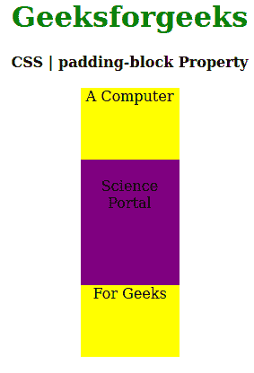
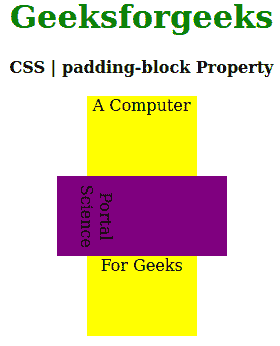

# CSS `padding-block` 属性

> 原文：[https://www.geeksforgeeks.org/css-padding-block-property/](https://www.geeksforgeeks.org/css-padding-block-property/)

CSS 中的 `padding-block` 属性用于定义元素的逻辑块开始和结束填充。此属性有助于根据元素的书写模式、方向和文本方向放置填充。

## 语法

```html
padding-block: length|percentage|auto|inherit|initial|unset;
```

## 属性值

*   `length`：设置 `px`、`cm`、`pt` 等定义的固定值。也允许负值。它的默认值是 `0px`。
*   `percentage`：它与长度相同，但它根据窗口大小的百分比设置填充块大小。
*   `auto`：当希望浏览器确定填充块大小时使用。
*   `initial`：用于将 `padding-block` 属性的值设置为默认值。
*   `inherit`：当希望元素从其父元素继承 `padding-block` 属性时使用。
*   `unset`：用于取消设置默认 `padding-block` 属性值。

下面的例子说明了 CSS 中的 `padding-block` 属性。

## 例 1

```html
<!DOCTYPE html>
<html>

<head>
    <title>CSS | padding-block Property</title>
    <style>
        h1 {
            color: green;
        }

        div {
            background-color: yellow;
            width: 110px;
            height: 80px;
        }
        .two {
            padding-block: 20px 40px;
            background-color: purple;
        }
    </style>
</head>

<body>
    <center>
        <h1>Geeksforgeeks</h1>
        <b>CSS | padding-block Property</b>
        <br><br>
        <div class="one">A Computer</div>
        <div class="two">Science Portal</div>
        <div class="three">For Geeks</div>
    </center>
</body>

</html>
```

**输出：**


## 例 2

```html
<!DOCTYPE html>
<html>

<head>
    <title>CSS | padding-block Property</title>
    <style>
        h1 {
            color: green;
        }

        div {
            background-color: yellow;
            width: 110px;
            height: 80px;
        }
        .two {
            padding-block: 20px 40px;
            writing-mode: vertical-lr;
            background-color: purple;
        }
    </style>
</head>

<body>
    <center>
        <h1>Geeksforgeeks</h1>
        <b>CSS | padding-block Property</b>
        <br><br>
        <div class="one">A Computer</div>
        <div class="two">Science Portal</div>
        <div class="three">For Geeks</div>
    </center>
</body>

</html>
```

**输出：**


## 支持的浏览器

`padding-block` 属性支持的浏览器如下：

*   火狐浏览器
*   谷歌 Chrome
*   边缘
*   歌剧

## 参考

[T2](T2)