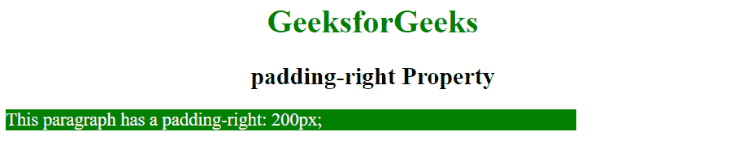
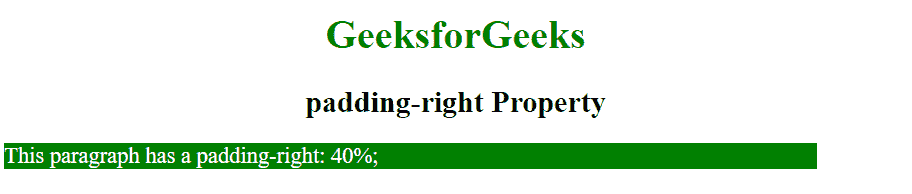
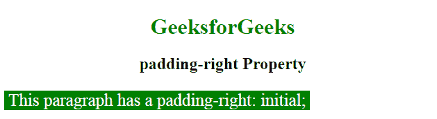

# CSS `padding-right` 属性

> 原文: [https://www.geeksforgeeks.org/css-padding-right-property/](https://www.geeksforgeeks.org/css-padding-right-property/)

填充是其内容和边框之间的空间。CSS 中的 `padding-right` 属性用于设置元素右侧填充区域的宽度。

**语法:**

```html
padding-right: length | percentage | initial | inherit;
```

**属性值:**

*   **`length`**: 此值用于将填充的大小指定为固定值。默认值为 `0`。它必须是非负的。
    **语法:**

    ```html
    padding-right: length;
    ```

    **示例:**

    ### HTML 示例

    ```html
    <!DOCTYPE html>
    <html>
        <head>
            <title>
                padding-right Property
            </title>
            <style>
                .geek {
                    padding-right: 200px;
                    color: white;
                    background: green;
                    width:50%;
                    font-size:18px;
                }
            </style>
        </head>
        <body style = "text-align:center">
            <h1 style = "color: green;">
                GeeksforGeeks
            </h1>
            <h2>
                padding-right Property
            </h2>
            <!-- padding-right property used here -->
            <p class = "geek">
                This paragraph has a padding-right: 200px;
            </p>
        </body>
    </html>
    ```

    **输出:**

    

*   **`percentage`**: 该值用于设置元素宽度的右填充百分比。它必须是非负的。
    **语法:**

    ```html
    padding-right: percentage;
    ```

    **示例:**

    ### HTML 示例

    ```html
    <!DOCTYPE html>
    <html>
        <head>
            <title>
                padding-right Property
            </title>
            <style>
                .geek {
                    padding-right: 40%;
                    color: white;
                    background: green;
                    width:50%;
                    font-size:18px;
                }
            </style>
        </head>
        <body style = "text-align:center">
            <h1 style = "color: green;">
                GeeksforGeeks
            </h1>
            <h2>
                padding-right Property
            </h2>
            <!-- padding-right property used here -->
            <p class = "geek">
                This paragraph has a padding-right: 40%;
            </p>
        </body>
    </html>
    ```

    **输出:**

    

*   **`initial`**: 该值用于将属性设置为其默认值。
    **语法:**

    ```html
    padding-right: initial;
    ```

    **示例:**

    ### HTML 示例

    ```html
    <!DOCTYPE html>
    <html>
        <head>
            <title>
                padding-right Property
            </title>
            <style>
                .geek {
                    padding-right: initial;
                    color: white;
                    background: green;
                    width:70%;
                    font-size:25px;
                }
            </style>
        </head>
        <body style = "text-align:center">
            <h1 style = "color: green;">
                GeeksforGeeks
            </h1>
            <h2>
                padding-right Property
            </h2>
            <!-- padding-right property used here -->
            <p class = "geek">
                This paragraph has a padding-right: initial;
            </p>
        </body>
    </html>
    ```

    **输出:**

    

**支持的浏览器:** 由 `padding-right` 属性支持的浏览器如下:

*   Google Chrome 1.0
*   Internet Explorer 4.0
*   Firefox 1.0
*   Opera 3.5
*   Safari 1.0