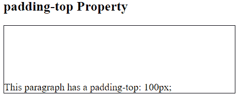
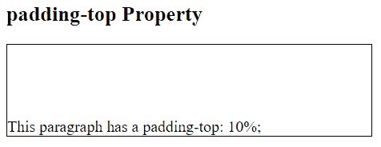
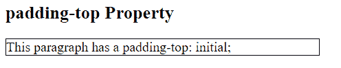

# CSS `padding-top` 属性

> 原文: [https://www.geeksforgeeks.org/css-padding-top-property/](https://www.geeksforgeeks.org/css-padding-top-property/)

填充是其内容和边框之间的空间。CSS 中的 `padding-top` 属性用于设置元素顶部填充区域的宽度。

## 语法

```html
padding-top: length|percentage|initial|inherit;
```

## 属性值

### `length`
此模式用于将填充大小指定为固定值。大小可以以 `px`、`cm` 等形式设置。默认值为 `0`。它必须是非负的。

**语法:**
```html
padding-top: length;
```

**示例:**
```html
<!DOCTYPE html>
<html>
    <head>
        <title>
            padding-top Property
        </title>
        <style>
            .geek {
                padding-top: 100px;
                width:50%;
                font-size:18px;
                border: 1px solid black;
            }
        </style>
    </head>
    <body>
        <h2>
            padding-top Property
        </h2>
        <!-- padding property used here -->
        <p class = "geek">
            This paragraph has a padding-top: 100px;
        </p>
    </body>
</html>
```

**输出:**


### `percentage`
此模式用于将顶部填充设置为元素宽度的百分比。它必须是非负的。

**语法:**
```html
padding-top: percentage (%)
```

**示例:**
```html
<!DOCTYPE html>
<html>
    <head>
        <title>
            padding-top Property
        </title>
        <style>
            .geek {
                padding-top: 10%;
                width:50%;
                font-size:18px;
                border: 1px solid black;
            }
        </style>
    </head>
    <body>
        <h2>
            padding-top Property
        </h2>
        <!-- padding property used here -->
        <p class = "geek">
            This paragraph has a padding-top: 10%;
        </p>
    </body>
</html>
```

**输出:**


### `initial`
用于将 `padding-top` 属性设置为其默认值。

**语法:**
```html
padding-top: initial;
```

**示例:**
```html
<!DOCTYPE html>
<html>
    <head>
        <title>
            padding-top Property
        </title>
        <style>
            .geek {
                padding-top: initial;
                width:50%;
                font-size:18px;
                border: 1px solid black;
            }
        </style>
    </head>
    <body>
        <h2>
            padding-top Property
        </h2>
        <!-- padding property used here -->
        <p class = "geek">
            This paragraph has a padding-top: initial;
        </p>
    </body>
</html>
```

**输出:**


### `inherit`
用于从其父元素继承 `padding-top` 属性。

## 支持的浏览器
`padding-top` 属性支持的浏览器如下:

*   谷歌 Chrome 1.0
*   Internet Explorer 4.0
*   Firefox 1.0
*   Safari 1.0
*   歌剧 3.5