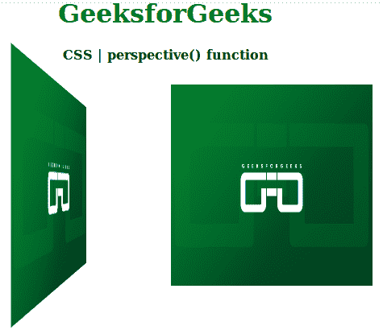

# CSS `perspective()` 函数

> 原文: [https://www.geeksforgeeks.org/css-perspective-function/](https://www.geeksforgeeks.org/css-perspective-function/)

`perspective()` 函数是 CSS 中的一个内置函数，与 `transform` 属性一起使用来设置图像的透视效果。

**语法:**

```html
perspective( length );
```

**参数:** 该函数接受单参数 `length`，用于保存透视等级的值。`length` 值表示从用户到 z=0 平面的距离。这是一个强制参数。

**返回值:** 在用户定义值的基础上使图像透视。

下面的例子说明了 CSS 中的 `perspective()` 函数:

## 示例

```html
<!DOCTYPE html>
<html>

<head>
    <title>
        CSS | perspective() function
    </title>

    <style>
        h1 {
            color: green;
        }
        .left {
            transform: perspective(400px) rotateY(70deg);
        }
    </style>
</head>

<body>
    <center>
        <h1>GeeksforGeeks</h1>

        <h4>CSS | perspective() function</h4>

        <div>
            

            
        </div>
    </center>
<body>

</html>
```

**输出:**



**支持的浏览器:** 以下是 `CSS | perspective()` 函数支持的浏览器:

*   `Google Chrome`
*   `Internet Explorer / Microsoft Edge`
*   `Mozilla Firefox`
*   `Safari`
*   `Opera`