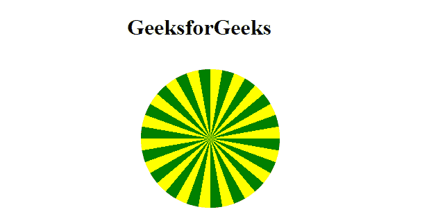

# CSS 重复-圆锥-渐变()函数

> 原文: [https://www.geeksforgeeks.org/css-repeating-conic-gradient-function/](https://www.geeksforgeeks.org/css-repeating-conic-gradient-function/)

`repeating-conic-gradient()`函数是 CSS 中的一个内置函数，用于在背景图像中重复圆锥梯度。

## 语法

> `background-image: repeating-conic-gradient(from angle, color-stop1, color-stop2, ...);`

## 参数

*   `angle`: 该参数以角度为值，定义顺时针方向的渐变旋转。
*   `color-stop1, color-stop2`: 此参数保存颜色值，后面分别是开始位置(以度为单位)和结束位置(以度为单位)。

## 示例

以下示例说明了 CSS 中的`repeating-conic-gradient()`函数。

### HTML

```html
<!DOCTYPE html>
<html>

<head>
    <style>
        .container {
            background-color: green;
            height: 200px;
            width: 200px;
            float: left;
            margin: 20px;
            border-radius: 50%;
        }

        .a {
            background-image:
                repeating-conic-gradient(
                    from 10deg,
                    green 0deg 10deg,
                    yellow 10deg 20deg
                );
        }
    </style>
</head>

<body>
    <h1>GeeksforGeeks</h1>
    <div class="container a"></div>
</body>

</html>
```

### 输出



重复锥形梯度

## 支持的浏览器

*   谷歌 Chrome 69.0 及以上版本
*   互联网浏览器: 不支持
*   Mozilla 83.0 及以上版本
*   Opera 56.0 及以上版本
*   Safari 12.1 及以上版本