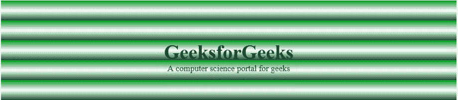
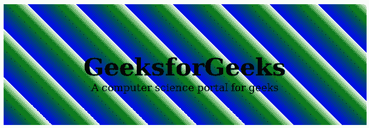

# CSS `repeating-linear-gradient()` 函数

> 原文：[https://www.geeksforgeeks.org/css-repeating-linear-gradient-function/](https://www.geeksforgeeks.org/css-repeating-linear-gradient-function/)

`repeating-linear-gradient()` 函数是 CSS 中的一个内置函数，用于重复线性渐变。

## 语法

```html
background-image: repeating-linear-gradient( angle | to side-or-corner, color-stop1, color-stop2, ...);
```

## 参数

该功能接受下列许多参数：

*   `angle`：此参数用于保持渐变的方向角度。它的值介于 0 到 360 度之间。默认情况下，其值为 180 度。
*   `side-or-corner`：此参数用于定义渐变线起点的位置。它由两个关键词组成：第一个表示水平边，`left` 或 `right`，第二个表示垂直边，`top` 或 `bottom`。顺序无关，每个关键字都是可选的。
*   `color-stop1`, `color-stop2`, ...：此参数用于保存颜色值及其可选停止位置。

以下示例说明了 CSS 中的 `repeating-linear-gradient()` 函数：

## 例 1

```html
<!DOCTYPE html>
<html>
    <head>
        <title>repeating-linear-gradient() Function</title>
        <style>
            #main {
                height: 200px;
                background-color: white;
                background-image: repeating-linear-gradient(#090,
                                        #fff 10%, #2a4f32 20%);
            }
            .gfg {
                text-align:center;
                font-size:40px;
                font-weight:bold;
                padding-top:80px;
            }
            .geeks {
                font-size:17px;
                text-align:center;
            }
        </style>
    </head>
    <body>
        <div id="main">
            <div class = "gfg">GeeksforGeeks</div>
            <div class = "geeks">A computer science portal for geeks</div>
        </div>
    </body>
</html>
```

**输出：**


## 例 2

```html
<!DOCTYPE html>
<html>
    <head>
        <title>repeating-linear-gradient() Function</title>
        <style>
            #main {
                height: 200px;
                background-color: white;
                background-image: repeating-linear-gradient(45deg,
                blue, green 7%, white 10%);
            }
            .gfg {
                text-align:center;
                font-size:40px;
                font-weight:bold;
                padding-top:80px;
            }
            .geeks {
                font-size:17px;
                text-align:center;
            }
        </style>
    </head>
    <body>
        <div id="main">
            <div class = "gfg">GeeksforGeeks</div>
            <div class = "geeks">A computer science portal for geeks</div>
        </div>
    </body>
</html>
```

**输出：**
