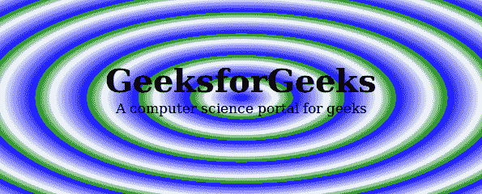

# CSS `repeating-radial-gradient()` 函数

> 原文: [https://www.geeksforgeeks.org/css-repeating-radial-gradient-function/](https://www.geeksforgeeks.org/css-repeating-radial-gradient-function/)

`repeating-radial-gradient()` 函数是 CSS 中的一个内置函数，用于创建重复的径向渐变。

## 语法

```css
background-image: repeating-radial-gradient(shape size at position, 
start-color, ..., last-color); 
```

## 参数

该函数接受多个参数，如下所示：

*   `shape`: 此参数用于定义渐变的形状。它有两个可能的值 `circle` 或 `ellipse`。默认形状值为 `ellipse`。
*   `size`: 此参数用于定义渐变的大小。可能的值有：`farthest-corner` (默认)、`closest-side`、`closest-corner`、`farthest-side`。
*   `position`: 此参数用于定义渐变的位置。默认值为 `center`。
*   `start-color, ..., last-color`: 此参数用于定义颜色值，后跟可选的停止位置。

以下示例说明 CSS 中的 `repeating-radial-gradient()` 函数：

## 示例 1

```html
<!DOCTYPE html>
<html>
    <head>
        <title>CSS Gradients</title>
        <style>
            #main {
                height: 250px;
                width: 600px;
                background-color: white;
                background-image: repeating-radial-gradient(blue,
                white 10%, green 15%)
            }
            .gfg {
                text-align:center;
                font-size:40px;
                font-weight:bold;
                padding-top:80px;
            }
            .geeks {
                font-size:17px;
                text-align:center;
            }
        </style>
    </head>
    <body>
        <div id="main">
            <div class = "gfg">GeeksforGeeks</div>
            <div class = "geeks">A computer science portal for geeks</div>
        </div>
    </body>
</html>
```

**输出:**



## 示例 2

```html
<!DOCTYPE html>
<html>
    <head>
        <title>CSS Gradients</title>
        <style>
            #main {
                height: 400px;
                width: 400px;
                background-color: white;
                background-image: repeating-radial-gradient(circle,
                blue, white 10%, green 15%)
            }
            .gfg {
                text-align:center;
                font-size:40px;
                font-weight:bold;
                padding-top:170px;
            }
            .geeks {
                font-size:17px;
                text-align:center;
            }
        </style>
    </head>
    <body>
        <div id="main">
            <div class = "gfg">GeeksforGeeks</div>
            <div class = "geeks">A computer science portal for geeks</div>
        </div>
    </body>
</html>
```

**输出:**


## 支持的浏览器

*   `Google Chrome`
*   `Internet Explorer`
*   `Firefox`
*   `Opera`
*   `Safari`