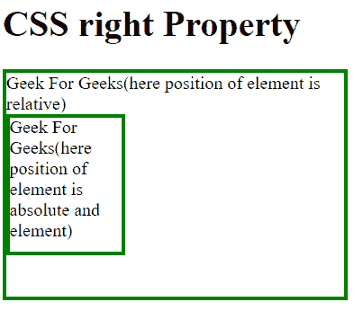
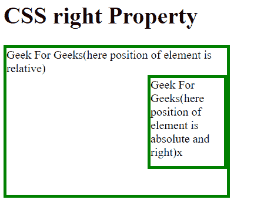
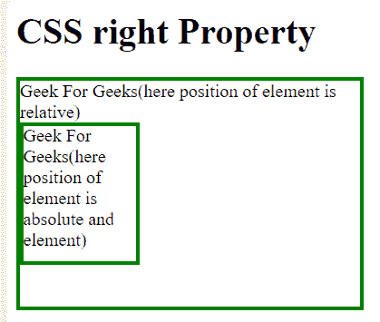

# CSS right 属性

> 原文: [https://www.geeksforgeeks.org/css-right-property/](https://www.geeksforgeeks.org/css-right-property/)

`css right` 属性主要影响元素的水平位置，`css` 属性对未定位的元素没有影响。

## 语法

```html
right: auto|length|initial|inherit;
```

## 属性值

### `auto`

这是默认属性，浏览器将计算右边缘位置。

**语法:**

```html
right:auto;
```

**示例-1:**

```html
<!Doctype html>
<html>
<head>
    <title>
        CSS | right Property
    </title>
    <style>
        div.geek {
            position: relative;
            width: 300px;
            height: 200px;
            border: 3px solid green;
        }

        div.geeks {
            position: absolute;
            /* "auto" right property*/
            right: auto;
            width: 100px;
            height: 120px;
            border: 3px solid green;
        }
    </style>
</head>
<body>
    <h1>CSS right Property</h1>
    <div class="geek">
        Geek For Geeks(here position of element is relative)
        <div class="geeks">
            Geek For Geeks
            (here position of element is absolute and element)
        </div>
    </div>
</body>
</html>
```

**输出:**


### `length`

长度用于设置元素右边缘的位置，单位可以是 `px`、`cm` 等。它应该始终为正值。

**语法:**

```html
right:length;
```

**示例-2:**

```html
<!Doctype html>
<html>
<head>
    <title>
        CSS | right Property
    </title>
    <style>
        div.geek {
            position: relative;
            width: 300px;
            height: 200px;
            border: 3px solid green;
        }

        div.geeks {
            position: absolute;
            /* "length" right property*/
            right: 0px;
            width: 100px;
            height: 120px;
            border: 3px solid green;
        }
    </style>
</head>
<body>
    <h1>CSS right Property</h1>
    <div class="geek">
        Geek For Geeks(here position of element is relative)
        <div class="geeks">
            Geek For Geeks
            (here position of element is absolute and element)
        </div>
    </div>
</body>
</html>
```

**输出:**


### `initial`

`initial` 关键字用于设置 `CSS` 属性的默认值。

**语法:**

```html
right:initial;
```

**示例-3:**

```html
<!Doctype html>
<html>
<head>
    <title>
        CSS | right Property
    </title>
    <style>
        div.geek {
            position: relative;
            width: 300px;
            height: 200px;
            border: 3px solid green;
        }

        div.geeks {
            position: absolute;
            /* "initial" right property*/
            right: initial;
            width: 100px;
            height: 120px;
            border: 3px solid green;
        }
    </style>
</head>
<body>
    <h1>CSS right Property</h1>
    <div class="geek">
        Geek For Geeks(here position of element is relative)
        <div class="geeks">
            Geek For Geeks
            (here position of element is absolute and element)
        </div>
    </div>
</body>
</html>
```

**输出:**


### `inherit`

`inherit` 关键字也用于设置 `CSS` 属性的默认值。这里的默认值是前一个元素的设定值。

**语法:**

```html
right:inherit;
```

**示例-4:**

```html
<!Doctype html>
<html>
<head>
    <title>
        CSS | right Property
    </title>
    <style>
        div.geek {
            position: relative;
            width: 300px;
            height: 200px;
            border: 3px solid green;
        }

        div.geeks {
            position: absolute;
            /* "inherit" right property*/
            right: inherit;
            width: 100px;
            height: 120px;
            border: 3px solid green;
        }
    </style>
</head>
<body>
    <h1>CSS right Property</h1>
    <div class="geek">
        Geek For Geeks(here position of element is relative)
        <div class="geeks">
            Geek For Geeks
            (here position of element is absolute and element)
        </div>
    </div>
</body>
</html>
```

**输出:**


## 支持的浏览器

以下是支持 `right` 属性的浏览器:

*   谷歌 Chrome 1.0
*   Edge 5.5
*   Firefox 1.0
*   Opera 5.0
*   Safari 1.0