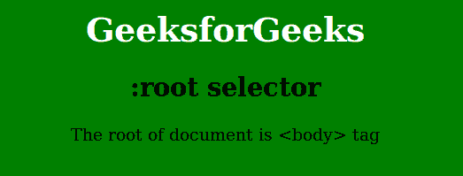

# CSS :root 选择器

> 原文：`https://www.geeksforgeeks.org/css-root-selector/`

`:root` 选择器用于选择 HTML 文档的根元素。这个选择器可以匹配文档中的所有元素。

## 语法

```css
:root {
    /* CSS 属性 */
}
```

## 示例

```html
<!DOCTYPE html>
<html>
    <head>
        <title>root selector</title>
        <style> 
            h1 {
                color: White;
            }
            :root {
                background: green;
            }
            body {
                text-align: center;
            }
        </style>
    </head>
    <body>
        <h1>GeeksforGeeks</h1>
        <h2>:root selector</h2>
        <p>The root of document is <body> tag</p>
    </body>
</html>
```

## 输出



## 支持的浏览器

`:root` 选择器支持的浏览器如下：

*   `Safari` 3.2
*   `Chrome` 4.0
*   `Firefox` 3.5
*   `Opera` 9.6
*   `Internet Explorer` 9.0