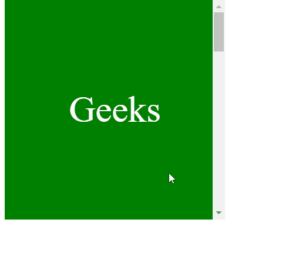

# CSS scroll-margin-bottom 属性

> 原文：[https://www.geeksforgeeks.org/css-scroll-margin-bottom-property/](https://www.geeksforgeeks.org/css-scroll-margin-bottom-property/)

`scroll-margin-bottom` 属性用于一次性将所有滚动边距设置到元素的底部。为 `scroll-margin-bottom` 指定的值决定了主要在支持范围之外的页面应该保持多少可见。

因此，`scroll-margin-bottom` 值代表定义滚动捕捉区域的外排，该区域用于将该框捕捉到捕捉端口。

## 语法

```html
scroll-margin-bottom: length

/* Or */

scroll-margin-bottom: Global_Values
```

## 属性值

该属性接受上面提到的和下面描述的两个属性：

*   `length`：该属性是指用长度单位定义的值：`px`、`rem`、`em`、`vh` 等。
*   `Global_Values`：该属性是指 `initial`、`inherit`、`unset` 等全局值。

**注意：** `scroll-margin-bottom` 不接受百分比值作为长度。

## 示例

在本例中，您可以通过滚动到示例内容的两个“界面”中间的一点来查看 `scroll-margin-bottom` 的效果。

### HTML

```html
<!DOCTYPE html>
<html>

<head>
    <style>
        .scroller {
              width: 300px;
              height:300px;
              overflow-x: hidden;
              overflow-y: auto;
              scroll-snap-type:y mandatory;
        }

        .scroller > div {
              width: 300px;
              height: 300px;
              font-size: 50px; 
              color: white;
              display: flex; 
              align-items: center; 
              justify-content: center; 
              scroll-snap-align: end none;
        }

        .scroller div:nth-child(odd){
              background-color: green;
              scroll-margin-bottom: 1rem;
        }
        .scroller div:nth-child(even){
              background-color: rgb(160, 231, 45);
              scroll-margin-bottom: 3rem;
        }
    </style>
</head>

<body>
    <div class="scroller">
        <div>Geeks</div>
        <div>for</div>
        <div>Geeks</div>
        <div>for</div>
        <div>Geeks</div>
    </div>
</body>

</html>
```

## 输出



## 支持的浏览器

*   Chrome
*   Firefox
*   Edge
*   Opera
*   Safari（部分支持）