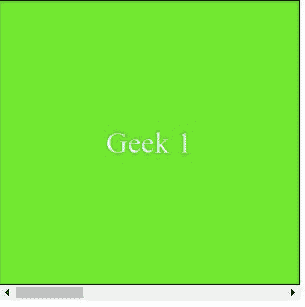

# CSS 滚动-边距-内联属性

> 原文: [https://www.geeksforgeeks.org/css-scroll-margin-inline-property/](https://www.geeksforgeeks.org/css-scroll-margin-inline-property/)

`scroll-margin-inline`属性用于一次将所有滚动边距设置为滚动元素的开始和结束。该属性是`scroll-margin-inline-start`和`scroll-margin-inline-end`属性的简写。开始侧和结束侧的选择取决于写入模式。对于`horizontal-tb`写入模式，开始侧和结束侧分别是左侧和右侧。
其中`horizontal-tb`代表`horizontal-top-to-bottom`。

同样，开始侧和结束侧分别是`vertical-rl`或`vertical-lr`写入模式的顶侧和底侧。
其中`vertical-rl`是从右向左的垂直，而`vertical-lr`是从左向右的垂直。

**语法:**

```html
scroll-margin-inline: length
```

或者

```html
scroll-margin-inline: Global_Values
```

**属性值:**
`scroll-margin-inline`属性接受上面提到的和下面描述的两个属性。
- **长度:** 该属性是指用长度单位定义的值，如`em`、`px`、`rem`、`vh`等。
- **Global_Values:** 该属性是指`inherit`、`initial`、`unset`等全局值。

**注意:** `scroll-margin-inline`不接受百分比值作为长度。

**示例:**
在本例中，您可以通过滚动到示例内容的两个界面中间的点来查看`scroll-margin-inline`的效果。

## 超文本标记语言

```html
<!DOCTYPE html>
<html>

<head>
    <style>
        .scroll {
            width: 300px;
            height: 300px;
            overflow-x: scroll;
            display: flex;
            box-sizing: border-box;
            scroll-snap-type: x mandatory;
        }

        .scroll>div {
            flex: 0 0 300px;
            border: 1px solid #000;
            background-color: #57e714;
            color: #fff;
            font-size: 30px;
            display: flex;
            align-items: center;
            justify-content: center;
            scroll-snap-align: end;
        }

        .scroll>div:nth-child(2n) {
            background-color: #fff;
            color: #0fe962;
        }

        .scroll>div:nth-child(2) {
            scroll-margin-inline: 2rem;
        }

        .scroll>div:nth-child(3) {
            scroll-margin-inline: 3rem;
        }
    </style>

</head>

<body>

<div class="scroll">
    <div>Geek 1</div>
    <div>Geek 2</div>
    <div>Geek 3</div>
    <div>Geek 4</div>
</div>

</body>

</html>
```

**输出:**



**支持的浏览器:**

- 火狐浏览器
- Chrome(不支持)
- 边缘(不支持)
- Safari(不支持)
- 互联网浏览器(不支持)
- 歌剧(不支持)