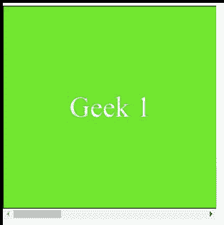

# CSS 滚动-边距-内联-开始属性

> 原文：[https://www.geeksforgeeks.org/css-scroll-margin-inline-start-property/](https://www.geeksforgeeks.org/css-scroll-margin-inline-start-property/)

`scroll-margin-inline-start`属性用于一次性将所有滚动边距设置为滚动元素的内联尺寸的开始。起始侧的选择取决于写入模式。开始侧分别是`horizontal-tb`写入模式的左侧和`vertical-lr`和`vertical-rl`写入模式的顶部或底部。
`horizontal-tb`代表`horizontal from top to bottom`，`vertical-rl`为`vertical from right to left`，`vertical-lr`为`vertical from left to right`。

## 语法

```html
scroll-margin-inline-start: length
```

或者

```html
scroll-margin-inline-start: Global_Values
```

## 属性值

`scroll-margin-inline-start`属性接受上面提到的和下面描述的两个属性。

*   **length**：该属性是指用长度单位定义的值，如`em`、`px`、`rem`、`vh`等。
*   **Global_Values**：该属性是指`inherit`、`initial`、`unset`等全局值。

**注意**：`scroll-margin-inline-start`不接受百分比值作为长度。

## 示例

在本例中，您可以通过滚动到示例内容的两个界面中间的点来查看`scroll-margin-inline-start`的效果。

### HTML

```html
<!DOCTYPE html>
<html>
<head>
    <style>
        .scroll {
            width: 300px;
            height: 300px;
            overflow-x: scroll;
            display: flex;
            box-sizing: border-box;
            scroll-snap-type: x mandatory;
        }

        .scroll>div {
            flex: 0 0 300px;
            border: 1px solid #000;
            background-color: #57e714;
            color: #fff;
            font-size: 40px;
            display: flex;
            align-items: center;
            justify-content: center;
            scroll-snap-align: start;
        }

        .scroll>div:nth-child(2n) {
            background-color: #fff;
            color: #0fe962;
        }

        .scroll>div:nth-child(2) {
            scroll-margin-inline-start: 2rem;
        }

        .scroll>div:nth-child(3) {
            scroll-margin-inline-start: 3rem;
        }
    </style>
</head>
<body>
    <div class="scroll">
        <div>Geek 1</div>
        <div>Geek 2</div>
        <div>Geek 3</div>
        <div>Geek 4</div>
    </div>
</body>
</html>
```

### 输出



## 支持的浏览器

*   Firefox
*   Chrome
*   Edge
*   Opera

**注意**：不支持 Internet Explorer 和 Safari。