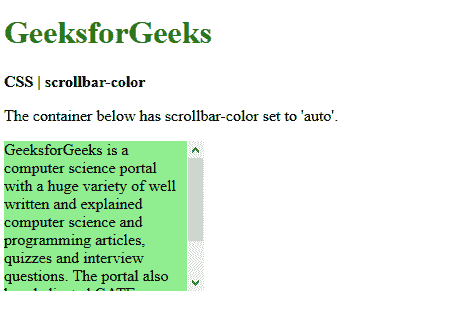
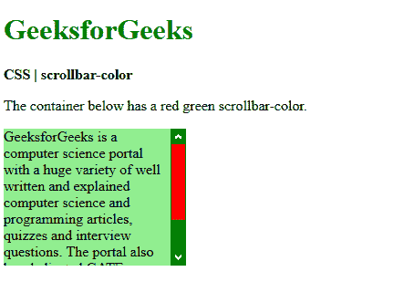
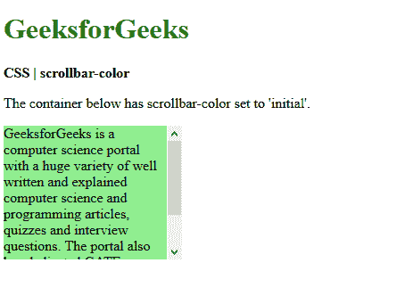
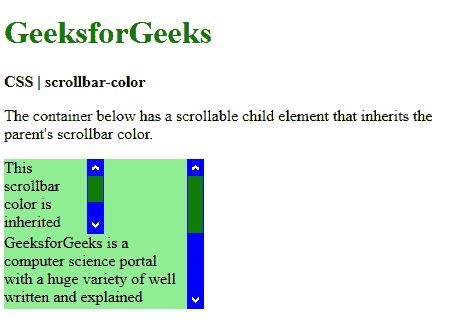

# CSS | 滚动条颜色属性

> 原文: [https://www.geeksforgeeks.org/css-scrollbar-color-property/](https://www.geeksforgeeks.org/css-scrollbar-color-property/)

**滚动条颜色**属性用于设置元素滚动条的颜色。它可以用来分别控制滚动条轨道和滚动条滑块颜色。
滚动条的轨迹是滚动条的背景，它保持不变并显示可滚动的区域。滚动条的大拇指指的是浮动在轨道顶部的滚动条的移动部分，表示滚动条的当前位置。

## 语法

```html
scrollbar-color: auto | color | dark | light | initial | inherit
```

## 属性值

*   `auto`: 用于将滚动条颜色设置为由浏览器自动设置。这是默认值，提供浏览器默认颜色来渲染滚动条。

## 示例

### auto 值示例

```html
<!DOCTYPE html>
<html>
<head>
  <title>
    CSS | scrollbar-color
  </title>
  <style>
    .scrollbar-auto {
      scrollbar-color: auto;
      height: 150px;
      width: 200px;
      overflow-y: scroll;
      background-color: lightgreen;
    }
  </style>
</head>
<body>
  <h1 style="color: green">
    GeeksforGeeks
  </h1>
  <b>
    CSS | scrollbar-color
  </b>
  <p>
    The container below has
    scrollbar-color set to 'auto'.
  </p>
  <div class="scrollbar-auto">
    GeeksforGeeks is a computer science
    portal with a huge variety of well
    written and explained computer science
    and programming articles, quizzes and
    interview questions. The portal also
    has dedicated GATE preparation and
    competitive programming sections.
  </div>
</body>
</html>
```

**输出:**


### color 值示例

*   `color`: 用于将滚动条颜色设置为任何自定义颜色。它接受两个值，第一个应用于滚动条滑块，第二个颜色应用于滚动条轨道。

```html
<!DOCTYPE html>
<html>
<head>
  <title>
    CSS | scrollbar-color
  </title>
  <style>
    .scrollbar-colored {
      scrollbar-color: red green;
      height: 150px;
      width: 200px;
      overflow-y: scroll;
      background-color: lightgreen;
    }
  </style>
</head>
<body>
  <h1 style="color: green">
    GeeksforGeeks
  </h1>
  <b>
    CSS | scrollbar-color
  </b>
  <p>
    The container below has a
    red green scrollbar-color.
  </p>
  <div class="scrollbar-colored">
    GeeksforGeeks is a computer science
    portal with a huge variety of well
    written and explained computer science
    and programming articles, quizzes and
    interview questions. The portal also
    has dedicated GATE preparation and
    competitive programming sections.
  </div>
</body>
</html>
```

**输出:**


### 其他属性值

*   `light`: 它用于提供滚动条的更亮的变体，可以基于默认颜色或自定义颜色。该属性在所有主要浏览器上都已停止使用。
*   `dark`: 它用于提供滚动条的更暗的变体，可以基于默认颜色或自定义颜色。该属性在所有主要浏览器上都已停止使用。
*   `initial`: 用于将其颜色设置为默认值。

### initial 值示例

```html
<!DOCTYPE html>
<html>
<head>
  <title>
    CSS | scrollbar-color
  </title>
  <style>
    .scrollbar-initial {
      scrollbar-color: initial;
      height: 150px;
      width: 200px;
      overflow-y: scroll;
      background-color: lightgreen;
    }
  </style>
</head>
<body>
  <h1 style="color: green">
    GeeksforGeeks
  </h1>
  <b>
    CSS | scrollbar-color
  </b>
  <p>
   The container below has
   scrollbar-color set to 'initial'.
  </p>
  <div class="scrollbar-initial">
    GeeksforGeeks is a computer science
    portal with a huge variety of well
    written and explained computer science
    and programming articles, quizzes and
    interview questions. The portal also
    has dedicated GATE preparation and
    competitive programming sections.
  </div>
</body>
</html>
```

**输出:**


*   `inherit`: 用于从其父代继承颜色。

### inherit 值示例

```html
<!DOCTYPE html>
<html>
<head>
  <title>
    CSS | scrollbar-color
  </title>
  <style>
    .scrollbar-colored {
      scrollbar-color: green blue;
      height: 150px;
      width: 200px;
      overflow-y: scroll;
      background-color: lightgreen;
    }
    .scrollbar-inherit {
      scrollbar-color: inherit;
      height: 75px;
      width: 100px;
      overflow-y: scroll;
    }
  </style>
</head>
<body>
  <h1 style="color: green">
    GeeksforGeeks
  </h1>
  <b>
    CSS | scrollbar-color
  </b>
  <p>
    The container below has
    a scrollable child element
    that inherits the parent's
    scrollbar color.
  </p>
  <div class="scrollbar-colored">
    <div class="scrollbar-inherit">
      This scrollbar color is inherited
      from the parent.
    </div>
    GeeksforGeeks is a computer science
    portal with a huge variety of well
    written and explained computer science
    and programming articles, quizzes and
    interview questions. The portal also
    has dedicated GATE preparation and
    competitive programming sections.
  </div>
</body>
</html>
```

**输出:**


## 支持的浏览器

滚动条颜色属性支持的浏览器如下:

*   Firefox 64