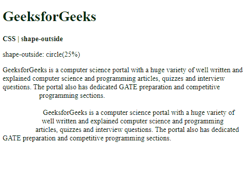
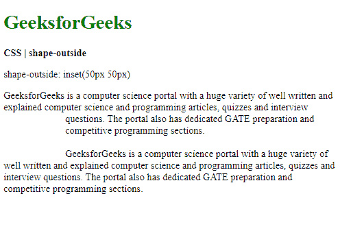
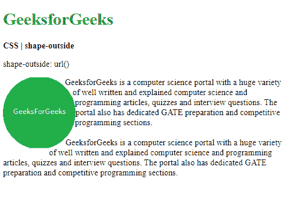

# CSS shape-outside 属性

> 原文: [https://www.geeksforgeeks.org/css-shape-outside-property/](https://www.geeksforgeeks.org/css-shape-outside-property/)

`shape-outside` 属性用于定义相邻内联内容可能环绕的形状。它可以用来定义复杂的形状，包括可以用来环绕文本的图像，而不是简单的框。

## 语法

```html
shape-outside: <basic-shape> | <shape-box> | <image> | none | initial | inherit
```

## 属性值

*   **basic-shape:** 用于定义应使用哪个形状来计算浮动区域。可以使用以下支持的函数之一创建形状：
    *   `circle()`: 用于制作圆形。
    *   `ellipse()`: 用于制作椭圆形状。
    *   `inset()`: 用于制作矩形。
    *   `polygon()`: 用于制作顶点数超过 3 个的形状。
    *   `path()`: 用于创建具有直线、圆弧或曲线的形状。

## 示例 1

本例实现了 `circle()` 函数。

```html
<!DOCTYPE html>
<html>
<head>
  <title>
    CSS | shape-outside
  </title>
  <style>
    .outline {
      shape-outside: circle(25%);
      width: 100px;
      height: 200px;
      float: left;
    }
  </style>
</head>
<body>
  <h1 style="color: green">
    GeeksforGeeks
  </h1>
  <b>
    CSS | shape-outside
  </b>
  <p>
    shape-outside: circle(25%)
  </p>
  <div class="outline">
  </div>
  <div class="container">
    GeeksforGeeks is a computer science
    portal with a huge variety of well
    written and explained computer science
    and programming articles, quizzes and
    interview questions. The portal also
    has dedicated GATE preparation and
    competitive programming sections.
    <br><br>
    GeeksforGeeks is a computer science
    portal with a huge variety of well
    written and explained computer science
    and programming articles, quizzes and
    interview questions. The portal also
    has dedicated GATE preparation and
    competitive programming sections.
  </div>
</body>
</html>
```

**输出:**


## 示例 2

本示例实现了 `inset()` 函数。

```html
<!DOCTYPE html>
<html>
<head>
  <title>
    CSS | shape-outside
  </title>
  <style>
    .outline {
      shape-outside: inset(50px 50px);
      width: 150px;
      height: 150px;
      float: left;
    }
  </style>
</head>
<body>
  <h1 style="color: green">
    GeeksforGeeks
  </h1>
  <b>
    CSS | shape-outside
  </b>
  <p>
    shape-outside: inset(50px 50px)
  </p>
  <div class="outline">
  </div>
  <div class="container">
    GeeksforGeeks is a computer science
    portal with a huge variety of well
    written and explained computer science
    and programming articles, quizzes and
    interview questions. The portal also
    has dedicated GATE preparation and
    competitive programming sections.
    <br><br>
    GeeksforGeeks is a computer science
    portal with a huge variety of well
    written and explained computer science
    and programming articles, quizzes and
    interview questions. The portal also
    has dedicated GATE preparation and
    competitive programming sections.
  </div>
</body>
</html>
```

**输出:**


*   **shape-box:** 用于定义在形状内部定位时使用盒子模型的哪一部分。这些值在定义了形状值之后使用。有 4 个可用的值：
    *   `margin-box`: 用于定义被外侧边距包围的形状。拐角半径是根据边界半径和边距值确定的。这是将使用的默认值。
    *   `border-box`: 用于定义由外侧边缘包围的形状。遵循默认的边界半径成形规则。
    *   `padding-box`: 用于定义由外部填充边包围的形状。遵循默认的边界半径成形规则。
    *   `content-box`: 用于定义由外部内容边缘包围的形状。
*   **image:** 用于指定将提取其 alpha 值来计算浮动区域的图像。可以使用 `url()` 函数来定义图像。也可以使用渐变来代替图像。

## 示例

```html
<!DOCTYPE html>
<html>
<head>
  <title>
    CSS | shape-outside
  </title>
  <style>
    .outline {
      shape-outside: url("https://media.geeksforgeeks.org/wp-content/uploads/20191118233732/circle-img1.png");
      background: url("https://media.geeksforgeeks.org/wp-content/uploads/20191118233732/circle-img1.png") no-repeat;
      width: 150px;
      height: 150px;
      float: left;
    }
  </style>
</head>
<body>
  <h1 style="color: green">
    GeeksforGeeks
  </h1>
  <b>
    CSS | shape-outside
  </b>
  <p>shape-outside: url()</p>
  <div class="outline">
  </div>
  <div class="container">
    GeeksforGeeks is a computer science
    portal with a huge variety of well
    written and explained computer science
    and programming articles, quizzes and
    interview questions. The portal also
    has dedicated GATE preparation and
    competitive programming sections.
    <br><br>
    GeeksforGeeks is a computer science
    portal with a huge variety of well
    written and explained computer science
    and programming articles, quizzes and
    interview questions. The portal also
    has dedicated GATE preparation and
    competitive programming sections.
  </div>
</body>
</html>
```

**输出:**


*   **none:** 用于将属性设置为没有浮动区域。内联内容默认围绕 `margin-box` 包裹。
*   **initial:** 用于将属性设置为其默认值。
*   **inherit:** 用于设置属性从其父级继承。

## 支持的浏览器

`shape-outside` 属性支持的浏览器如下：

*   Chrome 37
*   Firefox 62
*   Safari 10.1
*   Opera 24