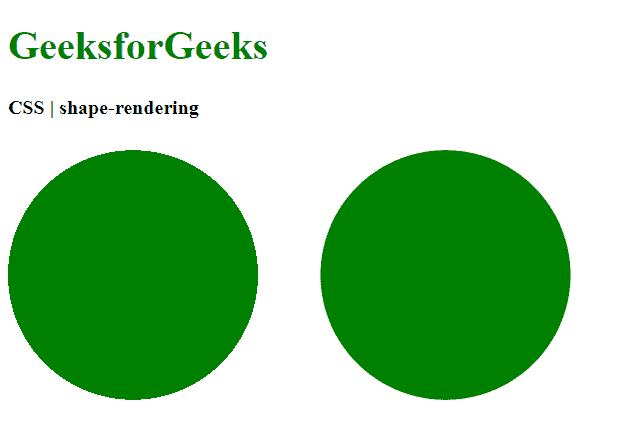
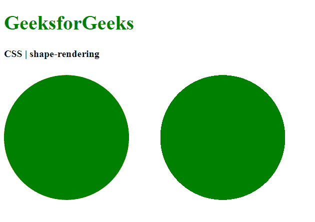

# CSS 形状渲染属性

> 原文: [https://www.geeksforgeeks.org/css-shape-rendering-property/](https://www.geeksforgeeks.org/css-shape-rendering-property/)

`shape-rendering`属性用于提示渲染器在渲染圆形、矩形或路径等形状时必须进行的权衡。可以告诉渲染器使形状在几何上精确，或者优化形状以在某些情况下加快渲染速度。

## 语法

```html
shape-rendering: auto | optimizeSpeed | crispEdges | geometricPrecision | initial | inherit
```

## 属性值

### `auto`
用于指示用户代理将自动做出决策，以平衡速度、获得清晰的边缘或良好的几何精度。通常，良好的精度比速度和清晰的边缘更重要。这是默认值。

**示例:**

```html
<!DOCTYPE html>
<html>
<head>
  <title>
    CSS | shape-rendering property
  </title>
  <style>
    .shape-crisp {
      /* Assume the crispEdges
      value for demonstration */
      shape-rendering: crispEdges;
      fill: green;
    }

    .shape-auto {
      shape-rendering: auto;
      fill: green;
    }
  </style>
</head>
<body>
  <h1 style="color: green">
    GeeksforGeeks
  </h1>
  <b>
    CSS | shape-rendering
  </b>
  <div class="container">
    <svg height="250px" width="500px"
      xmlns="http://www.w3.org/2000/svg"
      version="1.1">
      <circle class="shape-crisp"
        cx="100" cy="125" r="100"/>
      <circle class="shape-auto"
        cx="350" cy="125" r="100"/>
    </svg>
  </div>
</body>
</html>
```

**输出:** 将`crispEdges`值与`auto`值进行比较


### `optimizeSpeed`
用于指示形状将以强调速度而非几何精度或清晰边缘的方式进行渲染。这可能导致用户代理为所有形状关闭抗锯齿。

**示例:**

```html
<!DOCTYPE html>
<html>
<head>
  <title>
    CSS | shape-rendering property
  </title>
  <style>
    .shape-auto {
      /* Assume the auto
      value for demonstration */
      shape-rendering: auto;
      fill: green;
    }

    .shape-optimizespeed {
      shape-rendering: optimizeSpeed;
      fill: green;
    }
  </style>
</head>
<body>
  <h1 style="color: green">
    GeeksforGeeks
  </h1>
  <b>
    CSS | shape-rendering
  </b>
  <div class="container">
    <svg height="250px" width="500px"
      xmlns="http://www.w3.org/2000/svg"
      version="1.1">
      <circle class="shape-auto"
        cx="100" cy="125" r="100"/>
      <circle class="shape-optimizespeed"
        cx="350" cy="125" r="100"/>
    </svg>
  </div>
</body>
</html>
```

**输出:** 将`auto`值与`optimizeSpeed`值进行比较


### `crispEdges`
用于指示形状将以强调清晰边缘的对比度而非几何精度或速度的方式进行渲染。用户代理可能会为形状关闭抗锯齿，并调整线条位置和宽度以与设备的像素对齐。

**示例:**

```html
<!DOCTYPE html>
<html>
<head>
  <title>
    CSS | shape-rendering property
  </title>
  <style>
    .shape-auto {
      /* Assume the auto
      value for demonstration */
      shape-rendering: auto;
      fill: green;
    }

    .shape-crisp {
      shape-rendering: crispEdges;
      fill: green;
    }
  </style>
</head>
<body>
  <h1 style="color: green">
    GeeksforGeeks
  </h1>
  <b>
    CSS | shape-rendering
  </b>
  <div class="container">
    <svg height="250px" width="500px"
      xmlns="http://www.w3.org/2000/svg"
      version="1.1">
      <circle class="shape-auto"
        cx="100" cy="125" r="100"/>
      <circle class="shape-crisp"
        cx="350" cy="125" r="100"/>
    </svg>
  </div>
</body>
</html>
```

**输出:** 将`auto`值与`crispEdges`值进行比较


### `geometricPrecision`
用于指示形状将以几何精度而非速度或清晰边缘为重点进行渲染。

**示例:**

```html
<!DOCTYPE html>
<html>
<head>
    <title>
        CSS | shape-rendering property
    </title>
    <style>
        .shape-auto {
            /* Assume the auto
            value for demonstration */
            shape-rendering: auto;
            fill: green;
        }

        .shape-crisp {
            shape-rendering: geometricPrecision;
            fill: green;
        }
    </style>
</head>
<body>
    <h1 style="color: green">
        GeeksforGeeks
    </h1>
    <b>
        CSS | shape-rendering
    </b>
    <div class="container">
        <svg height="250px" width="500px"
            xmlns="http://www.w3.org/2000/svg"
            version="1.1">
            <circle class="shape-auto"
                cx="100" cy="125" r="100"/>
            <circle class="shape-crisp"
                cx="350" cy="125" r="100"/>
        </svg>
    </div>
</body>
</html>
```

**输出:** 将`crispEdges`值与`geometricPrecision`值进行比较


### `initial`
用于将属性设置为其默认值。

**示例:**

```html
<!DOCTYPE html>
<html>
<head>
  <title>
    CSS | shape-rendering
  </title>
  <style>
    .shape-crisp {
      /* Assume the crispEdges
      value for demonstration */
      shape-rendering: crispEdges;
      fill: green;
    }

    .shape-initial {
      shape-rendering: initial;
      fill: green;
    }
  </style>
</head>
<body>
  <h1 style="color: green">
    GeeksforGeeks
  </h1>
  <b>
    CSS | shape-rendering
  </b>
  <div class="container">
    <svg height="250px" width="500px"
      xmlns="http://www.w3.org/2000/svg"
      version="1.1">
      <circle class="shape-crisp"
        cx="100" cy="125" r="100"/>
      <circle class="shape-initial"
        cx="350" cy="125" r="100"/>
    </svg>
  </div>
</body>
</html>
```

**输出:** 比较`crispEdges`值和`initial`值


### `inherit`
用于设置属性从其父元素继承。

## 支持的浏览器
`shape-rendering`属性支持的浏览器如下:
*   Chrome
*   Firefox
*   Safari
*   Opera
*   Internet Explorer 9