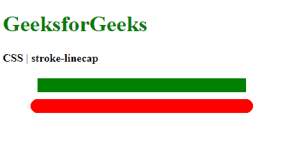
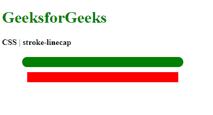

# CSS 描边线帽属性

> 原文：[https://www.geeksforgeeks.org/css-stroke-linecap-property/](https://www.geeksforgeeks.org/css-stroke-linecap-property/)

`stroke-linecap`属性用于定义在开放子路径末端使用的形状。

**语法：**

```html
stroke-linecap: butt | round | square | initial | inherit
```

**属性值：**

## `butt`
用于指示描边不会延伸到描边端点之外。它使描边看起来在尖锐的直角处结束。

**示例：**

```html
<!DOCTYPE html>
<html>
<head>
  <title>
    CSS | stroke-linecap
  </title>
  <style>
    /* Assume the round
       value for
       demonstration */
    .stroke-round {
      stroke-linecap: round;
      stroke-width: 20px;
      stroke: green;
    }

    .stroke-butt {
      stroke-linecap: butt;
      stroke-width: 20px;
      stroke: red;
    }
  </style>
</head>
<body>
  <h1 style="color: green">
    GeeksforGeeks
  </h1>
  <b>
    CSS | stroke-linecap
  </b>
  <div class="container">
    <svg width="400px"
      xmlns="http://www.w3.org/2000/svg"
      version="1.1">
      <line class="stroke-round" x1="50"
        x2="350" y1="30" y2="30" />
      <line class="stroke-butt" x1="50"
         x2="350" y1="60" y2="60" />
    </svg>
  </div>
</body>
</html>
```

**输出：** 比较`round`值和`butt`值。


## `round`
用于指示描边的末端被延伸为一个直径等于描边宽度的半圆。零长度的子路径将在其点处有一个完整的圆。

**示例：**

```html
<!DOCTYPE html>
<html>
<head>
  <title>
    CSS | stroke-linecap
  </title>
  <style>
    /* This is the
       default value */
    .stroke-butt {
      stroke-linecap: butt;
      stroke-width: 20px;
      stroke: green;
    }

    .stroke-round {
      stroke-linecap: round;
      stroke-width: 20px;
      stroke: red;
    }
  </style>
</head>
<body>
  <h1 style="color: green">
    GeeksforGeeks
  </h1>
  <b>
    CSS | stroke-linecap
  </b>
  <div class="container">
    <svg width="400px"
      xmlns="http://www.w3.org/2000/svg"
      version="1.1">
      <line class="stroke-butt" x1="50"
        x2="350" y1="30" y2="30" />
      <line class="stroke-round" x1="50"
        x2="350" y1="60" y2="60" />
    </svg>
  </div>
</body>
</html>
```

**输出：** 将`butt`值与`round`值进行比较。


## `square`
用于指示描边的末端被延伸为一个矩形，其高度等于描边的宽度，宽度等于描边宽度的一半。零长度的子路径将在其点处有一个正方形。

**示例：**

```html
<!DOCTYPE html>
<html>
<head>
  <title>
    CSS | stroke-linecap
  </title>
  <style>
    /* This is the default
       value */
    .stroke-butt {
      stroke-linecap: butt;
      stroke-width: 20px;
      stroke: green;
    }

    .stroke-square {
      stroke-linecap: square;
      stroke-width: 20px;
      stroke: red;
    }
  </style>
</head>
<body>
  <h1 style="color: green">
    GeeksforGeeks
  </h1>
  <b>
    CSS | stroke-linecap
  </b>
  <div class="container">
    <svg width="400px"
      xmlns="http://www.w3.org/2000/svg"
      version="1.1">
      <line class="stroke-butt" x1="50"
        x2="350" y1="30" y2="30" />
      <line class="stroke-square" x1="50"
        x2="350" y1="60" y2="60" />
    </svg>
  </div>
</body>
</html>
```

**输出：** 比较`butt`值和`square`值。


## `initial`
用于将属性设置为其默认值。

**示例：**

```html
<!DOCTYPE html>
<html>
<head>
  <title>
    CSS | stroke-linecap
  </title>
  <style>
    /* Assume the round
       value for
       demonstration */
    .stroke-round {
      stroke-linecap: round;
      stroke-width: 20px;
      stroke: green;
    }

    .stroke-butt {
      stroke-linecap: butt;
      stroke-width: 20px;
      stroke: red;
    }
  </style>
</head>
<body>
  <h1 style="color: green">
    GeeksforGeeks
  </h1>
  <b>
    CSS | stroke-linecap
  </b>
  <div class="container">
    <svg width="400px"
      xmlns="http://www.w3.org/2000/svg"
      version="1.1">
      <line class="stroke-round" x1="50"
        x2="350" y1="30" y2="30" />
      <line class="stroke-butt" x1="50"
        x2="350" y1="60" y2="60" />
    </svg>
  </div>
</body>
</html>
```

**输出：** 比较`round`值和`initial`值。


## `inherit`
用于设置属性从其父级继承。

**支持的浏览器：** 由`stroke-linecap`属性支持的浏览器如下：

*   Chrome
*   Firefox
*   Safari
*   Opera
*   Internet Explorer 9