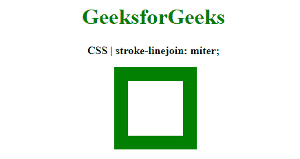
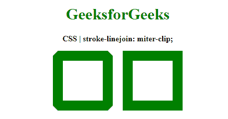
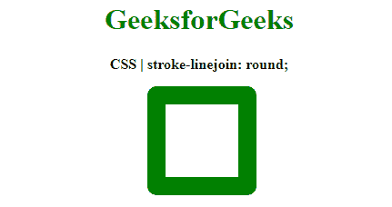
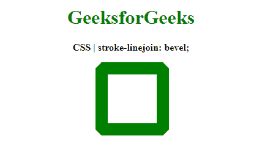
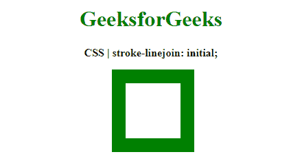

# CSS | `stroke-linejoin` 属性

> 原文: [https://www.geeksforgeeks.org/css-stroke-linejoin-property/](https://www.geeksforgeeks.org/css-stroke-linejoin-property/)

`stroke-linejoin` 属性是一个用于定义形状的内置属性，该形状用于结束笔划的开放子路径。

**语法:**

```html
stroke-linejoin: miter | miter-clip | round | bevel | arcs | initial | inherit
```

**属性值:**

*   `miter`: 用于表示使用尖角连接两端。笔划的外边缘延伸到路径段的切线，直到它们相交。这使末端形成一个尖角。

**示例:**

```html
<!DOCTYPE html>
<html>
<head>
    <title>CSS | stroke-linejoin property</title>
    <style>
        .stroke1 {
            stroke-linejoin: miter;
            stroke-width: 20px;
            stroke: green;
            fill: none;
        }
    </style>
</head>
<body>
    <center>
        <h1 style="color: green">GeeksforGeeks</h1>
        <b>CSS | stroke-linejoin: miter;</b>
        <div class="container">
            <svg width="400px" height="200px" xmlns="http://www.w3.org/2000/svg" version="1.1">
                <rect x="153" y="25" width="100" height="100" class="stroke1" />
            </svg>
        </div>
    </center>
</body>
</html>
```

**输出:**


*   `miter-clip`: 用于表示使用尖角连接两端。笔划的外边缘延伸到路径段的切线，直到它们相交。

除了另一个属性之外，它给结束一个像 `miter` 值一样的尖角。`stroke-miterlimit` 用于确定如果斜接超过某个值是否会被修剪。它用于在非常尖锐的连接或动画上提供更好看的斜接。

**示例:**

```html
<!DOCTYPE html>
<html>
<head>
    <title>CSS | stroke-linejoin property</title>
    <style>
        .stroke1 {
            stroke-linejoin: miter-clip;
            /* setting a lower miterlimit */
            stroke-miterlimit: 1;
            stroke-width: 20px;
            stroke: green;
            fill: none;
        }
        .stroke2 {
            stroke-linejoin: miter-clip;
            /* setting a higher miterlimit */
            stroke-miterlimit: 2;
            stroke-width: 20px;
            stroke: green;
            fill: none;
        }
    </style>
</head>
<body>
    <center>
        <h1 style="color: green">GeeksforGeeks</h1>
        <b>CSS | stroke-linejoin: miter-clip;</b>
        <div class="container">
            <svg width="400px" height="200px" xmlns="http://www.w3.org/2000/svg" version="1.1">
                <rect x="80" y="25" width="100" height="100" class="stroke1" />
                <rect x="220" y="25" width="100" height="100" class="stroke2" />
            </svg>
        </div>
    </center>
</body>
</html>
```

**输出:**


*   `round`: 用于表示使用圆角连接两端。

**示例:**

```html
<!DOCTYPE html>
<html>
<head>
    <title>CSS | stroke-linejoin property</title>
    <style>
        .stroke1 {
            stroke-linejoin: round;
            stroke-width: 20px;
            stroke: green;
            fill: none;
        }
    </style>
</head>
<body>
    <center>
        <h1 style="color: green">GeeksforGeeks</h1>
        <b>CSS | stroke-linejoin: round;</b>
        <div class="container">
            <svg width="400px" height="200px" xmlns="http://www.w3.org/2000/svg" version="1.1">
                <rect x="153" y="25" width="100" height="100" class="stroke1" />
            </svg>
        </div>
    </center>
</body>
</html>
```

**输出:**


*   `bevel`: 用于表示连接点被垂直于关节处裁剪。

**示例:**

```html
<!DOCTYPE html>
<html>
<head>
    <title>CSS | stroke-linejoin property</title>
    <style>
        .stroke1 {
            stroke-linejoin: bevel;
            stroke-width: 20px;
            stroke: green;
            fill: none;
        }
    </style>
</head>
<body>
    <center>
        <h1 style="color: green">GeeksforGeeks</h1>
        <b>CSS | stroke-linejoin: bevel;</b>
        <div class="container">
            <svg width="400px" height="200px" xmlns="http://www.w3.org/2000/svg" version="1.1">
                <rect x="152" y="25" width="100" height="100" class="stroke1" />
            </svg>
        </div>
    </center>
</body>
</html>
```

**输出:**


*   `arcs`: 用于表示弧角用于连接路径段。这种形状是由笔画外边缘的延伸形成的，其曲率与外边缘在连接点处的曲率相同。
*   `initial`: 用于将属性设置为其默认值。

**示例:**

```html
<!DOCTYPE html>
<html>
<head>
    <title>CSS | stroke-linejoin</title>
    <style>
        .stroke1 {
            stroke-linejoin: initial;
            stroke-width: 20px;
            stroke: green;
            fill: none;
        }
    </style>
</head>
<body>
    <center>
        <h1 style="color: green">GeeksforGeeks</h1>
        <b>CSS | stroke-linejoin: initial;</b>
        <div class="container">
            <svg width="400px" height="200px" xmlns="http://www.w3.org/2000/svg" version="1.1">
                <rect x="153" y="25" width="100" height="100" class="stroke1" />
            </svg>
        </div>
    </center>
</body>
</html>
```

**输出:**


*   `inherit`: 用于设置属性从其父级继承。

**支持的浏览器:**
由 `stroke-linejoin` 属性支持的浏览器如下:

*   Chrome
*   Internet Explorer 9
*   Firefox
*   Safari
*   Opera

**注意:** 各大浏览器都不支持 `stroke-linejoin: arcs;`。