# CSS 样式表单

> 原文: [https://www.geeksforgeeks.org/css-styling-forms/](https://www.geeksforgeeks.org/css-styling-forms/)

CSS 表单用于为用户创建交互式表单。它提供了许多设置样式的方法。
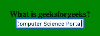

有许多 CSS 属性可用于创建 HTML 表单并为其设置样式，以使其更具交互性，下面列出了其中一些属性:

## Attribute Selector

`input` 表单的 `type` 属性可以根据用户的选择采取多种形式。它可以是任何可能的类型，如 `text`、`search`、`url`、`tel`、`email`、`password`、日期选择器、`number`、`checkbox`、`radio`、`file` 等。用户在创建表单时需要指定 `type`。

**示例:**

```html
<!DOCTYPE html>
<html>
    <head>
        <style>
        body{
            background-color:green;
        }
        </style>
    </head>
<body>
        <center>
            <b>Is Geeksforgeeks useful ?</b>
            <form>
                <input type="radio" name="useful" value="yes" checked> 
                Yes <br>
                <input type="radio" name="useful" value="def_yes"> 
                Definitely Yes  
            </form>
        </center>
    </body>
</html>
```

**输出** :
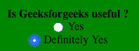

考虑另一个输入类型只是文本的例子:

```html
<!DOCTYPE html>
<html>
<head>
    <style>
        body{
            background-color:green;
        }
    </style>
</head>
<body>
    <center>
    <form>
        <b>Do you find Geeksforgeeks helpful?</b>   
            <br>
        <input type="text" name="info"><br>
    </form>
    </center>
</body>
</html>
```

**输出** :
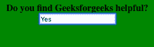

## Styling the Width of Input

`width` 属性用于设置输入字段的宽度。考虑下面的例子，其中宽度被设置为整个屏幕的 10%。

```html
<!DOCTYPE html>
<html>
<head>
    <style>
        input{
            width:10%;
        }
body{
            background-color:green;
        }
    </style>
</head>
<body>
    <center>
    <form>
        <b>Do you find Geeksforgeeks helpful?</b>
            <br>
        <input type="text" name="info"><br>
    </form>
    </center>
</body>
</html>
```

**输出** :
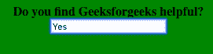

## Add Padding in Inputs

`padding` 属性用于在文本字段内部添加空间。考虑下面的例子:

```html
<!DOCTYPE html>
<html>
<head>
    <style>
        input{
            width:10%;
            padding: 12px;
        }
body{
            background-color:green;
        }
    </style>
</head>
<body>
    <center>
        <form>
            <b>Do you find Geeksforgeeks helpful?</b><br>
            <input type="text" name="info"><br>
        </form>
    </center>
</body>
</html>
```

**输出** :
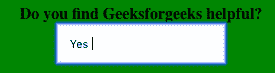

## Set Margin for Inputs

`margin` 属性用于在输入字段外部添加空间。当有多个输入时，这很有帮助。考虑下面有两个输入的例子，并观察它们之间的空间（外边距）。

```html
<!DOCTYPE html>
<html>
<head>
    <style>
        input{
            width:10%;
            margin: 8px;
        }
body{
            background-color:green;
        }
    </style>
</head>
<body>
    <center>
    <form>
        <b>Mention two topics that you liked on Geeksforgeeks</b>
            <br>
        <input type="text" name="info"><br>
        <input type="text" name="info"><br>
    </form>
    </center>
</body>
</html>
```

**输出** :
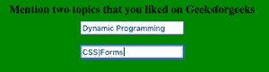

## Adding Border and Border-radius

`border` 属性用于改变边框的大小和颜色，而 `border-radius` 属性用于添加圆角。

考虑下面的例子，其中创建了 `2px` `纯红` 边框，其 `border-radius` 为 `4px`。

```html
<!DOCTYPE html>
<html>
<head>
    <style>
        input{
            width:10%;
            margin: 8px;
            border: 2px solid red;
            border-radius: 4px;
        }
body{
            background-color:green;
        }
    </style>
</head>
<body>
    <center>
        <form>
            <b>
                Mention two topics that you liked on 
                Geeksforgeeks
            </b>
            <br>
            <input type="text" name="info"><br>
            <input type="text" name="info"><br>
        </form>
    </center>
</body>
</html>
```

**输出** :
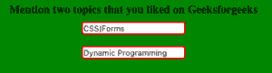

**注意:** 用户还可以在任何特定的一侧有边框，并移除其他边框或拥有不同颜色的所有边框。考虑下面的例子，其中用户只想要顶部（蓝色）和底部（红色）的边框。

```html
<!DOCTYPE html>
<html>
<head>
    <style>
        input{
            width:10%;
            margin: 8px;
            border: none;
            border-top: 3px solid blue;
            border-bottom: 3px solid red;
        }
body{
            background-color:green;
        }
    </style>
</head>
<body>
    <center>
        <form>
            <b>
                Mention two topics that you liked on 
                Geeksforgeeks
            </b>
            <br>
            <input type="text" name="info"><br>
            <input type="text" name="info"><br>
        </form>
    </center>
</body>
</html>
```

**输出** :
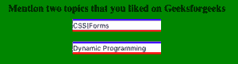

## Adding Color to text and Background

`color` 属性用于更改输入中文本的颜色，`background-color` 属性用于更改输入字段背景的颜色。

考虑以下示例，其中文本颜色为黑色，背景颜色设置为绿色。

```html
<!DOCTYPE html>
<html>
<head>
    <style>
        input{
            width:10%;
            margin: 8px;
            border: none;
            background-color: green;
            color: black;
        }
body{
            background-color:white;
        }
    </style>
</head>
<body>
    <center>
        <form>
            <b>
                Mention two topics that you liked 
                on Geeksforgeeks
            </b>
            <br>
            <input type="text" name="info"><br>
            <input type="text" name="info"><br>
        </form>
    </center>
</body>
</html>
```

**输出** :
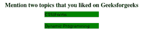

## Focus Selector

当我们点击输入字段时，它会获得一个蓝色的轮廓。你可以使用 `:focus` 选择器来改变这种行为。

考虑下面的例子，用户想要一个 `3px` 的红色轮廓和绿色背景。

```html
<!DOCTYPE html>
<html>
<head>
    <style>
        input{
            width:10%;
            margin: 8px;
            color: black;
        }
input[type=text]:focus {
        border: 3px solid red;
        background-color: green;
        }
body{
            background-color:white;
        }
    </style>
</head>
<body>
    <center>
    <form>
        <b>
            Mention two topics that you liked 
            on Geeksforgeeks
        </b>
        <br>
        <input type="text" name="info"><br>
        <input type="text" name="info"><br>
    </form>
    </center>
</body>
</html>
```

**输出** :
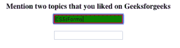

## 在输入表单中添加图像

`background-image` 属性可用于在输入表单中放置图像，并可使用 `background-position` 属性进行定位，用户还可以决定是否重复。

考虑下面的例子，图像在无重复模式的背景中。

```html
<!DOCTYPE html>
<html>
<head>
    <style>
        input{
            width: 20%;
            background-image: url('search.png');
            background-position: 10px 10px;
            background-repeat: no-repeat;
            padding: 12px 20px 12px 40px;
        }

        body{
            background-color:white;
        }
    </style>
</head>
<body>
    <center>
        <form>
            <b>Search on Geeksforgeeks</b><br>
            <input type="text" name="info" placeholder="Search.."><br>
        </form>
    </center>
</body>
</html>
```

**输出**:
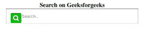

## 过渡属性

`transition` 属性可用于输入字段，通过指定放松时的宽度和聚焦时的宽度以及操作所需的时间段，来改变字段的大小。

考虑下面的例子，其中放松的输入场宽度为 15%，当聚焦时在 1 秒内变为 30%。

```html
<!DOCTYPE html>
<html>
<head>
    <style>
        input{
            width: 15%;
            -webkit-transition: width 1s ease-in-out;
            transition: width 1s ease-in-out;
        }

        input[type=text]:focus {
            width: 30%;
            border:4px solid blue;
        }

        body{
            background-color:green;
        }
    </style>
</head>
<body>
    <center>
        <form>
            <b>Search on Geeksforgeeks</b><br>
            <input type="text" name="info" placeholder="Search.."><br>
        </form>
    </center>
</body>
</html>
```

**输出**:
放松时
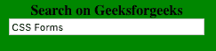
专注时
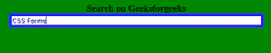