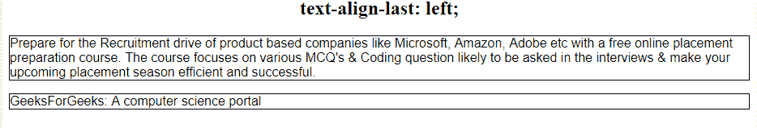
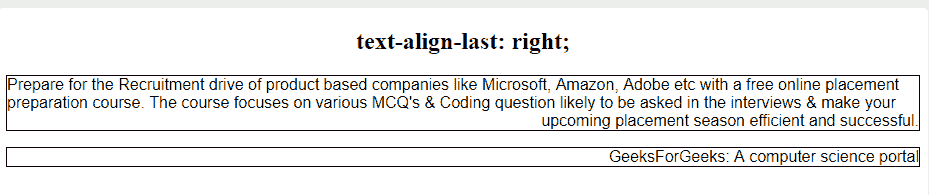
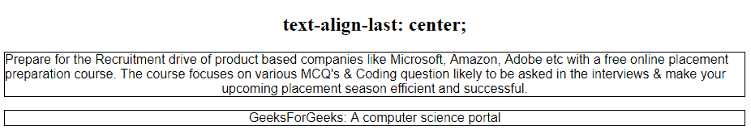
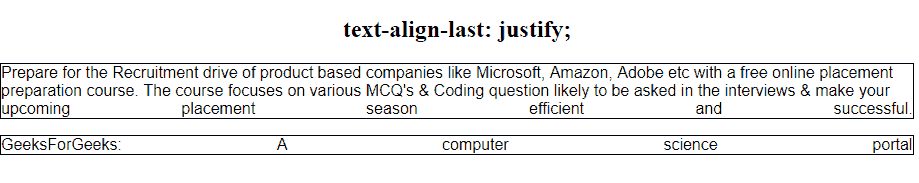
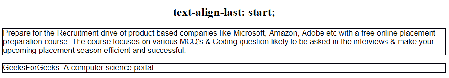
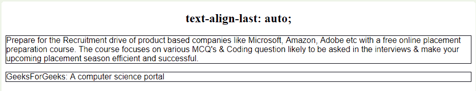
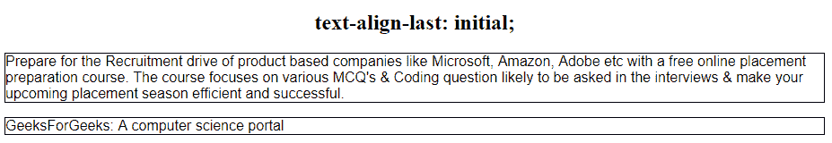

# CSS `text-align-last` 属性

> 原文: [https://www.geeksforgeeks.org/css-text-align-last-property/](https://www.geeksforgeeks.org/css-text-align-last-property/)

CSS 中的 `text-align-last` 属性用于设置段落的最后一行，就在换行符之前。换行可能是由于段落的自然结束，也可能是由于使用了 `<br>` 标签。`text-align-last` 属性设置应用了该属性的元素中所有最后一行的对齐方式。例如，如果 `text-align-last` 属性应用于 `<p>` 元素，则 `<p>` 元素的所有最后一行都将受到该属性的影响。

## 语法

```html
text-align-last: auto|start|end|left|right|center|justify|initial|inherit;
```

## 默认值

其默认值为 `auto`。

## 属性值

### `left`

它使段落的最后一行相对于容器左对齐。

**语法:**

```html
text-align-last: left;
```

**示例:**

```html
<!DOCTYPE html>
<html>
    <head>
        <title>
            text-align-last property
        </title>
        <!-- CSS style to text-align-last property -->
        <style>
            p {
                text-align-last: left;
                font-family: sans-serif;
                border: 1px solid black;
            }
        </style>
    </head>
    <body>
        <h2 style = "text-align:center">
            text-align-last: left;
        </h2>
        <!-- text-align-last: left; property -->
        <p>
            Prepare for the Recruitment drive of product based companies like Microsoft, Amazon, Adobe etc with a free online placement preparation course. The course focuses on various MCQ's & Coding question likely to be asked in the interviews & make your upcoming placement season efficient and successful.
        </p>
        <!-- text-align-last: right; property -->
        <p> GeeksForGeeks: A computer science portal</p>
    </body>
</html>
```

**输出:**


### `right`

它使段落的最后一行相对于容器右对齐。

**语法:**

```html
text-align-last: right;
```

**示例:**

```html
<!DOCTYPE html>
<html>
    <head>
        <title>
            text-align-last property
        </title>
        <!-- CSS style to text-align-last property -->
        <style>
            p {
                text-align-last: right;
                font-family: sans-serif;
                border: 1px solid black;
            }
        </style>
    </head>
    <body>
        <h2 style = "text-align:center">
            text-align-last: right;
        </h2>
        <!-- text-align-last: left; property -->
        <p>
            Prepare for the Recruitment drive of product based companies like Microsoft, Amazon, Adobe etc with a free online placement preparation course. The course focuses on various MCQ's & Coding question likely to be asked in the interviews & make your upcoming placement season efficient and successful.
        </p>
        <!-- text-align-last: right; property -->
        <p> GeeksForGeeks: A computer science portal</p>
    </body>
</html>
```

**输出:**


### `center`

它使最后一行相对于容器居中对齐。

**语法:**

```html
text-align-last: center;
```

**示例:**

```html
<!DOCTYPE html>
<html>
    <head>
        <title>
            text-align-last property
        </title>
        <!-- CSS style to text-align-last property -->
        <style>
            p {
                text-align-last: center;
                font-family: sans-serif;
                border: 1px solid black;
            }
        </style>
    </head>
    <body>
        <h2 style = "text-align:center">
            text-align-last: center;
        </h2>
        <!-- text-align-last: left; property -->
        <p>
            Prepare for the Recruitment drive of product based companies like Microsoft, Amazon, Adobe etc with a free online placement preparation course. The course focuses on various MCQ's & Coding question likely to be asked in the interviews & make your upcoming placement season efficient and successful.
        </p>
        <!-- text-align-last: right; property -->
        <p> GeeksForGeeks: A computer science portal</p>
    </body>
</html>
```

**输出:**


### `justify`

它使最后一行两端对齐，即最后一行将占据容器的整个宽度，单词之间会插入额外的空间以实现此属性。

**语法:**

```html
text-align-last: justify;
```

**示例:**

```html
<!DOCTYPE html>
<html>
    <head>
        <title>
            text-align-last property
        </title>
        <!-- CSS style to text-align-last property -->
        <style>
            p {
                text-align-last: justify;
                font-family: sans-serif;
                border: 1px solid black;
            }
        </style>
    </head>
    <body>
        <h2 style = "text-align:center">
            text-align-last: justify;
        </h2>
        <!-- text-align-last: left; property -->
        <p>
            Prepare for the Recruitment drive of product based companies like Microsoft, Amazon, Adobe etc with a free online placement preparation course. The course focuses on various MCQ's & Coding question likely to be asked in the interviews & make your upcoming placement season efficient and successful.
        </p>
        <!-- text-align-last: right; property -->
        <p> GeeksForGeeks: A computer science portal</p>
    </body>
</html>
```

**输出:**


### `start`

如果文本方向是从左到右 (LTR)，它使最后一行左对齐；如果文本方向是从右到左 (RTL)，它使最后一行右对齐。

**语法:**

```html
text-align-last: start;
```

**示例:**

```html
<!DOCTYPE html>
<html>
    <head>
        <title>
            text-align-last property
        </title>
        <!-- CSS style to text-align-last property -->
        <style>
            p {
                text-align-last: start;
                font-family: sans-serif;
                border: 1px solid black;
            }
        </style>
    </head>
    <body>
        <h2 style = "text-align:center">
            text-align-last: start;
        </h2>
        <!-- text-align-last: left; property -->
        <p>
            Prepare for the Recruitment drive of product based companies like Microsoft, Amazon, Adobe etc with a free online placement preparation course. The course focuses on various MCQ's & Coding question likely to be asked in the interviews & make your upcoming placement season efficient and successful.
        </p>
        <!-- text-align-last: right; property -->
        <p> GeeksForGeeks: A computer science portal</p>
    </body>
</html>
```

**输出:**


### `end`

如果文本方向是从左到右 (LTR)，它使最后一行右对齐；如果文本方向是从右到左 (RTL)，它使最后一行左对齐。

**语法:**

```html
text-align-last: end;
```

**示例:**

```html
<!DOCTYPE html>
<html>
    <head>
        <title>
            text-align-last property
        </title>
```

# text-align-last 属性

`text-align-last` 属性用于设置段落最后一行的对齐方式。

## 属性值

### `auto`
当 `text-align` 属性未设置为 `justify` 时，它使段落的最后一行根据容器的 `text-align` 属性进行对齐。

**语法:**
```html
text-align-last: auto;
```

**示例:**
```html
<!DOCTYPE html>
<html>
    <head>
        <title>
            text-align-last property
        </title>
        <!-- CSS style to text-align-last property -->
        <style>
            p {
                text-align-last: auto;
                font-family: sans-serif;
                border: 1px solid black;
            }
        </style>
    </head>
    <body>
        <h2 style = "text-align:center">
            text-align-last: auto;
        </h2>
        <!-- text-align-last: left; property -->
        <p>
            Prepare for the Recruitment drive of product based companies like Microsoft, Amazon, Adobe etc with a free online placement preparation course. The course focuses on various MCQ's & Coding question likely to be asked in the interviews & make your upcoming placement season efficient and successful.
        </p>
        <!-- text-align-last: right; property -->
        <p> GeeksForGeeks: A computer science portal</p>
    </body>
</html>
```

**输出:**


### `initial`
它使段落的最后一行根据其默认值（左对齐）进行对齐。

**语法:**
```html
text-align-last: initial;
```

**示例:**
```html
<!DOCTYPE html>
<html>
    <head>
        <title>
            text-align-last property
        </title>
        <!-- CSS style to text-align-last property -->
        <style>
            p {
                text-align-last: initial;
                font-family: sans-serif;
                border: 1px solid black;
            }
        </style>
    </head>
    <body>
        <h2 style = "text-align:center">
            text-align-last: initial;
        </h2>
        <!-- text-align-last: left; property -->
        <p>
            Prepare for the Recruitment drive of product based companies like Microsoft, Amazon, Adobe etc with a free online placement preparation course. The course focuses on various MCQ's & Coding question likely to be asked in the interviews & make your upcoming placement season efficient and successful.
        </p>
        <!-- text-align-last: right; property -->
        <p> GeeksForGeeks: A computer science portal</p>
    </body>
</html>
```

**输出:**


### `inherit`
根据其父元素的 `text-align-last` 属性，使段落的最后一行对齐。

## 支持的浏览器
`text-align-last` 属性支持的浏览器如下:
*   谷歌 Chrome 47.0
*   Internet Explorer 5.5
*   火狐 49.0， 12.0 -moz-
*   Opera 34.0