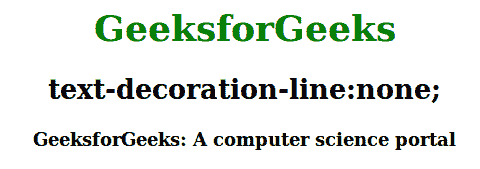
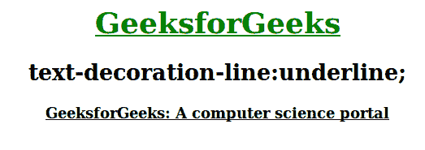
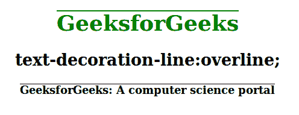
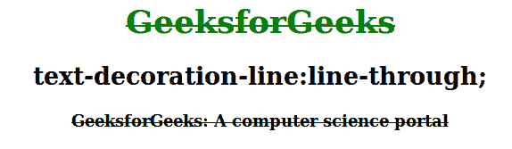
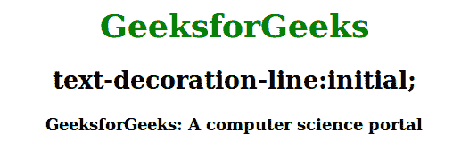

# CSS text-decoration-line 属性

> 原文：[https://www.geeksforgeeks.org/css-text-decoration-line-property/](https://www.geeksforgeeks.org/css-text-decoration-line-property/)

`text-decoration-line` 属性用于设置各种文字装饰。文本装饰可以包括许多值，例如下划线、上划线、换行等。可以组合多个文本装饰属性。例如，`underline` 和 `overline` 值可用于在文本下方和上方显示线条。

**语法：**

```html
text-decoration-line: none | underline | overline | line-through | initial | inherit;
```

[`text-decoration`](https://www.geeksforgeeks.org/css-text-decoration-property/) 属性是[简写属性](https://www.geeksforgeeks.org/css-shorthand-properties/)，用于文字装饰线条（必需）、文字装饰颜色和文字装饰样式。

**属性值：** 下面的例子很好地描述了所有的属性。

## `none`
为默认值，用于指定文本无线条修饰文本。

**语法：**

```html
text-decoration-line: none;
```

**示例：** 本示例演示了 `text-decoration-line` 属性的使用，该属性的值设置为 `none`。

### HTML

```html
<!DOCTYPE html>
<html>
<head>
    <title>text-decoration-line property</title>

    <!-- text-decoration-line property used here -->
    <style>
    h1 {
        color: green;
        text-decoration-line: none;
    }

    .gfg {
        text-decoration-line: none;
        font-weight: bold;
    }
    </style>
</head>

<body style="text-align:center">
    <h1>GeeksforGeeks</h1>
    <h2>text-decoration-line: none;</h2>
    <p class="gfg">
      GeeksforGeeks: A computer science portal
    </p>

</body>
</html>
```

**输出：**



## `underline`
用于在文字下方或下方显示一行。

**语法：**

```html
text-decoration-line: underline;
```

**示例：** 该示例演示了使用 `text-decoration-line` 属性，该属性的值设置为 `underline`。

### HTML

```html
<!DOCTYPE html>
<html>
<head>
    <title> text-decoration-line property </title>

    <!-- text-decoration-line property used here -->
    <style>
    h1 {
        color: green;
        text-decoration-line: underline;
    }

    .gfg {
        text-decoration-line: underline;
        font-weight: bold;
    }
    </style>
</head>

<body style="text-align:center">
    <h1>GeeksforGeeks</h1>
    <h2>text-decoration-line:underline;</h2>
    <p class="gfg">
      GeeksforGeeks: A computer science portal
    </p>

</body>
</html>
```

**输出：**



## `overline`
用于在文本上显示一条线。

**语法：**

```html
text-decoration-line: overline;
```

**示例：** 该示例演示了使用 `text-decoration-line` 属性，该属性的值设置为 `overline`。

### HTML

```html
<!DOCTYPE html>
<html>
<head>
    <title> text-decoration-line property </title>

    <!-- text-decoration-line property used here -->
    <style>
    h1 {
        color: green;
        text-decoration-line: overline;
    }

    .gfg {
        text-decoration-line: overline;
        font-weight: bold;
    }
    </style>
</head>

<body style="text-align:center">
    <h1>GeeksforGeeks</h1>
    <h2>text-decoration-line:overline;</h2>
    <p class="gfg">
      GeeksforGeeks: A computer science portal
    </p>

</body>
</html>
```

**输出：**



## `line-through`
用于显示一条穿越文本的线。

**语法：**

```html
text-decoration-line: line-through;
```

**示例：** 本示例演示了 `text-decoration-line` 属性的使用，该属性的值设置为 `line-through`。

### HTML

```html
<!DOCTYPE html>
<html>
<head>
    <title> text-decoration-line property </title>
    <!-- text-decoration-line property used here -->
    <style>
    h1 {
        color: green;
        text-decoration-line: line-through;
    }

    .gfg {
        text-decoration-line: line-through;
        font-weight: bold;
    }
    </style>
</head>

<body style="text-align:center">
    <h1>GeeksforGeeks</h1>
    <h2>text-decoration-line:line-through;</h2>
    <p class="gfg">
      GeeksforGeeks: A computer science portal
    </p>

</body>
</html>
```

**输出：**



## `initial`
用于将元素的 CSS 属性设置为默认值。这和没有设置该属性是一样的。

**语法：**

```html
text-decoration-line: initial;
```

**示例：** 本示例演示了 `text-decoration-line` 属性的使用，该属性的值设置为 `initial`。

### HTML

```html
<!DOCTYPE html>
<html>
<head>
    <title> text-decoration-line property </title>

    <!-- text-decoration-line property used here -->
    <style>
    h1 {
        color: green;
        text-decoration-line: initial;
    }

    .gfg {
        text-decoration-line: initial;
        font-weight: bold;
    }
    </style>
</head>

<body style="text-align:center">
    <h1>GeeksforGeeks</h1>
    <h2>text-decoration-line:initial;</h2>
    <p class="gfg">
      GeeksforGeeks: A computer science portal
    </p>

</body>
</html>
```

**输出：**



**支持的浏览器：** 由 `text-decoration-line` 属性支持的浏览器如下：

*   Google Chrome 57.0
*   Microsoft Edge 79.0
*   Firefox 36.0, 6.0 -moz-
*   Apple Safari 7.1 -webkit-
*   Opera 44.0