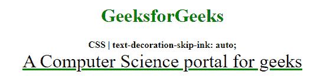
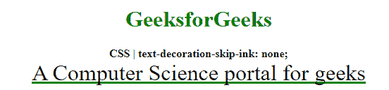

# CSS text-decoration-skip-ink 属性

> 原文：[https://www.geeksforgeeks.org/css-text-decoration-skip-ink-property/](https://www.geeksforgeeks.org/css-text-decoration-skip-ink-property/)

`text-decoration-skip-ink` 属性用于指定下划线和上划线通过字符或字形时的渲染方式。

## 语法

```html
text-decoration-sink: auto | none
```

## 属性值

*   `auto`：该值用于指定跳过通过字符的下划线和上划线。这是默认值。
*   `none`：该值用于指定不跳过通过字符的下划线和上划线。它会切断像“g”和“t”这样的字符。

以下示例说明了 `CSS text-decoration-skip-ink` 属性：

### 示例 1

在本例中，我们将使用 `text-decoration-skip-ink: auto;` 属性值。

```html
<!DOCTYPE html>
<html>

<head>
    <title>
        CSS | text-decoration-skip-ink
    </title>
    <style>
        .skip-ink-auto {
            font-size: 2em;
            text-decoration: underline green;

            /* text decoration-skip-ink effect */
            text-decoration-skip-ink: auto;
        }
    </style>
</head>

<body>
    <center>
        <h1 style="color: green">
            GeeksforGeeks
        </h1>

        <b>
            CSS | text-decoration-skip-ink: auto;
        </b>

        <div class="skip-ink-auto">
            A Computer Science portal for geeks
        </div>
    </center>
</body>

</html>
```

**输出：**


### 示例 2

在本例中，我们将使用 `text-decoration-skip-ink: none;` 属性值。

```html
<!DOCTYPE html>
<html>

<head>
    <title>
        CSS | text-decoration-skip-ink
    </title>
    <style>
        .skip-ink-none {
            font-size: 2em;
            text-decoration: underline green;

            /* text decoration-skip-ink effect */
            text-decoration-skip-ink: none;
        }
    </style>
</head>

<body>
    <center>
        <h1 style="color: green">
            GeeksforGeeks
        </h1>

        <b>
            CSS | text-decoration-skip-ink: none;
        </b>

        <div class="skip-ink-none">
            A Computer Science portal for geeks
        </div>
    </center>
</body>

</html>
```

**输出：**


## 支持的浏览器

`text-decoration-skip-ink` 属性支持的浏览器如下：

*   谷歌 Chrome 64
*   Firefox 70
*   歌剧 50