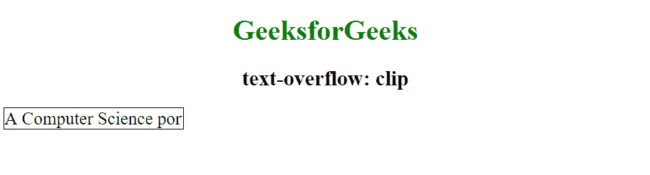
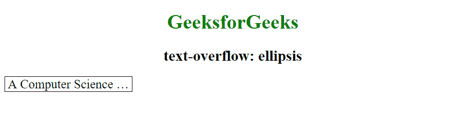
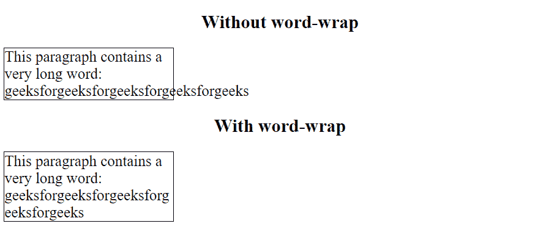
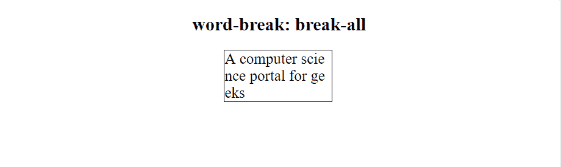
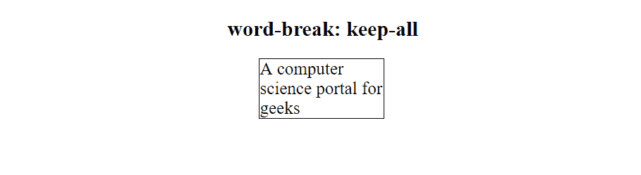
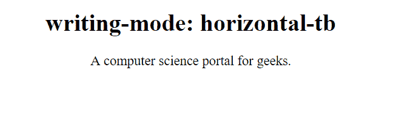
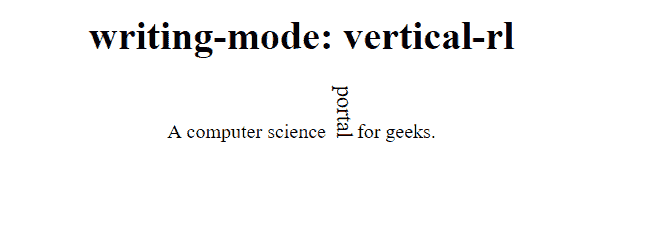

# CSS 文本效果

> 原文：[https://www.geeksforgeeks.org/css-text-effects/](https://www.geeksforgeeks.org/css-text-effects/)

CSS 是在各种网络文档中添加样式的机制。文本效果允许我们对 HTML 文档中使用的文本应用不同类型的效果。

以下是 CSS 中可用于给文本添加效果的一些属性：

1.  文本溢出
2.  自动换行
3.  断字
4.  书写模式

让我们详细了解其中的每一项：

## Text-Overflow

CSS `text-overflow` 属性是一种限制超出其父元素宽度的文本的方法。它有助于指定如何表示对用户不可见的溢出文本部分。

### 语法

```html
element {
    text-overflow: clip | ellipsis;
    //CSS Property
}
```

### 值

*   `clip`：这是此属性的默认值。此关键字值将在内容区域的限制处截断文本，因此截断可能发生在字符的中间。

    ```html
    <!DOCTYPE html>
    <html>
        <head>
            <style>
                div.geek {
                    white-space: nowrap;
                    width: 200px;
                    overflow: hidden;
                    border: 1px solid #000000;
                    font-size: 20px;
                    text-overflow: clip;
                }

                div.geek:hover {
                    overflow: visible;
                }
            </style>
        </head>
        <body style = "text-align: center">
            <h1 style = "color:green">
                GeeksforGeeks
            </h1>
            <h2>
                text-overflow: clip
            </h2>
            <div class="geek">
                A Computer Science portal for geeks.
            </div>
        </body>
    </html>
    ```

    **输出：**
    

*   `ellipsis`：这将显示省略号（'…'）来表示被截断的文本。省略号显示在内容区域内，减少了显示的文本量。如果没有足够的空间显示省略号，它将被截断。

    ```html
    <!DOCTYPE html>
    <html>
        <head>
            <style>
                div.geek {
                    white-space: nowrap;
                    width: 200px;
                    overflow: hidden;
                    border: 1px solid #000000;
                    font-size: 20px;
                    text-overflow: ellipsis;
                }

                div.geek:hover {
                    overflow: visible;
                }
            </style>
        </head>
        <body style = "text-align: center">
            <h1 style = "color:green">
                GeeksforGeeks
            </h1>
            <h2>
                text-overflow: ellipsis
            </h2>
            <div class="geek">
                A Computer Science portal for geeks.
            </div>
        </body>
    </html>
    ```

    **输出：**
    

## Word wrap

CSS `word-wrap` 属性定义了当单词太长而无法适应其父容器时，是否允许浏览器在单词内换行。如果一个单词太长而无法适应某个区域，它会向外扩展：

### 语法

```html
element {
    word-wrap: break-word;
    //CSS Property
}
```

### 示例

```html
<!DOCTYPE html>
<html>
    <head>
        <title>word wrap</title>
        <style>
            p {
                width: 11em;
                border: 1px solid #000000;
                text-align: left;
                font-size: 20px;
            }
            p.test {
                word-wrap: break-word;
            }
        </style>
    </head>
    <body style = "text-align: center;">
        <h2>Without word-wrap</h2>
        <p>
            This paragraph contains a very long word:
            geeksforgeeksforgeeksforgeeksforgeeks
        </p>
        <h2>With word-wrap</h2>
        <p class="test">
            This paragraph contains a very long word: geeks
            forgeeksforgeeksforgeeksforgeeks
        </p>
    </body>
</html>
```

**输出：**


## 断字

断字 CSS 属性设置是否在文本溢出内容框的地方出现换行符。它指定了换行规则。

### 语法

```html
element {
    word-break: keep-all | break-all;
    //CSS Property
}
```

*   `break-all`：用于在任何两个字符之间插入单词换行以防止单词溢出。

    **示例：**

    ```html
    <!DOCTYPE html>
    <html>
        <head>
            <title>word-break: break-all</title>
            <style>
                p.geek {
                    width: 140px;
                    border: 1px solid #000000;
                    word-break: break-all;
                    text-align: left;
                    font-size: 20px;
                }
            </style>
        </head>
        <body style= "text-align: center;">
            <h2>word-break: break-all</h2>
            <p class="geek">
                A computer science portal for geeks
            </p>
        </body>
    </html>
    ```

    **输出：**
    

*   `keep-all`：用于以默认样式断字。

    **示例：**

    ```html
    <!DOCTYPE html>
    <html>
        <head>
            <title>word-break: keep-all</title>
            <style>
                p.geek {
                    width: 140px;
                    border: 1px solid #000000;
                    word-break: keep-all;
                    text-align: left;
                    font-size: 20px;
                }
            </style>
        </head>
        <body style= "text-align: center;">
            <h2>word-break: keep-all</h2>
            <p class="geek">
                A computer science portal for geeks
            </p>
        </body>
    </html>
    ```

    **输出：**
    

## Writing mode

CSS `writing-mode` 属性指定文本行是水平还是垂直布局。

### 语法

```html
element {
     writing-mode: horizontal-tb | vertical-rl;
    //CSS Property
}
```

*   `horizontal-tb`：这是属性的默认值，即文本从左到右、从上到下阅读。下一个水平行位于上一行的下方。

    **示例：**

    ```html
    <!DOCTYPE html>
    <html>
        <head>
            <title>writing-mode: horizontal-tb</title>
            <style>
                p.geek {
                    writing-mode: horizontal-tb;
                    font-size: 18px;
                }
            </style>
        </head>
        <body style = "text-align: center;">
            <h1>writing-mode: horizontal-tb</h1>
            <p class="geek">
                A computer science portal for geeks.
            </p>
        </body>
    </html>
    ```

    **输出：**
    

*   `vertical-rl`：在此属性中，文本从右到左、从上到下阅读。下一个垂直行位于上一行的左侧。

    **示例：**

    ```html
    <!DOCTYPE html>
    <html>
        <head>
            <title>writing-mode: vertical-rl</title>
            <style>
                span.test2 {
                    writing-mode: vertical-rl;
                    font-size: 18px;
                }
            </style>
        </head>
        <body style = "text-align: center;">
            <h1>writing-mode: vertical-rl</h1>
            <span class="test2">
                A computer science portal for geeks.
            </span>
        </body>
    </html>
    ```

    **输出：**
    

# writing-mode: vertical-rl

```html
<body style = "text-align: center;">
                <h1>writing-mode: vertical-rl</h1>
                    <p class="geek"></p>
                    <p>
                        computer science <span class="test2">portal </span>
                        for geeks.
                    </p>
            </body>
        </html>
```

## 输出:

