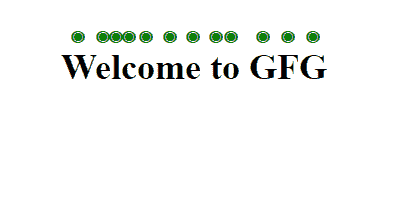

# CSS 文本强调属性

> 原文: [https://www.geeksforgeeks.org/css-text-emphasis-property/](https://www.geeksforgeeks.org/css-text-emphasis-property/)

在本文中，我们将讨论 CSS 中的 `text-emphasis` 属性。它是 `text-emphasis-style` 和 `text-emphasis-color` 的简写属性。它将强调属性应用于字符（空格和控制字符除外）。

## 语法

```html
text-emphasis: text-emphasis-style text-emphasis-color;
```

## 属性

*   `text-emphasis-style`: 定义强调标记的形状。接受 `filled`、`open`、`dot`、`triangle`、`none` 等值。
*   `text-emphasis-color`: 定义强调标记的颜色。

## 示例

### 超文本标记语言

```html
<!DOCTYPE html>
<html>

<head>
    <style>
    h2 {
        text-emphasis: filled double-circle green;
        -webkit-text-emphasis: filled double-circle green;
    }
    </style>
    <title>Text Emphasis</title>
</head>

<body>
    <center>
        <h2>Welcome to GFG</h2>
    </center>
</body>

</html>
```

**输出:**



## 支持的浏览器

*   Chrome 25 及以上
*   Edge 79 及以上
*   Firefox 46 及以上版本
*   Opera 15 及以上
*   Safari 7 及以上版本