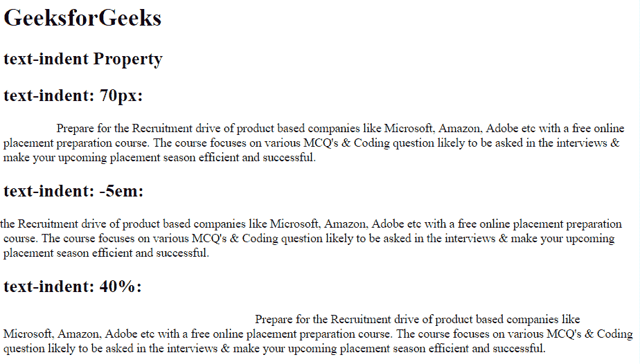
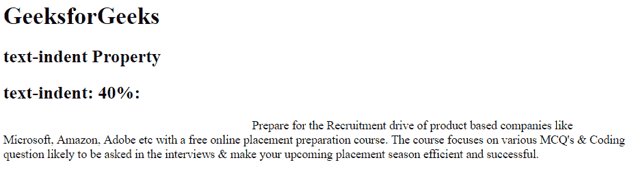
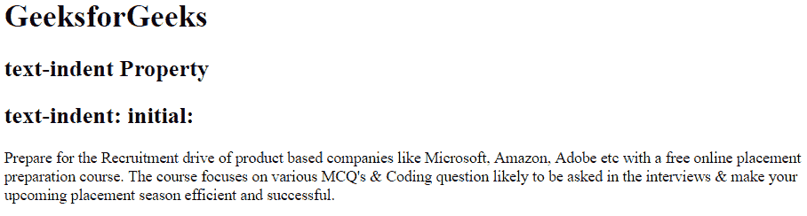

# CSS 文本缩进属性

> 原文: [https://www.geeksforgeeks.org/css-text-indent-property/](https://www.geeksforgeeks.org/css-text-indent-property/)

CSS 中的文本缩进属性用于定义每个文本块中第一行的缩进。它也取负值。这意味着如果该值为负，那么第一行将向左缩进。

## 语法

```html
text-indent: length|initial|inherit;
```

## 属性值

### `length`
用于设置固定的缩进量，单位可以是 `px`、`pt`、`cm`、`em` 等。`length` 的默认值是 `0`。

**语法:**

```html
text-indent: length;
```

**示例:**

```html
<!DOCTYPE html>
<html>
    <head>
        <title>
            CSS text-indent Property
        </title>
        <!-- CSS text-indent property -->
        <style>
            .sudo {
                text-indent: 70px;
            }
            .geeks {
                text-indent: -5em;
            }
            .gfg {
                text-indent: 40%;
            }
        </style>
    </head>
    <body>
        <h1 style = "">GeeksforGeeks</h1>
        <h2> text-indent Property</h2>
        <h2>text-indent: 70px:</h2>
        <div class = "sudo">
            Prepare for the Recruitment drive of product
            based companies like Microsoft, Amazon, Adobe
            etc with a free online placement preparation
            course. The course focuses on various MCQ's
            & Coding question likely to be asked in the
            interviews & make your upcoming placement
            season efficient and successful.
        </div>
        <h2>text-indent: -5em:</h2>
        <div class = "geeks">
            Prepare for the Recruitment drive of product
            based companies like Microsoft, Amazon, Adobe
            etc with a free online placement preparation
            course. The course focuses on various MCQ's
            & Coding question likely to be asked in the
            interviews & make your upcoming placement
            season efficient and successful.
        </div>
        <h2>text-indent: 40%:</h2>
        <div class = "gfg">
            Prepare for the Recruitment drive of product
            based companies like Microsoft, Amazon, Adobe
            etc with a free online placement preparation
            course. The course focuses on various MCQ's
            & Coding question likely to be asked in the
            interviews & make your upcoming placement
            season efficient and successful.
        </div>
    </body>
</html>
```

**输出:**


### `percentage (%)`
用于定义相对于元素宽度的百分比缩进量。

**语法:**

```html
text-indent: %;
```

**示例:**

```html
<!DOCTYPE html>
<html>
    <head>
        <title>
            CSS text-indent Property
        </title>
        <!-- CSS text-indent property -->
        <style>
            .gfg {
                text-indent: 40%;
            }
        </style>
    </head>
    <body>
        <h1 style = "">GeeksforGeeks</h1>
        <h2> text-indent Property</h2>
        <h2>text-indent: 40%:</h2>
        <div class = "gfg">
            Prepare for the Recruitment drive of product
            based companies like Microsoft, Amazon, Adobe
            etc with a free online placement preparation
            course. The course focuses on various MCQ's
            & Coding question likely to be asked in the
            interviews & make your upcoming placement
            season efficient and successful.
        </div>
    </body>
</html>
```

**输出:**


### `initial`
用于将 `text-indent` 属性设置为其默认值。

**语法:**

```html
text-indent: initial;
```

**示例:**

```html
<!DOCTYPE html>
<html>
    <head>
        <title>
            CSS text-indent Property
        </title>
        <!-- CSS text-indent property -->
        <style>
            .gfg {
                text-indent: initial;
            }
        </style>
    </head>
    <body>
        <h1 style = "">GeeksforGeeks</h1>
        <h2> text-indent Property</h2>
        <h2>text-indent: initial:</h2>
        <div class = "gfg">
            Prepare for the Recruitment drive of product
            based companies like Microsoft, Amazon, Adobe
            etc with a free online placement preparation
            course. The course focuses on various MCQ's
            & Coding question likely to be asked in the
            interviews & make your upcoming placement
            season efficient and successful.
        </div>
    </body>
</html>
```

**输出:**


## 支持的浏览器
CSS 文本缩进属性支持的浏览器如下:

*   谷歌 Chrome 1.0
*   Internet Explorer 3.0
*   Firefox 1.0
*   Safari 1.0
*   歌剧 3.5