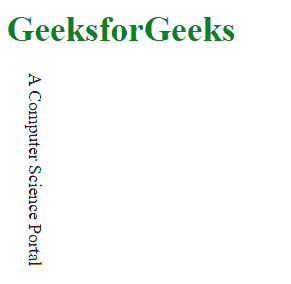
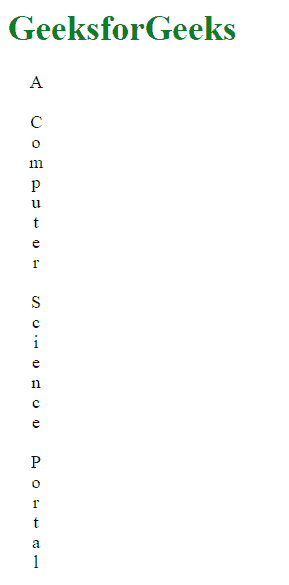

# CSS 文本方向属性

> 原文: [https://www.geeksforgeeks.org/css-text-orientation-property/](https://www.geeksforgeeks.org/css-text-orientation-property/)

CSS 中的 `text-orientation` 属性用于设置一行中字符的方向。这个属性在垂直脚本中很有用，比如创建垂直的表格标题，定义行的名称等等。

## 语法

```css
text-orientation: mixed|upright|sideways;
```

## 属性值

*   `mixed`: 此值用于将文本字符顺时针旋转90度。这是默认值。

**示例:**

```html
<!DOCTYPE html>
<head>
    <title>
        CSS | text-orientation Property
    </title>
    <style>
        h1 {
            color:green;
        }
        p {
            writing-mode: vertical-rl;
            text-orientation: mixed;
        }
    </style>
</head>
<body>
    <h1>GeeksforGeeks</h1>
    <p>A Computer Science Portal</p>
</body>
</html>
```

**输出:**


*   `upright`: 该值从屏幕右侧向下开始文本。

**示例:**

```html
<!DOCTYPE html>
<head>
    <title>
        CSS | text-orientation Property
    </title>
    <style>
        h1 {
            color:green;
        }
        p {
            writing-mode: vertical-rl;
            text-orientation: upright;
        }
    </style>
</head>
<body>
    <h1>GeeksforGeeks</h1>
    <p>A Computer Science Portal</p>
</body>
</html>
```

**输出:**


*   `sideways`: 此值将文本行顺时针旋转90度。

**示例:**

```html
<!DOCTYPE html>
<head>
    <title>
        CSS | text-orientation Property
    </title>
    <style>
        h1 {
            color:green;
        }
        p {
            writing-mode: vertical-rl;
            text-orientation: sideways;
        }
    </style>
</head>
<body>
    <h1>GeeksforGeeks</h1>
    <p>A Computer Science Portal</p>
</body>
</html>
```

**输出:**


## 注意

`text-orientation` 属性取决于 [`writing-mode`](https://www.geeksforgeeks.org/css-writing-mode-property/) 属性，如果没有设置在 `horizontal-tb` 上，则该属性有效。

## 支持的浏览器

`text-orientation` 属性支持的浏览器如下:

*   谷歌 Chrome
*   火狐浏览器
*   歌剧