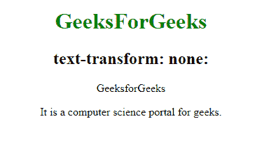
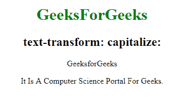
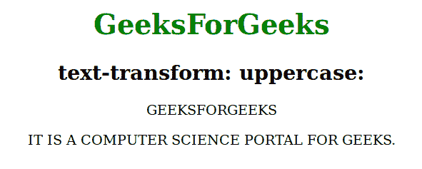
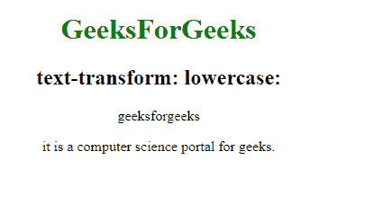
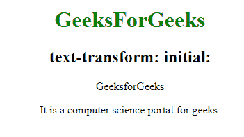

# 文本转换

> 原文：`https://www.geeksforgeeks.org/css-text-transform-property/`

`text-transform` 属性用于控制文本的大小写。

**语法：**

```html
text-transform: none|capitalize|uppercase|lowercase|initial|inherit;
```

## 属性值

### `none`
默认值。不进行任何大写转换。

**语法：**

```html
text-transform: none;
```

**示例：**

```html
<!DOCTYPE html>
<html>
<head>
    <title>
        CSS text-transform Property
    </title>
    <style>
        h1 {
            color: green;
        }

        p.gfg {
            text-transform: none;
        }
    </style>
</head>
<body>
    <center>
        <h1>GeeksForGeeks</h1>

        <h2>text-transform: none:</h2>
        <p class="gfg">GeeksforGeeks</p>

        <p class="gfg">
         It is a computer science portal for geeks.
        </p>
    </center>
</body>
</html>
```

**输出：**



### `capitalize`
将每个单词的第一个字符转换为大写。

**语法：**

```html
text-transform:capitalize;
```

**示例：**

```html
<!DOCTYPE html>
<html>
<head>
    <title>
        CSS text-transform Property
    </title>
    <style>
        h1 {
            color: green;
        }

        p.gfg {
            text-transform: capitalize;
        }
    </style>
</head>
<body>
    <center>
        <h1>GeeksForGeeks</h1>

        <h2>text-transform: capitalize:</h2>
        <p class="gfg">GeeksforGeeks</p>

        <p class="gfg">
         It is a computer science portal for geeks.
        </p>
    </center>
</body>
</html>
```

**输出：**



### `uppercase`
将每个单词中的所有字符转换为大写。

**语法：**

```html
text-transform:uppercase;
```

**示例：**

```html
<!DOCTYPE html>
<html>
<head>
    <title>
        CSS text-transform Property
    </title>
    <style>
        h1 {
            color: green;
        }

        p.gfg {
            text-transform: uppercase;
        }
    </style>
</head>
<body>
    <center>
        <h1>GeeksForGeeks</h1>

        <h2>text-transform: uppercase:</h2>
        <p class="gfg">GeeksforGeeks</p>

        <p class="gfg">
         It is a computer science portal for geeks.
        </p>
    </center>
</body>
</html>
```

**输出：**



### `lowercase`
将每个单词中的所有字符转换为小写。

**语法：**

```html
text-transform:lowercase;
```

**示例：**

```html
<!DOCTYPE html>
<html>
<head>
    <title>
        CSS text-transform Property
    </title>
    <style>
        h1 {
            color: green;
        }

        p.gfg {
            text-transform: lowercase;
        }
    </style>
</head>
<body>
    <center>
        <h1>GeeksForGeeks</h1>

        <h2>text-transform: lowercase:</h2>
        <p class="gfg">GeeksforGeeks</p>

        <p class="gfg">
         It is a computer science portal for geeks.
        </p>
    </center>
</body>
</html>
```

**输出：**



### `initial`
将属性设置为默认值。

**语法：**

```html
text-transform:initial;
```

**示例：**

```html
<!DOCTYPE html>
<html>
<head>
    <title>
        CSS text-transform Property
    </title>
    <style>
        h1 {
            color: green;
        }

        p.gfg {
            text-transform: initial;
        }
    </style>
</head>
<body>
    <center>
        <h1>GeeksForGeeks</h1>

        <h2>text-transform: initial:</h2>
        <p class="gfg">GeeksforGeeks</p>

        <p class="gfg">
         It is a computer science portal for geeks.
        </p>
    </center>
</body>
</html>
```

**输出：**



## 支持的浏览器
`text-transform` CSS 属性支持的浏览器如下：

*   Google Chrome 1.0
*   Internet Explorer 4.0
*   Firefox 1.0
*   Opera 1.0
*   Safari 3.5