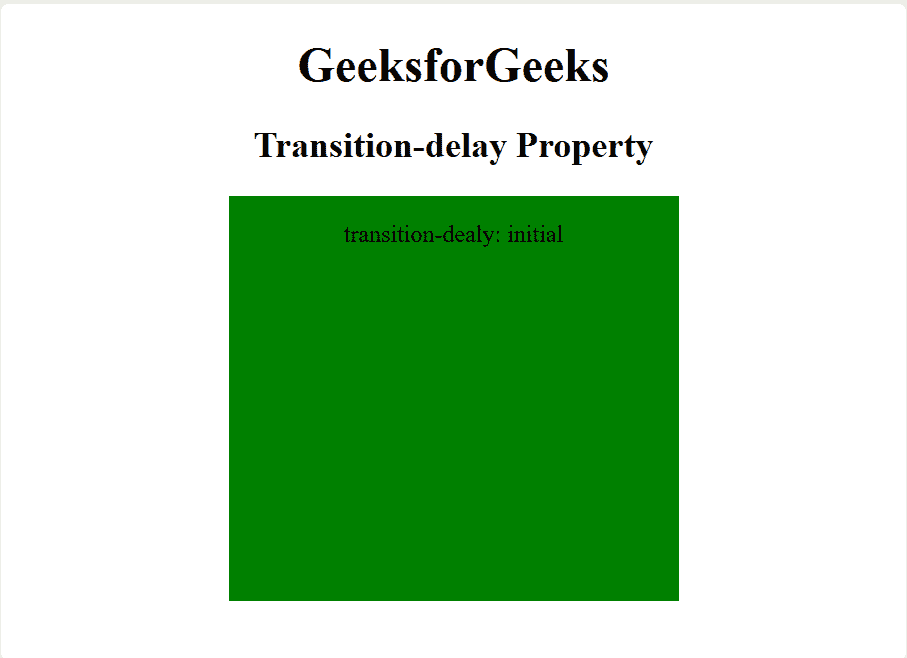
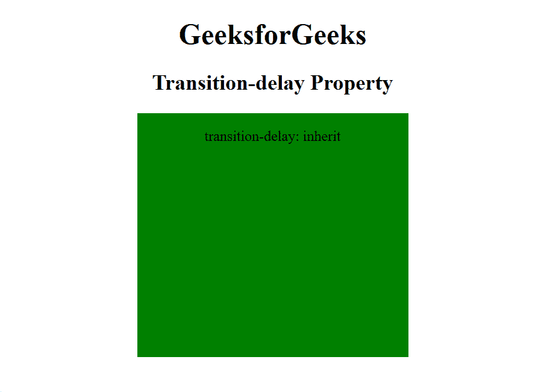

# CSS `transition-delay` 属性

> 原文：[https://www.geeksforgeeks.org/css-transition-delay-property/](https://www.geeksforgeeks.org/css-transition-delay-property/)

CSS 中的 `transition-delay` 属性用于指定开始转换的时间。以秒或毫秒为单位设置的转换延迟值。

**语法：**

```html
transition-delay: time|initial|inherit;
```

**属性值：**

*   `time`：指定开始过渡动画的时间长度（以秒或毫秒为单位）。
    **示例：**

### HTML 示例

```html
<!DOCTYPE html>
<html>
    <head>
        <title>
            CSS transition-delay Property
        </title>
        <style>
            div {
                width: 100px;
                height: 270px;
                background: green;
                transition-property: width;
                transition-duration: 5s;
                transition-delay: 2s;

                /* For Safari browser */
                -webkit-transition-property: width;
                -webkit-transition-duration: 5s;
                -webkit-transition-delay: 2s;
                display: inline-block;
            }

            div:hover {
                width: 300px;
            }
        </style>
    </head>
    <body style="text-align:center;">
        <h1>GeeksforGeeks</h1>
        <h2>Transition-delay Property</h2>
        <div>
            <p>transition-delay: 2s</p>
        </div>
    </body>
</html>
```

**输出：**


*   `initial`：它将转换延迟属性设置为默认值。
    **示例：**

### HTML 示例

```html
<!DOCTYPE html>
<html>
    <head>
        <title>
            CSS transition-delay Property
        </title>
        <style>
            div {
                width: 100px;
                height: 270px;
                background: green;
                transition-property: width;
                transition-duration: 5s;
                transition-delay: initial;

                /* For Safari browser */
                -webkit-transition-property: width;
                -webkit-transition-duration: 5s;
                -webkit-transition-delay: initial;
                display: inline-block;
            }

            div:hover {
                width: 300px;
            }
        </style>
    </head>
    <body style="text-align:center;">
        <h1>GeeksforGeeks</h1>
        <h2>Transition-delay Property</h2>
        <div>
            <p>transition-delay: initial</p>
        </div>
    </body>
</html>
```

**输出：**



*   `inherit`：该属性从其父元素继承而来。
    **示例：**

### HTML 示例

```html
<!DOCTYPE html>
<html>
    <head>
        <title>
            CSS transition-delay Property
        </title>
        <style>
            div {
                width: 100px;
                height: 270px;
                background: green;
                transition-property: width;
                transition-duration: 5s;
                transition-delay: inherit;

                /* For Safari browser */
                -webkit-transition-property: width;
                -webkit-transition-duration: 5s;
                -webkit-transition-delay: inherit;
                display: inline-block;
            }

            div:hover {
                width: 300px;
            }
        </style>
    </head>
    <body style="text-align:center;">
        <h1>GeeksforGeeks</h1>
        <h2>Transition-delay Property</h2>
        <div>
            <p>transition-delay: inherit</p>
        </div>
    </body>
</html>
```

**输出：**



**注意：** `transition-delay` 属性的默认值为零。

**支持的浏览器：** `transition-delay` 属性支持的浏览器如下：

*   Google Chrome 26.0，4.0 -webkit-
*   Edge 10.0
*   Firefox 16.0，4.0 -moz-
*   Safari 6.1，3.1 -webkit-
*   Opera 12.1，10.5 -o-