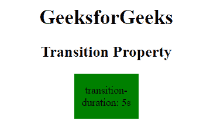
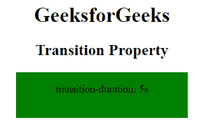
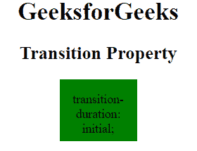
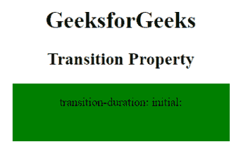
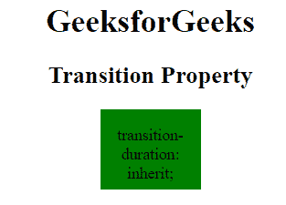
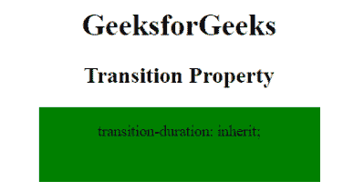

# CSS 过渡持续时间属性

> 原文：[https://www.geeksforgeeks.org/css-transition-duration-property/](https://www.geeksforgeks.org/css-transition-duration-property/)

CSS 中的过渡持续时间属性用于指定完成过渡效果的时间长度（以秒或毫秒为单位）。

**语法：**

```html
transition-duration: time|initial|inherit;
```

**属性值：**

*   `time`：用于指定完成过渡动画的时间长度（以秒或毫秒为单位）。

**语法：**

```html
transition-duration: time;
```

**示例：**

```html
<!DOCTYPE html>
<html>
    <head>
        <title>
            CSS transition-duration Property
        </title>
        <style>
            div {
                width: 100px;
                height: 70px;
                background: green;
                transition-property: width;
                transition-duration: 5s;

                /* For Firefox browser */
                -webkit-transition-property: width;
                -webkit-transition-duration: 5s;
                transition-delay: .2s;
                display: inline-block;
            }

            div:hover {
                width: 300px;
            }
        </style>
    </head>
    <body style = "text-align:center;">
        <h1>GeeksforGeeks</h1>
        <h2>Transition Property</h2>
        <div>
            <p>transition-duration: 5s</p>
        </div>
    </body>
</html>
```

**输出：**

*   过渡前：
        
*   过渡后：
        

*   `initial`：用于将 `transition-duration` 属性设置为其默认值。`transition-duration` 的默认值是 0。

**语法：**

```html
transition-duration: initial;
```

**示例：**

```html
<!DOCTYPE html>
<html>
    <head>
        <title>
            CSS transition-duration Property
        </title>
        <style>
            div {
                width: 100px;
                height: 80px;
                background: green;
                transition-property: width;
                transition-duration: initial;

                /* For Firefox browser */
                -webkit-transition-property: width;
                -webkit-transition-duration: initial;
                transition-delay: .2s;
                display: inline-block;
            }

            div:hover {
                width: 300px;
            }
        </style>
    </head>
    <body style = "text-align:center;">
        <h1>GeeksforGeeks</h1>
        <h2>Transition Property</h2>
        <div>
            <p>transition-duration: initial;</p>
        </div>
    </body>
</html>
```

**输出：**

*   过渡前：
        
*   过渡后：
        

*   `inherit`：`transition-duration` 属性的值从其父元素继承。

**语法：**

```html
transition-duration: inherit;
```

**示例 3：**

```html
<!DOCTYPE html>
<html>
    <head>
        <title>
            CSS transition-duration Property
        </title>
        <style>
            div {
                width: 100px;
                height: 270px;
                background: green;
                transition-property: width;
                transition-duration: inherit;
                transition-timing-function: ease-in;
                transition-delay: .2s;
                display: inline-block;
            }

            div:hover {
                width: 500px;
            }
        </style>
    </head>
    <body style = "text-align:center;">
        <h1>GeeksforGeeks</h1>
        <h2>Transition Property</h2>
        <div>
            <p>transition-duration: inherit</p>
        </div>
    </body>
</html>
```

**输出：**

*   过渡前：
        
*   过渡后：
        

**支持的浏览器：**`transition-duration` 属性支持的浏览器如下：

*   Chrome 26.0，4.0 -webkit-
*   Edge 10.0
*   Firefox 16.0，4.0 -moz-
*   Opera 12.1，10.5 -o-
*   Safari 6.1，3.1 -webkit-