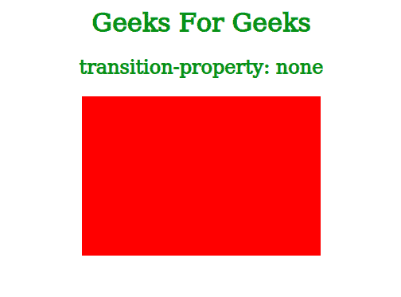
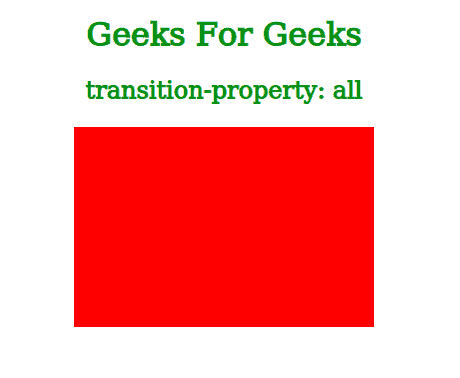
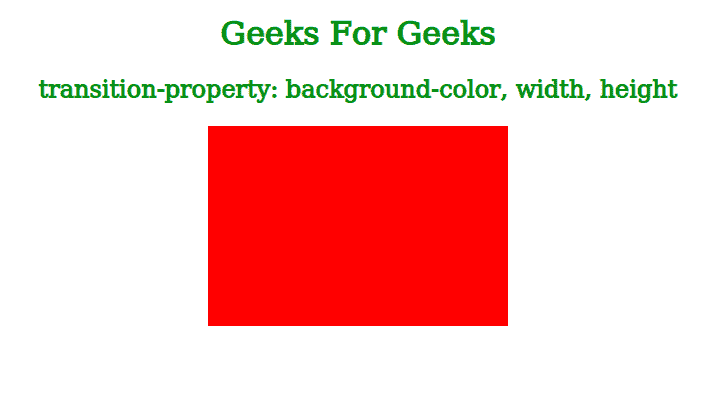
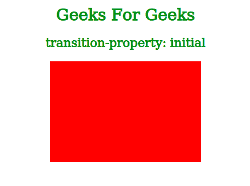
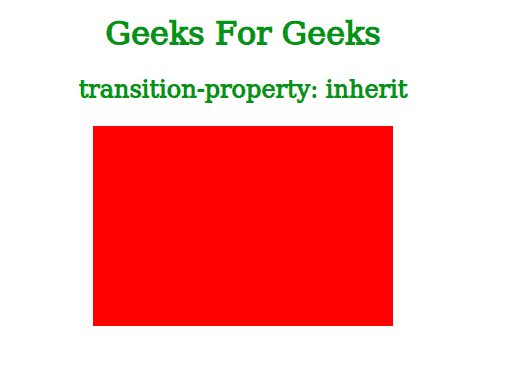

# CSS 过渡属性

> 原文：[https://www.geeksforgeeks.org/css-transition-property-property/](https://www.geeksforgeeks.org/css-transition-property-property/)

过渡效果用于显示指定持续时间内元素属性的变化。`transition-property`属性用于指定将发生过渡效果的 CSS 属性的名称。

## 语法

```html
transition-property: none | all | property | initial | inherit;
```

## 属性值

### none
此值用于指定没有属性会获得过渡效果。

**语法：**

```html
transition-property: none;
```

**示例：** 在下面的示例中，我们已经指定没有属性会获得过渡效果。因此，如果我们将鼠标悬停在框上，其属性的变化将是突然的，而不是在指定的持续时间内从一个值转换到另一个值。

```html
<!DOCTYPE html>
<html>
  <head>
    <title>CSS transition-property property</title>
    <style>
      .box{
        background-color: red;
        width: 300px;
        height: 200px;
        margin: auto;
        transition-property: none;
        transition-duration: 2s;
      }
      .box:hover{
        background-color: pink;
        width: 200px;
        height: 150px;
      }
      h1, h2{
        color: green;
        text-align: center;
      }
    </style>
  </head>
  <body>
    <h1>Geeks For Geeks</h1>
    <h2>transition-property: none</h2>
    <div class="box"></div>
  </body>
</html>
```

**输出：**



### all
所有 CSS 属性都将获得过渡效果。这也是此属性的默认值。

**语法：**

```html
transition-property: all;
```

**示例：** 我们也可以使用`all`值作为过渡属性，而不是指定我们需要过渡效果的所有属性的名称。这将允许我们显示所有属性的转换效果，而无需单独指定它们的名称，如下例所示：

```html
<!DOCTYPE html>
<html>
  <head>
    <title>CSS transition-property property</title>
    <style>
      .box{
        background-color: red;
        width: 300px;
        height: 200px;
        margin: auto;
        transition-property: all;
        transition-duration: 2s;
      }
      .box:hover{
        background-color: pink;
        width: 200px;
        height: 150px;
      }
      h1, h2{
        color: green;
        text-align: center;
      }
    </style>
  </head>
  <body>
    <h1>Geeks For Geeks</h1>
    <h2>transition-property: all</h2>
    <div class="box"></div>
  </body>
</html>
```

**输出：**



### property
我们可以指定将要应用过渡效果的 CSS 属性的名称。我们也可以通过用逗号分隔来指定多个属性。

**语法：**

```html
transition-property: property;
```

**示例：** 在下面的示例中，我们通过用逗号分隔过渡效果（即背景色、宽度和高度）来指定多个属性。因此，当我们将鼠标悬停在框上时，我们可以看到框属性中的过渡。

```html
<!DOCTYPE html>
<html>
  <head>
    <title>CSS transition-property property</title>
    <style>
      .box{
        background-color: red;
        width: 300px;
        height: 200px;
        margin: auto;
        transition-property: background-color, width, height;
        transition-duration: 2s;
      }
      .box:hover{
        background-color: pink;
        width: 200px;
        height: 150px;
      }
      h1, h2{
        color: green;
        text-align: center;
      }
    </style>
  </head>
  <body>
    <h1>Geeks For Geeks</h1>
    <h2>transition-property: background-color, width, height</h2>
    <div class="box"></div>
  </body>
</html>
```

**输出：**



### initial
用于将此属性设置为其默认值。当我们不知道特定属性的默认值时，此值很有用。

**语法：**

```html
transition-property: initial;
```

**示例：** 由于我们在下面的示例中将属性值指定为`initial`，该属性的默认值（即`all`）将被分配给`transition-property`。因此，当我们将鼠标悬停在框上时，所有改变的 CSS 属性都会发生转换效果。

```html
<!DOCTYPE html>
<html>
  <head>
    <title>CSS transition-property property</title>
    <style>
      .box{
        background-color: red;
        width: 300px;
        height: 200px;
        margin: auto;
        transition-property: initial;
        transition-duration: 2s;
      }
      .box:hover{
        background-color: pink;
        width: 200px;
        height: 150px;
      }
      h1, h2{
        color: green;
        text-align: center;
      }
    </style>
  </head>
  <body>
    <h1>Geeks For Geeks</h1>
    <h2>transition-property: initial</h2>
    <div class="box"></div>
  </body>
</html>
```

**输出：**



### inherit
用于指定此属性将从其父元素继承其值。

**语法：**

```html
transition-property: inherit;
```

**示例：** 由于我们已经将属性值指定为`inherit`在下面的示例中，该框将继承其属性的`transition-property`值。但是在这种情况下，其父级的`transition-property`值将是`all`（因为它是默认值），因为我们没有为其父级指定该值。因此，所有 CSS 属性都会发生转换效果。

```html
<!DOCTYPE html>
<html>
  <head>
    <title>CSS transition-property property</title>
    <style>
      .box{
        background-color: red;
        width: 300px;
        height: 200px;
        margin: auto;
        transition-property: inherit;
        transition-duration: 2s;
      }
      .box:hover{
        background-color: pink;
        width: 200px;
        height: 150px;
      }
      h1, h2{
        color: green;
        text-align: center;
      }
    </style>
  </head>
  <body>
    <h1>Geeks For Geeks</h1>
    <h2>transition-property: inherit</h2>
    <div class="box"></div>
  </body>
</html>
```

**输出：**



## 支持的浏览器
`transition-property`支持的浏览器如下：

*   谷歌 Chrome
*   微软公司出品的 web 浏览器
*   火狐浏览器
*   歌剧
*   旅行队