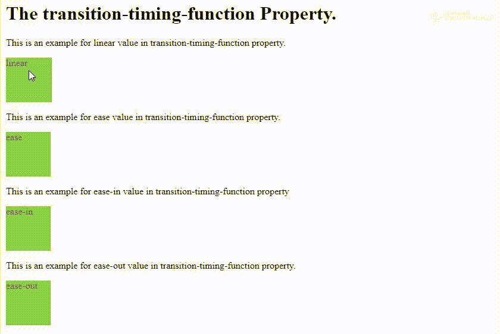

# CSS 过渡定时功能属性

> 原文：[https://www.geeksforgeeks.org/css-transition-timing-function-property/](https://www.geeksforgeeks.org/css-transition-timing-function-property/)

CSS 的`transition-timing-function`属性描述了一个过渡将如何在其持续时间内被展示。这将允许过渡在其过程中改变其速度和不同的运动属性。

`transition-timing-function`指定动画从一组 CSS 样式过渡到另一组 CSS 样式所用的时间曲线。

`transition-timing-function`的默认值为`ease`。该值将动画设置为慢速开始，然后在一段时间后速度增加，在结束之前速度再次变慢。

我们可以给这个属性赋予许多不同的值，其中一些是：

*   `linear` – 在这种情况下，动画从头到尾的速度是一样的。
*   `ease` – 动画以低速开始，然后加快，在结束前变慢。
*   `ease-in` – 动画以低速开始。
*   `ease-out` – 动画以低速结束。
*   `initial` – 这将属性设置为默认值。

## 示例

```html
<!DOCTYPE html>
<html>

<head>
    <style>
        div {
            height: 75px;
            width: 75px;
            background: yellowgreen;
            color: red;
            transition: width 5s;
        }

        #div1 {
            transition-timing-function: linear;
        }

        #div2 {
            transition-timing-function: ease;
        }

        #div3 {
            transition-timing-function: ease-in;
        }

        #div4 {
            transition-timing-function: ease-out;
        }

        div:hover {
            width: 300px;
        }
    </style>
</head>

<body>
    <h1>The transition-timing-function Property.</h1>
    <p>
        This is an example for linear value in transition-timing-function property.
        <div id="div1">linear</div>
    </p>
    <p>
        This is an example for ease value in transition-timing-function property.
        <div id="div2">ease</div>
    </p>
    <p>
        This is an example for ease-in value in transition-timing-function property.
        <div id="div3">ease-in</div>
    </p>
    <p>
        This is an example for ease-out value in transition-timing-function property.
        <div id="div4">ease-out</div>
    </p>
</body>

</html>
```

## 输出

