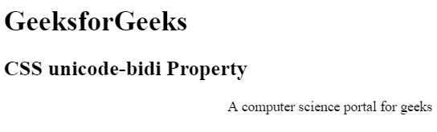
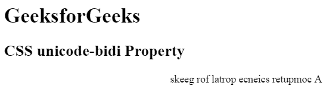

# CSS | unicode-bidi 属性

> 原文:[https://www.geeksforgeeks.org/css-unicode-bidi-property/](https://www.geeksforgeeks.org/css-unicode-bidi-property/)

HTML DOM 中的 `unicode-bidi` 属性与 `direction` 属性一起应用，以确定如何在文档中处理双向文本。

**语法:**

```html
unicode-bidi: normal|embed|bidi-override|initial|inherit;
```

## 属性值

### normal
它是默认值。该元素不会打开额外的嵌入层级。

**语法:**

```html
unicode-bidi: normal;
```

**示例:**

```html
<!DOCTYPE html>
<html>
<head>
    <title>
        CSS unicode-bidi Property
    </title>
    <!-- style for unicode-bidi property -->
    <style>
        .GFG {
            direction: rtl;
            unicode-bidi: normal;
        }
    </style>
</head>
<body>
    <h1>GeeksforGeeks</h1>
    <h2>
        CSS unicode-bidi Property
    </h2>
    <div class="GFG">
        A computer science portal for geeks
    </div>
</body>
</html>
```

**输出:**


### embed
此值用于打开一个额外的嵌入层级。

**语法:**

```html
unicode-bidi: embed;
```

**示例:**

```html
<!DOCTYPE html>
<html>
<head>
    <title>
        CSS unicode-bidi Property
    </title>
    <!-- style for unicode-bidi property -->
    <style>
        .GFG {
            direction: rtl;
            unicode-bidi: embed;
        }
    </style>
</head>
<body>
    <h1>GeeksforGeeks</h1>
    <h2>
        CSS unicode-bidi Property
    </h2>
    <div class="GFG">
        A computer science portal for geeks
    </div>
</body>
</html>
```

**输出:**


### bidi-override
此值为行内元素创建覆盖。对于块级元素，它会为不在另一个块级元素内的行内级后代创建覆盖。

**语法:**

```html
unicode-bidi: bidi-override;
```

**示例:**

```html
<!DOCTYPE html>
<html>
<head>
    <title>
        CSS unicode-bidi Property
    </title>
    <!-- style for unicode-bidi property -->
    <style>
        .GFG {
            direction: rtl;
            unicode-bidi: bidi-override;
        }
    </style>
</head>
<body>
    <h1>GeeksforGeeks</h1>
    <h2>
        CSS unicode-bidi Property
    </h2>
    <div class="GFG">
        A computer science portal for geeks
    </div>
</body>
</html>
```

**输出:**


### initial
它将 `unicode-bidi` 属性设置为其默认值。

**语法:**

```html
unicode-bidi: initial;
```

**示例:**

```html
<!DOCTYPE html>
<html>
<head>
    <title>
        CSS unicode-bidi Property
    </title>
    <!-- style for unicode-bidi property -->
    <style>
        .GFG {
            direction: rtl;
            unicode-bidi: initial;
        }
    </style>
</head>
<body>
    <h1>GeeksforGeeks</h1>
    <h2>
        CSS unicode-bidi Property
    </h2>
    <div class="GFG">
        A computer science portal for geeks
    </div>
</body>
</html>
```

**输出:**


### inherit
`unicode-bidi` 属性从其父元素继承。

**语法:**

```html
unicode-bidi: inherit;
```

**示例:**

```html
<!DOCTYPE html>
<html>
<head>
    <title>
        CSS unicode-bidi Property
    </title>
    <!-- style for unicode-bidi property -->
    <style>
        .Geeks {
            direction: rtl;
            unicode-bidi: bidi-override;
        }
        .GFG {
            unicode-bidi: inherit;
        }
    </style>
</head>
<body>
    <h1>GeeksforGeeks</h1>
    <h2>
        CSS unicode-bidi Property
    </h2>
    <div class="Geeks">
        <div class="GFG">
            A computer science portal for geeks
        </div>
    </div>
</body>
</html>
```

**输出:**


### isolate-override
它将 `isolate` 关键字的隔离行为应用于周围内容，并将 `bidi-override` 的覆盖行为应用于内部内容。

**语法:**

```html
unicode-bidi: isolate-override;
```

### plaintext
它使元素的方向性计算不考虑其父级的双向状态或 `direction` 属性的值。

**语法:**

```html
unicode-bidi: plaintext;
```

## 支持的浏览器
`unicode-bidi` 属性支持的浏览器如下:

*   谷歌 Chrome 2.0
*   Internet Explorer 5.5
*   Firefox 1.0
*   Safari 1.3
*   歌剧 9.2