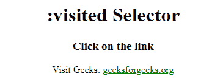

# CSS :visited 选择器

> 原文：[https://www.geeksforgeeks.org/css-visited-selector/](https://www.geeksforgeeks.org/css-visited-selector/)

CSS 中的 `:visited` 选择器用于选择已被访问的链接。例如，访问网站上的某个链接并再次看到它，然后你会发现该链接的颜色发生了变化。这种颜色的变化是由 `:visited` 选择器完成的。

`:visited` 选择器允许的 CSS 属性如下：

*   `color`
*   `border-color`
*   `background-color`
*   `outline-color`
*   `column-rule-color`
*   `fill-color` 和 `stroke-color`

## 语法

```css
:visited {
    /* CSS Properties */
}
```

## 示例

### HTML

```html
<!-- HTML code to illustrate :visited selectors -->
<!DOCTYPE html>
<html>
    <head>
        <title>:visited selector</title>
        <style>
            /* visited CSS property */
            a:visited {
                color: green;
            }
        </style>
    </head>

    <body style="text-align:center">
        <h1>:visited Selector</h1>
        <h3>Click on the link</h3>
        <p>
            Visit Geeks:
            <a href="https://www.geeksforgeeks.org/" target="_blank">geeksforgeeks.org</a>
        </p>
    </body>
</html>
```

## 输出



## 支持的浏览器

*   Google Chrome
*   Microsoft Edge
*   Firefox
*   Opera
*   Safari