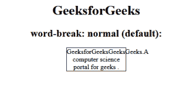
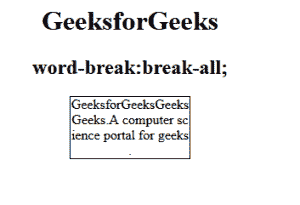
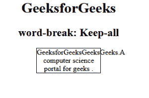
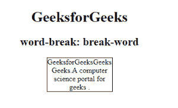
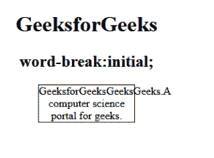

# CSS `word-break` 属性

> 原文: [https://www.geeksforgeeks.org/css-word-break-property/](https://www.geeksforgeeks.org/css-word-break-property/)

`word-break` 属性用于指定当单词到达行尾时如何断字。文本中的换行符可能出现在某些空格中，比如有空格或连字符时。

**语法:**

```css
word-break: normal|break-all|keep-all|break-word|initial|inherit;
```

**默认值:** `normal`

**属性值:** `word-break` 属性的值如下所示:

*   `normal`
*   `break-all`
*   `keep-all`
*   `break-word`
*   `initial`
*   `inherit`

### `normal`
该属性使用默认的换行规则。

**语法:**

```css
word-break: normal; /* 默认值 */
```

**示例:**

```html
<!DOCTYPE html>
<html>
    <head>
        <title>
            CSS | word-break Property
        </title>
        <style>
            p {
                width: 140px;
                border: 1px solid #000000;
            }

            p.gfg {
                word-break: normal;
            }
        </style>
    </head>
    <body>
        <center>
            <h1>GeeksforGeeks</h1>
            <h2>word-break: normal (default):</h2>
            <p class="gfg">GeeksforGeeksGeeksGeeks.
            A computer science portal for geeks .</p>
        </center>
    </body>
</html>
```

**输出:**



### `break-all`
用于任意字符处断字，防止溢出。

**语法:**

```css
word-break: break-all;
```

**示例:**

```html
<!DOCTYPE html>
<html>
    <head>
        <title>
            CSS | word-break Property
        </title>
        <style>
            p {
                width: 142px;
                border: 1px solid #000000;
            }

            p.gfg {
                word-break: break-all;
            }
        </style>
    </head>
    <body>
        <center>
            <h1 style="color:green;">GeeksforGeeks</h1>
            <h2>word-break: break-all;</h2>
            <p class="gfg">GeeksforGeeksGeeksGeeks. A
            computer science portal for geeks .</p>
        </center>
    </body>
</html>
```

**输出:**



### `keep-all`
与值 `normal` 相同。
**注:** 不宜用于中/日/韩文文本。

**语法:**

```css
word-break: keep-all;
```

**示例:**

```html
<!DOCTYPE html>
<html>
    <head>
        <title>
            CSS | word-break Property
        </title>
        <style>
            p {
                width: 140px;
                border: 1px solid #000000;
                color: black;
            }
            p.gfg {
                word-break: keep-all;
            }
        </style>
    </head>
    <body>
        <center>
            <h1>GeeksforGeeks</h1>
            <h2>word-break: Keep-all</h2>
            <p class="gfg">GeeksforGeeksGeeksGeeks.A
            computer science portal for geeks .</p>
        </center>
    </body>
</html>
```

**输出:**



### `break-word`
用于任意点断字，防止溢出。

**语法:**

```css
word-break: break-word;
```

**示例:**

```html
<!DOCTYPE html>
<html>
    <head>
        <title>
            CSS | word-break Property
        </title>
        <style>
            p {
                width: 140px;
                border: 1px solid #000000;
                color: black;
            }
            p.gfg {
                word-break: break-word;
            }
        </style>
    </head>
    <body>
        <center>
            <h1>GeeksforGeeks</h1>
            <h2>word-break: break-word</h2>
            <p class="gfg">GeeksforGeeksGeeksGeeks.A
            computer science portal for geeks .</p>
        </center>
    </body>
</html>
```

**输出:**



### `initial`
将属性设置为默认值。

**语法:**

```css
word-break: initial;
```

**示例:**

```html
<!DOCTYPE html>
<html>
    <head>
        <title>
            CSS | word-break Property
        </title>
        <style>
            p {
                width: 140px;
                border: 1px solid #000000;
                color: black;
            }
            p.gfg {
                word-break: initial;
            }
        </style>
    </head>
    <body>
        <center>
            <h1>GeeksforGeeks</h1>
            <h2>word-break:initial;</h2>
            <p class="gfg">GeeksforGeeksGeeksGeeks.A
            computer science portal for geeks.</p>
        </center>
    </body>
</html>
```

**输出:**



**支持的浏览器:** `word-break` 属性支持的浏览器如下:

*   Google Chrome
*   Microsoft Edge
*   Firefox
*   Opera
*   Safari