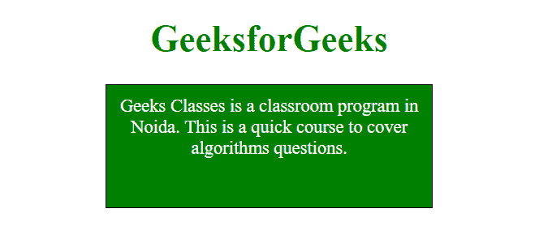
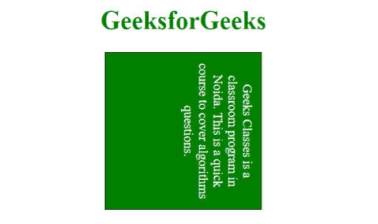
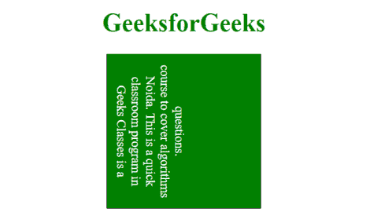

# CSS 书写模式属性

> 原文: [https://www.geeksforgeeks.org/css-writing-mode-property/](https://www.geeksforgeeks.org/css-writing-mode-property/)

书写模式 CSS 属性用于表示文本行是水平布局还是垂直布局，以及块前进的方向。

## 语法

```css
writing-mode: horizontal-tb|vertical-rl|vertical-lr;
```

## 默认值

其默认值为 `horizontal-tb`。

## 属性值

### `horizontal-tb`

此模式让内容从左到右水平流动，从上到下垂直流动。下一条水平线位于上一条线的下方。

**语法:**

```css
writing-mode: horizontal-tb;
```

**示例:**

```html
<!DOCTYPE html>
<html>
    <head>
        <title>writing-mode Property</title>
        <style>
            p.geek {
                width: 300px;
                height: 100px;
                border: 1px solid black;
                writing-mode: horizontal-tb;
                color: white;
                background: green;
            }
        </style>
    </head>
    <body style="text-align: center;">
        <h1 style="color:green;">GeeksforGeeks</h1>
        <p class="geek">
            Geeks Classes is a classroom program in Noida.
            This is a quick course to cover algorithms
            questions.
        </p>
    </body>
</html>
```

**输出:**


### `vertical-rl`

此模式让内容从上到下垂直流动，从右到左水平流动。下一条垂直线位于上一条线的左侧。

**语法:**

```css
writing-mode: vertical-rl;
```

**示例:**

```html
<!DOCTYPE html>
<html>
    <head>
        <title>writing-mode Property</title>
        <style>
            p.geek {
                width: 200px;
                height: 200px;
                border: 1px solid black;
                writing-mode: vertical-rl;
                color: white;
                background: green;
            }
        </style>
    </head>
    <body style="text-align: center;">
        <h1 style="color:green;">GeeksforGeeks</h1>
        <p class="geek">
            Geeks Classes is a classroom program in Noida.
            This is a quick course to cover algorithms
            questions.
        </p>
    </body>
</html>
```

**输出:**


### `vertical-lr`

此模式让内容从上到下垂直流动，从左到右水平流动。下一条垂直线位于上一条线的右侧。

**语法:**

```css
writing-mode: vertical-lr;
```

**示例:**

```html
<!DOCTYPE html>
<html>
    <head>
        <title>writing-mode Property</title>
        <style>
            p.geek {
                width: 200px;
                height: 200px;
                border: 1px solid black;
                writing-mode: vertical-lr;
                color: white;
                background: green;
            }
        </style>
    </head>
    <body style="text-align: center;">
        <h1 style="color:green;">GeeksforGeeks</h1>
        <p class="geek">
            Geeks Classes is a classroom program in Noida.
            This is a quick course to cover algorithms
            questions.
        </p>
    </body>
</html>
```

**输出:**


## 支持的浏览器

支持 `writing-mode` 属性的浏览器如下:

*   谷歌 Chrome 48.0
*   Internet Explorer 12.0
*   Firefox 41.0
*   Opera 35.0
*   苹果 Safari 11.0