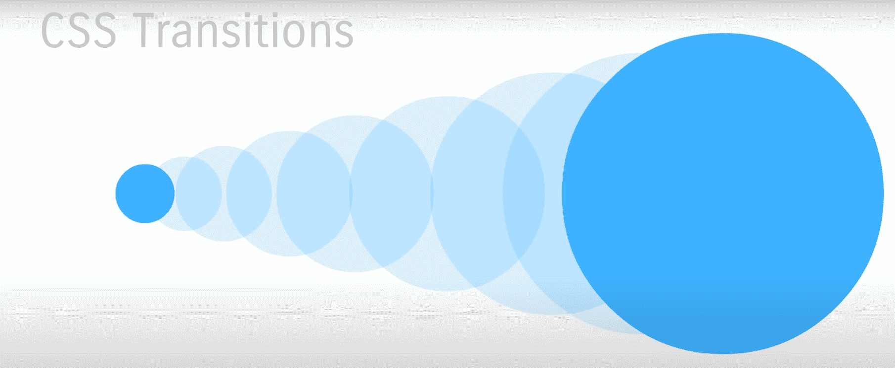
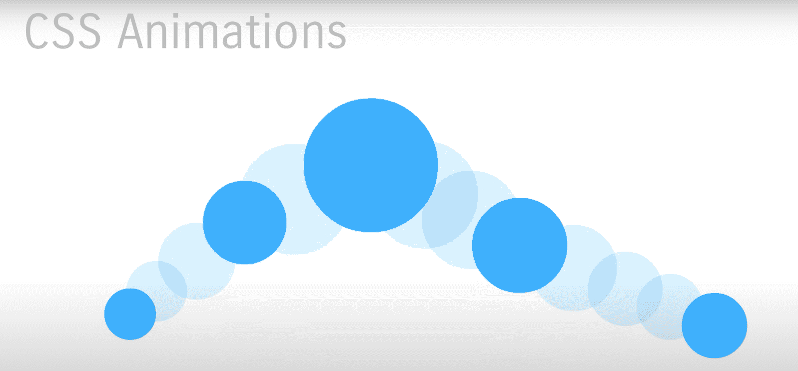
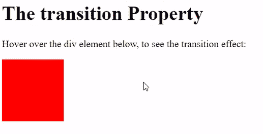
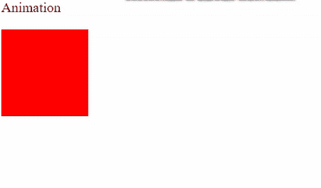

# CSS 中动画和转场的区别

> 原文：[https://www.geeksforgeeks.org/difference-between-animation-and-transition-in-css/](https://www.geeksforgeeks.org/difference-between-animation-and-transition-in-css/)

CSS **[转场](https://www.geeksforgeeks.org/css-transitions/)** 让你可以流畅的改变属性值，但是它们总是需要**像悬停一样触发**。属性更改不会立即生效。一段时间后，财产发生变化。例如，如果将元素的颜色从白色更改为黑色，更改会立即发生。CSS 变化按照可定制的加速曲线的时间间隔发生。

在两个状态之间转换的动画称为**隐式转换**，因为开始和最终状态之间的状态是由浏览器隐式定义的。



图 1：过渡从 A 点开始，在 B 点结束，没有中间点。

CSS **[动画](https://www.geeksforgeeks.org/css-animations/)** 允许 HTML 元素的动画化，不像转场只执行 A 点到 B 点的操作，还可以在两者之间进行更多的操作。动画由两个步骤组成，样式表中定义的 CSS 动画和一组指示动画开始和结束状态的关键帧。



图 2：从 A 点开始的动画在 B 点结束，其他点在中间。

**转场和动画的区别：**

| 转场 | 动画 |
| :--- | :--- |
| 转场不能循环（你可以循环它们，但它们不是为此目的设计的）。 | 动画没有这个问题。 |
| 转场需要一个触发器来运行，比如鼠标悬停。 | 动画会自行开始。它们不需要任何外部触发源。 |
| 转场在 JavaScript 中易于实现。 | 动画很难用 JavaScript 实现。操作关键帧和为它们分配新值的语法非常复杂。 |
| 将转场对象从一个点动画化到另一个点。 | 动画允许你定义关键帧，这些关键帧在不同状态下具有不同的属性和时间范围。 |
| 使用转场 JavaScript 来操作值。 | 通过拥有多个关键帧和简单的循环来提供灵活性。 |

**示例 1：** 以下示例演示了在应用*悬停*后改变颜色的过渡效果。

## 示例 1：转场效果

```html
<!DOCTYPE html>
<html>

<head>
    <style>
        div {
            width: 100px;
            height: 100px;
            background: red;
            transition: width 2s;
        }

        div:hover {
            background: yellow;
        }
    </style>
</head>

<body>
    <h1>The transition Property</h1>
    <p>
        Hover over the div element below,
        to see the transition effect:
    </p>
    <div></div>
</body>

</html>
```

**输出：**



**示例 2：** 以下示例演示了使用动画更改颜色。

## 示例 2：动画效果

```html
<!DOCTYPE html>
<html>

<head>
    <style>
        div {
            width: 100px;
            height: 100px;
            background-color: red;
            animation-name: example;
            animation-duration: 2s;
        }

        @keyframes example {
            0% {
                background-color: red;
            }
            50% {
                background-color: blue;
            }
            100% {
                background-color: yellow;
            }
        }
    </style>
</head>

<body>
    <p>Animation</p>
    <div></div>
</body>

</html>
```

**输出：**



使用动画改变颜色