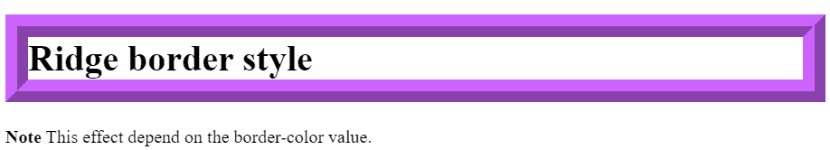
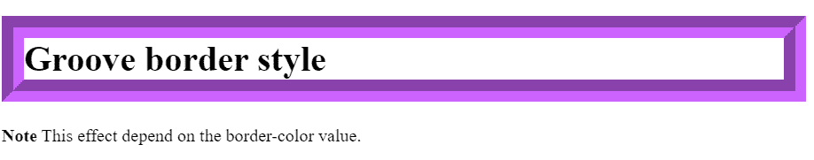

# CSS 中边框和凹槽样式的区别

> 原文：[https://www.geeksforgeeks.org/difference-between-border-ridge-and-groove-styles-in-css/](https://www.geeksforgeeks.org/difference-between-border-ridge-and-groove-styles-in-css/)

[CSS 边框样式](https://www.geeksforgeeks.org/css-border-style-property/)设置元素四个边框的样式。
该属性可以有一到四个值。只有一个值时，该值将应用于所有四个边框；否则，这将作为每个`border-top-style`、`border-right-style`、`border-bottom-style`、`border-left-style`的简写属性，其中每个边框样式都分配有单独的值。
此属性是以下 CSS 属性的简写：
*   [border-bottom-style](https://www.geeksforgeeks.org/css-border-bottom-style-property/)
*   [border-left-style](https://www.geeksforgeeks.org/css-border-left-style-property/)
*   [border-right-style](https://www.geeksforgeeks.org/css-border-right-style-property/)
*   [border-top-style](https://www.geeksforgeeks.org/css-border-top-style-property/)

### 语法：
```html
/* Keyword values */
border-style: groove;
border-style: ridge;

/* top and bottom | left and right */
border-style: dotted solid;

/* top | left and right | bottom */
border-style: hidden double dashed;

/* top | right | bottom | left */
border-style: none solid dotted dashed;

/* Global values */
border-style: inherit;
border-style: initial;
border-style: unset;
```

### Ridge 边框样式：
这是 CSS 的一个`border-style`属性值。它显示具有拉伸外观的边框。它是`groove`边框样式的反面。效果取决于边框颜色值。它看起来好像是从画布里出来的。`ridge`中的边框阴影位置是从**左上**开始的。它反转颜色值，使元素看起来凸起。

**语法：**
```html
border-style: ridge; 
```

**示例：**
```html
<!DOCTYPE html>
<html>

<style>
    h1.ridge {
     border-width: 20px;
     border-style: ridge; 
     border-color: #CC63FF
   }
  </style>
  <body>
   <h1 class="ridge">Ridge border style</h1>
   <p>
     <strong>Note</strong> 
     This effect depend on the border-color value.
   </p>

</body>
</html>
```

**输出：**


### Groove 边框样式：
这是 CSS 的一个`border-style`属性值。它以雕刻的外观显示边框。它是`ridge`风格的反面。效果取决于边框颜色值。它看起来就像是雕刻在画布上一样。(这通常是通过从比边框颜色稍亮和稍暗的两种颜色创建“阴影”来实现的)。`groove`中的边框阴影位置是从**右下角**开始的。它根据颜色值添加一个斜面，使元素看起来像是被压入了文档中。

**语法：**
```html
border-style: groove;
```

**示例：**
```html
<!DOCTYPE html>
<html>

<style>
    h1.groove {
    border-width: 10px;
    border-style: groove; 
    border-color: #CC63FF
   }
  </style>
  <body>
   <h1 class="groove">Groove border style</h1>
   <p>
     <strong>Note</strong> 
     This effect depend on the border-color value.
   </p>

</body>
</html>
```

**输出：**


### 结论：
*   当我们仔细观察这两个结果时，我们会发现在`groove`边框样式中，内边框的上边距和左边距是浅色的。内边框的右下边是深色的，在`ridge`边框样式中正好相反。
*   `groove`是一种 3D 效果，给人的印象是边框被雕刻到画布上。`ridge`是一种 3D 效果，与`groove`的效果相反，在`groove`中，边框似乎从画布中突出。