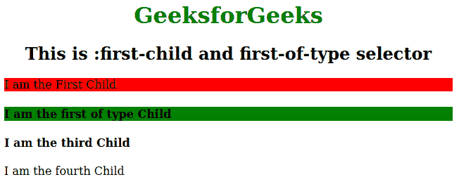

# CSS 中 `:first-child` 和 `:first-of-type` 选择器的区别

> 原文：[https://www.geeksforgeeks.org/difference-between-first-child-and-first-of-type-selector-in-css/](https://www.geeksforgeeks.org/difference-between-first-child-and-first-of-type-selector-in-css/)

它们都是 CSS 中用来选择特定子元素的 HTML 选择器。

- **`:first-child`**：`:first-child` 选择器用于选择那些作为其父元素第一个子元素的元素。注意：对于 IE8 及更早版本，必须声明 `DOCTYPE`。
- **`:first-of-type`**：`:first-of-type` 选择器用于定位其父元素中每个特定类型的第一个子元素。如果我们想在不给类的情况下对元素的第一个子元素进行样式化，我们可以使用它。

## HTML 示例

```html
<!DOCTYPE html>
<html>
<head>
    <title>:first-child and first-of-type selector</title>
    <style>
        h1 {
            color: green;
        }
        h1, h2 {
            text-align: center;
        }
        p:first-child {
            background: red;
        }
        h4:first-of-type {
            background: green;
        }
    </style>
</head>
<body>
    <h1>GeeksforGeeks</h1>
    <h2>This is :first-child and first-of-type selector</h2>
    <div>
        <p>I am the First Child</p>
        <h4>I am the first of type Child</h4>
        <h4>I am the third Child</h4>
        <p>I am the fourth Child</p>
    </div>
</body>
</html>
```

**输出：**



## `:first-child` 和 `:first-of-type` 选择器的区别

| :first-child 选择器 | :first-of-type 选择器 |
| :--- | :--- |
| 如果元素是其父元素的第一个子元素，选择器才会选中该元素。如果目标元素位于第二个位置，选择器将无法选中它。 | 如果元素出现在第二、第三或第四个位置，但只要是其类型的第一个，选择器就会选中该元素。 |
| 在上面的例子中，`div` 标签的子元素是 `p`、`h4`、`h4` 和 `p`。如果你将第一个 `p` 标签改为其他标签，那么 `:first-child` 选择器将无法选中任何子元素。 | 在上面的例子中，`div` 标签的子元素是 `p`、`h4`、`h4` 和 `p`。如果你将第一个 `p` 标签改为 `h4` 标签，那么 `:first-of-type` 选择器将选中父元素的第一个子元素，它同时也是该类型（`h4`）的第一个子元素。 |