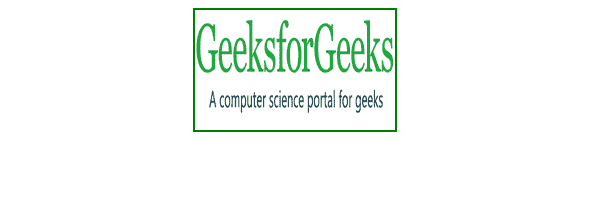
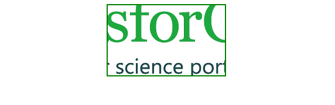
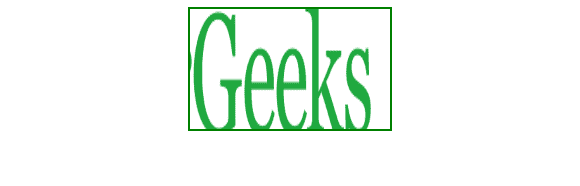

# 使用 CSS 显示调整大小和裁剪后的图像

> 原文：[https://www.geeksforgeeks.org/display-a-resized-and-cropped-image-using-css/](https://www.geeksforgeeks.org/display-a-resized-and-cropped-image-using-css/)

它有助于为网页上的预定义位置动态调整和裁剪任何图像。调整大小和裁剪后的图像用于网页。有一种方法可以让我们在 `div` 中移动裁剪后的图像。

## 方法一：使用常规宽度和高度挤压图像

使用常规宽度和高度将图像挤压到预定义位置。

**示例：**

```html
<!DOCTYPE html>
<html>
<head>
    <!-- Style to set the height and width of image -->
    <style>
        img {
            width: 200px;
            height: 120px;
            border: 2px solid green;
        }
    </style>
</head>
<body style="text-align:center">
    
</body>
</html>
```

**输出：**


## 方法二：使用背景图像定位

使用常规宽度、高度和背景位置，将图像作为背景图像以适应预定义位置（随机裁剪）。

**示例：**

```html
<!DOCTYPE html>
<html>
<head>
    <style>
        div {
            background-image: url('https://media.geeksforgeeks.org/wp-content/uploads/20190306102929/1172.png');
            width: 200px;
            height: 120px;
            background-position: center;
            border: 2px solid green;
        }
    </style>
</head>
<body>
    <center>
        <div></div>
    </center>
</body>
</html>
```

**输出：**


## 方法三：使用溢出隐藏和负边距裁剪

这是裁剪图像的最终方法，也可以调整大小。在此方法中，我们可以在 `div` 内移动图像。使用负边距在 `div` 内移动图像。

**示例：**

```html
<!DOCTYPE html>
<html>
<head>
    <style>
        .crop {
            width: 200px;
            height: 120px;
            overflow: hidden;
            border: 2px solid green;
        }
        .crop img {
            width: 450px;
            height: 300px;
            margin: -30px 0 0 -280px;
        }
    </style>
</head>
<body>
    <center>
        <div class="crop">
            
        </div>
    </center>
</body>
</html>
```

**输出：**
