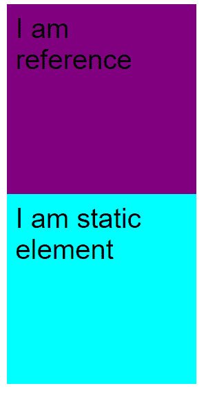
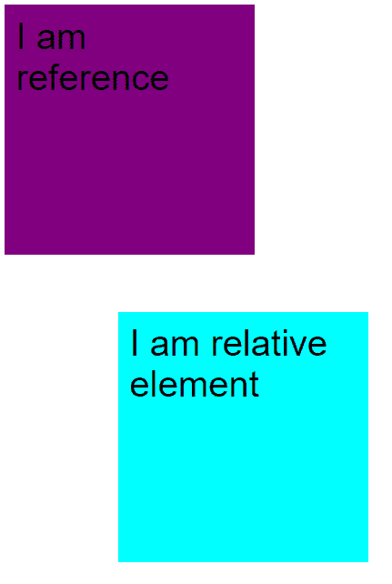
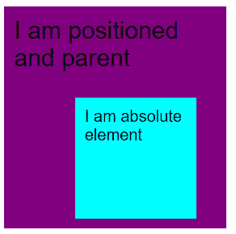
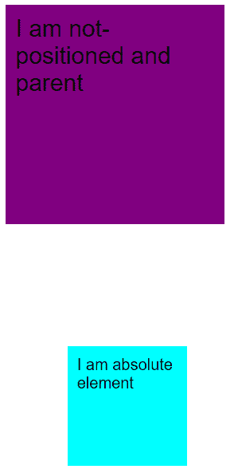
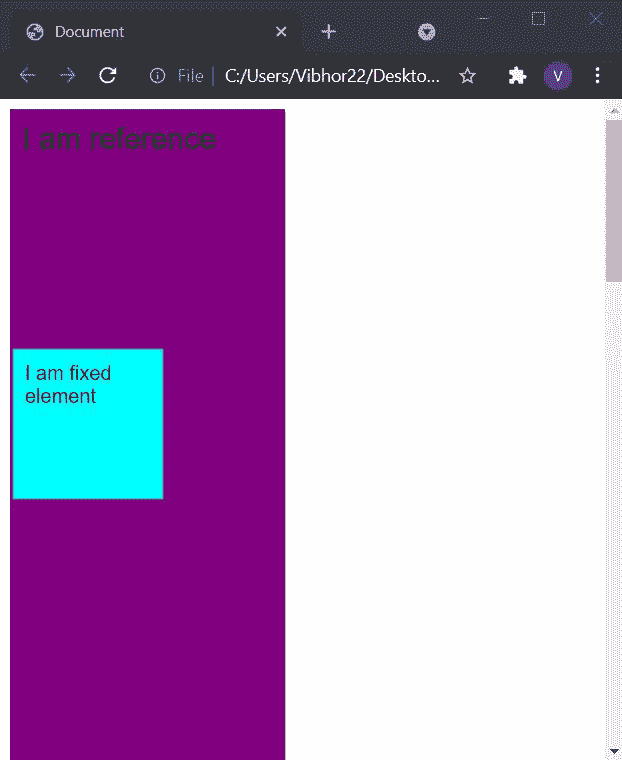
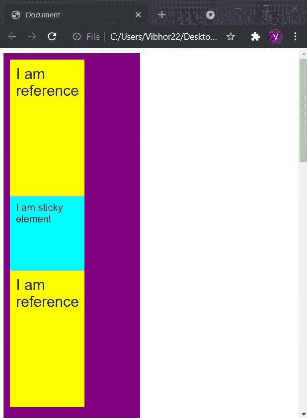

# 在 CSS 中解释位置属性

> 原文: [https://www.geeksforgeeks.org/explain-the-positions-property-in-css/](https://www.geeksforgeeks.org/explain-the-positions-property-in-css/)

在这篇文章中，我们将看到什么是 `position` 属性，如何明智地使用这个属性来制作网页。`position` 属性用于对齐 HTML 页面中的不同元素。位置属性对于制作高质量的网页起着重要的作用。

## CSS 中的 5 个位置属性

*   `static` (默认)
*   `relative`
*   `absolute`
*   `fixed`
*   `sticky`

## 语法

```css
selector {
    position: value;
}
/* value = static, relative, absolute, fixed, sticky */
```

让我们逐一了解这些属性。

### 1. position: static

`static` 是元素的默认位置值。在静态位置下，根据页面的正常流程定位元素。

**注意:** 如果 `position` 是 `static`，`left`、`right`、`top`、`bottom` 属性不会影响元素。

#### HTML 示例

```html
<!DOCTYPE html>
<html lang="en">

<head>
    <style>
        .purple {
            height: 200px;
            width: 200px;
            color: black;
            font-size: 1.5rem;
            padding: 10px;
            background-color: purple;
        }

        .cyan {
            position: static;
            font-size: 1.5rem;
            padding: 10px;
            height: 200px;
            width: 200px;
            background-color: cyan;
        }
    </style>
</head>

<body>
    <div class="purple">
        I am reference
    </div>
    <div class="cyan">
        I am static element
    </div>
</body>

</html>
```

**输出:**



### 2. position: relative

在这种情况下，元素保留在文档的正常流程中，但会影响 `left`、`right`、`top`、`bottom`。元素从它们在文档中的原始位置移动，从而产生空白空间，其他元素可以根据元素留下的空白空间进行自我调整。

#### HTML 示例

```html
<!DOCTYPE html>
<html lang="en">

<head>
    <style>
        .purple {
            height: 200px;
            width: 200px;
            color: black;
            font-size: 1.5rem;
            padding: 10px;
            background-color: purple;
        }

        .cyan {
            position: relative;
            left: 100px;
            top: 90px;
            font-size: 1.5rem;
            padding: 10px;
            height: 200px;
            width: 200px;
            background-color: cyan;
        }
    </style>
</head>

<body>
    <div class="purple"> I am reference </div>
    <div class="cyan"> I am relative element </div>
</body>

</html>
```

**输出:**



**说明:** 我们可以在这里看到元素从原来的位置向左上方变化，创造出一些空间。

### 3. position: absolute

`absolute` 元素不遵循正常的流程文档，而是相对于最近的 **定位祖先** 定位自己。它的最终位置使用 `top`、`bottom`、`left` 和 `right` 来确定。

**注:** 定位元素是指 `position` 属性不是 `static` 的元素。

这些元素不占用任何空间，其他元素对待 `absolute` 元素就像没有元素一样。父元素应该是 **定位的且 `position` 属性不是 `absolute`**，如果父元素没有定位，那么 `absolute` 元素根据最近定位的祖先来定位自己。使用绝对位置时，我们一般设置 `z-index`。

**考虑两种情况了解绝对位置:**

**情况 1:** 当父元素的 `position` 值为 **定位时** (表示父元素的 `position` 属性不等于 `static`)。

#### HTML 示例

```html
<!DOCTYPE html>
<html lang="en">

<head>
    <style>
        .purple {
            position: relative;
            height: 200px;
            width: 200px;
            color: black;
            font-size: 1.5rem;
            padding: 10px;
            background-color: purple;
        }

        .cyan {
            position: absolute;
            bottom: 10px;
            left: 70px;
            font-size: 1.5rem;
            padding: 10px;
            height: 100px;
            width: 100px;
            background-color: cyan;
        }
    </style>
</head>

<body>
    <div class="purple">
        I am positioned and parent
        <div class="cyan"> I am absolute element </div>
    </div>
</body>

</html>
```

**输出:**



**说明:** 这里我们可以看到子元素已经根据父元素进行了自我调整，没有给它分配额外的空间。

**情况 2:** 当父元素为 **未定位** 时。

#### HTML 示例

```html
<!DOCTYPE html>
<html lang="en">

<head>
    <style>
        .purple {
            position: static;
            height: 200px;
            width: 200px;
            color: black;
            font-size: 1.5rem;
            padding: 10px;
            background-color: purple;
        }

        .cyan {
            position: absolute;
            bottom: 10px;
            left: 70px;
            font-size: 1.5rem;
            padding: 10px;
            height: 100px;
            width: 100px;
            background-color: cyan;
        }
    </style>
</head>

<body>
    <div class="purple">
        I am not-positioned and parent
        <div class="cyan"> I am absolute element </div>
    </div>
</body>

</html>
```

**输出:**



**解释:** 由于父元素没有定位，子元素会尝试相对于最近定位的祖先进行自身调整。这里位置最近的祖先是 `<html>`，所以元素根据 `<html>` 进行调整。

### 4. position: fixed

`fixed` 元素不遵循正常的文档流，相对于 `<html>` 标签定位自身。这个元素总是粘在屏幕上。

#### HTML 示例

```html
<!DOCTYPE html>
<html lang="en">

<head>
    <style>
        .purple {
            position: relative;
            height: 2000px;
            width: 200px;
            color: black;
            font-size: 1.5rem;
            font-family: sans-serif;
            padding: 10px;
            background-color: purple;
        }

        .cyan {
            position: fixed;
            top: 200px;
            left: 10px;
            padding: 10px;
            font-size: 1rem;
            color: black;
            height: 100px;
            width: 100px;
            background-color: cyan;
        }
    </style>
</head>

<body>
    <div class="purple">
        I am reference
        <div class="cyan">
            I am fixed element
        </div>
    </div>
</body>

</html>
```

**输出:**



即使上下滚动，您也可以看到固定元素保持在原来的位置。

### 5. position: sticky

`sticky` 有点棘手，但是很容易理解。我们可以认为 `sticky` 是 **`relative` 和 `fixed` 的组合**。记住 `fixed` 元素在某个位置保持固定，但是在 `sticky` 元素中，它相对于某个点表现为 `relative`，之后表现为 `fixed`。

#### HTML 示例

```html
<!DOCTYPE html>
<html lang="en">

<head>
    <style>
        .purple {
            position: absolute;
            height: 2000px;
            width: 200px;
            color: black;
            font-size: 1.5rem;
            font-family: sans-serif;
            padding: 10px;
            background-color: purple;
        }

        .cyan {
            position: sticky;
            top: 10px;
            left: 0px;
            padding: 10px;
            font-size: 1rem;
            color: black;
            height: 100px;
            width: 100px;
            background-color: cyan;
            z-index: 2;
        }

        .yellow {
            padding: 10px;
            position: relative;
            height: 100px;
            width: 100px;
            background-color: yellow;
        }
    </style>
</head>

<body>
    <div class="purple">
        <div class="yellow">I am reference</div>
        <div class="cyan">
            I am sticky element
        </div>
        <div class="yellow">I am reference</div>
    </div>
</body>

</html>
```

**输出:**



**解释:** 在上面的输出中，您可以看到 `sticky` 元素的行为就像一个 `relative` 元素，直到它到达一个特定的偏移量。然后，超过这一点，它会粘在页面上，表现得像 `fixed` 的一样 (这里的偏移量是 `top` 的 `10px`)。

**注意:** 在 `sticky` 中，`left`、`right`、`top`、`bottom` 并不决定元素在 `relative` 状态下的位置，而是指定元素应该在什么位置表现得像 `fixed` 的一样。