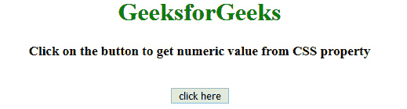
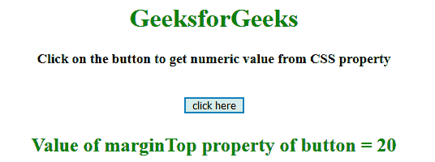
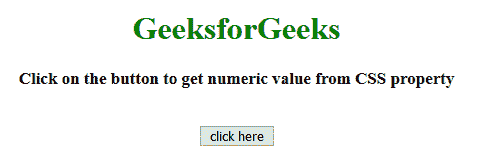
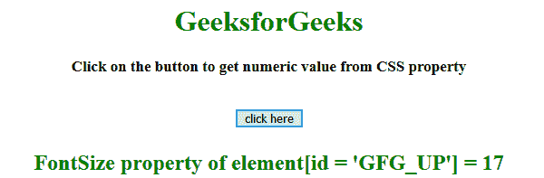

# 使用jQuery获取CSS属性的数值部分

> 原文：[https://www.geeksforgeeks.org/get-the-numeric-part-of-css-property-using-jquery/](https://www.geeksforgeeks.org/get-the-numeric-part-of-css-property-using-jquery/)

给定一个HTML文档，任务是获取CSS属性的数字部分。比如如果`margin-top = 10px`，我们只需要提取`10`。这里讨论的方法很少。
先了解几个方法。

## jQuery方法介绍

### jQuery `on()` 方法
此方法为选定的元素及其子元素添加一个或多个事件处理程序。

**语法：**
```html
$(selector).on(event, childSel, data, fun, map)
```

**参数：**
*   **`event`**：此参数为必填项。它指定要添加到选定元素的一个或多个事件或命名空间。如果有多个事件值，用空格隔开。事件必须是有效的。
*   **`childSel`**：该参数为可选参数。它指定事件处理程序应该只附加到已定义的子元素。
*   **`data`**：此参数为可选。它指定要传递给函数的附加数据。
*   **`fun`**：这个参数是必须的。它指定事件发生时要运行的函数。
*   **`map`**：它指定了一个事件映射(`{event:func(), event:func(), ...}`)，该事件映射有一个或多个要添加到所选元素的事件，以及事件发生时要运行的函数。

### jQuery `text()` 方法
该方法设置/返回所选元素的文本内容。如果使用此方法返回内容，则提供所有匹配元素的文本内容（HTML标签将被移除）。如果用这个方法设置内容，它会替换所有匹配元素的内容。

**语法：**
*   **返回文字内容：**
    ```html
    $(selector).text()
    ```
*   **设置文字内容：**
    ```html
    $(selector).text(content)
    ```
*   **使用功能设置文本内容：**
    ```html
    $(selector).text(function(index, curContent))
    ```

**参数：**
*   **`content`**：此参数为必填项。它为选定的元素指定新的文本内容。
*   **`function(index, curContent)`**：此参数可选。它指定了一个函数，为选定的元素返回新的文本内容。
    *   **`index`**：返回元素在集合中的索引位置。
    *   **`curContent`**：返回当前选中元素的内容。

### jQuery `css()` 方法
此方法为定义的元素设置/返回一个或多个样式属性。

**语法：**
*   **返回CSS属性：**
    ```html
    css("propertyname")
    ```
*   **设置CSS属性：**
    ```html
    css("propertyname", "value")
    ```
*   **设置多个CSS属性：**
    ```html
    css({"propertyname":"value", "propertyname":"value", ...});
    ```

**参数：**
*   **`propertyName`**：指定元素的属性。
*   **`value`**：指定元素的值。

### `replace()` 方法
此方法在字符串中搜索一个定义的值或正则表达式，并返回一个用新值替换了定义值的新字符串。

**语法：**
```html
string.replace(searchVal, newvalue)
```

**参数：**
*   **`searchVal`**：此参数为必填项。它指定将被新值替换的值或正则表达式。
*   **`newvalue`**：此参数为必填项。它指定要替换搜索值的值。

**返回值：**
返回一个新字符串，其中定义的值已被新值替换。

## 示例

### 示例 1
本示例选择元素，然后使用`.css()`方法、一个正则表达式和`.replace()`方法提取其属性。

```html
<!DOCTYPE html>
<html>
<head>
    <title>
        JQuery | Get numeric part of CSS property.
    </title>
    <style>
        #GFG_UP {
            font-size: 17px;
            font-weight: bold;
        }
        #GFG_DOWN {
            color: green;
            font-size: 24px;
            font-weight: bold;
        }
        button {
            margin-top: 20px;
        }
    </style>
</head>
<script src="https://ajax.googleapis.com/ajax/libs/jquery/3.4.0/jquery.min.js">
</script>
<body style="text-align:center;" id="body">
    <h1 style="color:green;">
        GeeksforGeeks
    </h1>
    <p id="GFG_UP">
    </p>
    <button>
        click here
    </button>
    <p id="GFG_DOWN">
    </p>
    <script>
        $('#GFG_UP').text('Click on the button to get numeric value from CSS property');
        $('button').on('click', function() {
            var data = $('button').css('marginTop').replace(/[^-\d\.]/g, '');
            $('#GFG_DOWN').text("Value of marginTop property of button = " + data);
        });
    </script>
</body>
</html>
```

**输出：**
*   **点击按钮前：**
    
*   **点击按钮后：**
    

### 示例 2
本示例选择具有`[id = 'GFG_UP']`的元素，然后使用`.css()`方法、一个正则表达式和`.replace()`方法提取其`fontSize`属性。

```html
<!DOCTYPE html>
<html>
<head>
    <title>
        JQuery | Get numeric part of CSS property.
    </title>
    <style>
        #GFG_UP {
            font-size: 17px;
            font-weight: bold;
        }
        #GFG_DOWN {
            color: green;
            font-size: 24px;
            font-weight: bold;
        }
        button {
            margin-top: 20px;
        }
    </style>
</head>
<script src="https://ajax.googleapis.com/ajax/libs/jquery/3.4.0/jquery.min.js">
</script>
<body style="text-align:center;" id="body">
    <h1 style="color:green;">
        GeeksforGeeks
    </h1>
    <p id="GFG_UP">
    </p>
    <button>
        click here
    </button>
    <p id="GFG_DOWN">
    </p>
    <script>
        $('#GFG_UP').text('Click on the button to get numeric value from CSS property');
        $('button').on('click', function() {
            var data = $('#GFG_UP').css('fontSize').replace(/[^-\d\.]/g, '');
            $('#GFG_DOWN').text("FontSize property of element[id = 'GFG_UP'] = " + data);
        });
    </script>
</body>
</html>
```

**输出：**
*   **点击按钮前：**
    
*   **点击按钮后：**
    